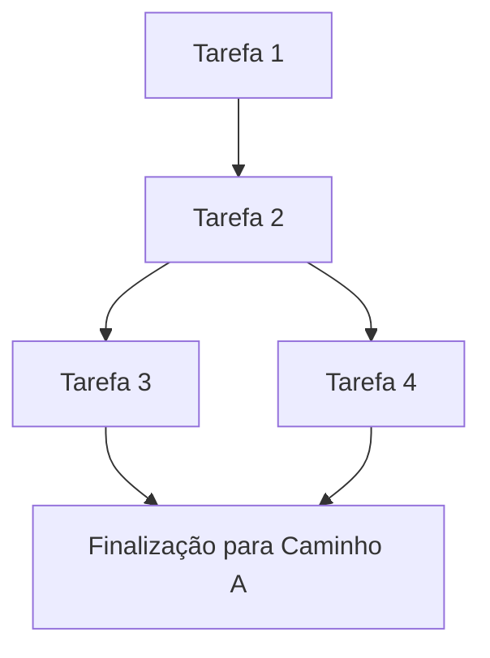

# Template de Planejamento de Elite (Albedo Planning 2.0)

Este template deve ser usado para tarefas que afetem lógica crítica, múltiplos arquivos ou mudanças de estado complexas.

## 1. Visão Geral e Objetivos
[Breve descrição do 'O Que' e 'Por Que']

## 2. DAG de Implementação (Ordem de Execução)

## 3. Matriz de Risco (FMEA Light)
| Risco | Probabilidade (1-5) | Impacto (1-5) | Mitigação |
| :--- | :---: | :---: | :--- |
| Ex: Deadlock em threads | 2 | 5 | Uso de `parking_lot` e auditoria de locks |
| Ex: Perda de performance | 3 | 4 | Profiling com logs do POD |

## 4. Análise Tridimensional (3DE)
- **Vertical**: [Abstração]
- **Horizontal**: [Vizinhança/Efeitos Colaterais]
- **Temporal**: [Estados e Ciclo de Vida]

## 5. Observabilidade (POD Hooks)
- [ ] Log de entrada em `fn x`
- [ ] Log de transição de estado de Y para Z
- [ ] Rastreio de erro no Canal Assíncrono W

## 7. Red Teaming / Cenário de Pesadelo
- **Qual o pior erro possível nesta implementação?** [Descreva]
- **Mecanismo de Defesa**: Como o código impede que isso se torne catastrófico ou trave a UI?
- **Recuperação**: O sistema consegue se auto-corrigir ou exige intervenção manual/reinicio?
