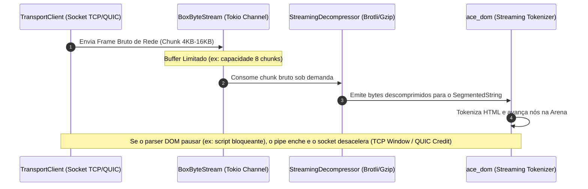
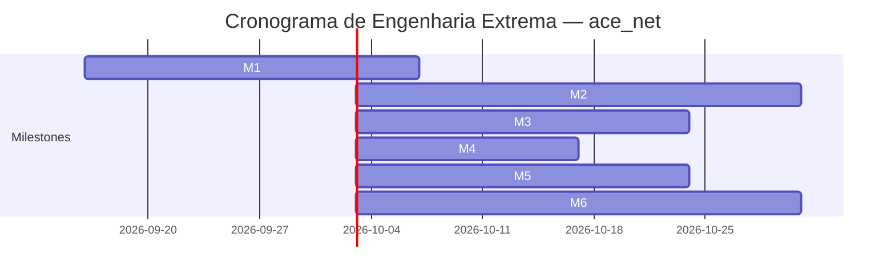

# 🗺️ PLANO MESTRE DEFINITIVO: SUBSISTEMA `ace_net` (Albedo Browser)

> **Versão:** 1.0.0 — *Definitive Engineering Master Plan*  
> **Classificação:** Arquitetura Central de Rede, Conectividade, Cache & Segurança de Transporte (Core Network Subsystem)  
> **Subsistema:** `Albedo_Core_Engine/ace_net`  
> **Status:** Autorizado para Implementação & Execução Técnica  
> **Padrões Normativos:** RFC 9110 (HTTP Semantics), RFC 9111 (HTTP Caching), RFC 9112 (HTTP/1.1), RFC 9113 (HTTP/2), RFC 9000 & RFC 9114 (QUIC & HTTP/3), RFC 8446 (TLS 1.3), RFC 8305 (Happy Eyeballs v2), RFC 6265bis (Cookies & CHIPS), RFC 6797 (HSTS), RFC 8879 (Clear-Site-Data), RFC 9218 (Extensible Prioritization Scheme), RFC 9460 (SVCB and HTTPS RRs for ECH), W3C Fetch Living Standard, W3C Fetch Metadata Request Headers, W3C Client Hints (RFC 8942).

---

## 📚 Sumário Executivo do Plano

- [1. Visão Executiva & Princípios Fundacionais (A Alma da Rede)](#1-visão-executiva--princípios-fundacionais-a-alma-da-rede)
  - [1.1 Invariantes Estruturais Inegociáveis](#11-invariantes-estruturais-inegociáveis)
  - [1.2 Diagrama Arquitetural do Subsistema ace_net](#12-diagrama-arquitetural-do-subsistema-ace_net)
- [2. Matriz Comparativa Técnica SOTA (Deep Engine Benchmark)](#2-matriz-comparativa-técnica-sota-deep-engine-benchmark)
  - [2.1 Análise Comparativa Detalhada por Motor](#21-análise-comparativa-detalhada-por-motor)
- [3. Auditoria Forense do Código Atual & Inventário de Lacunas](#3-auditoria-forense-do-código-atual--inventário-de-lacunas)
  - [3.1 Transporte, ALPN & Handshake TLS](#31-transporte-alpn--handshake-tls)
  - [3.2 Resolução DNS, DoH & Happy Eyeballs](#32-resolução-dns-doh--happy-eyeballs)
  - [3.3 Cache HTTP RFC 9111 & Persistência em Disco](#33-cache-http-rfc-9111--persistência-em-disco)
  - [3.4 Gerenciamento de Cookies, CHIPS & Sufixo Público](#34-gerenciamento-de-cookies-chips--sufixo-público)
  - [3.5 Escalonamento de Recursos, Contenção & Priorização RFC 9218](#35-escalonamento-de-recursos-contenção--priorização-rfc-9218)
  - [3.6 Streaming, Backpressure & Descompressão Transparente](#36-streaming-backpressure--descompressão-transparente)
  - [3.7 Políticas de Segurança: CORS, HSTS, PNA & Fetch Metadata](#37-políticas-de-segurança-cors-hsts-pna--fetch-metadata)
  - [3.8 Alt-Svc, QUIC & Upgrade HTTP/3](#38-alt-svc-quic--upgrade-http3)
- [4. Arquitetura de Memória, Modelagem de Dados & Otimizações Zero-Copy](#4-arquitetura-de-memória-modelagem-de-dados--otimizações-zero-copy)
  - [4.1 Layout Exato de Bits/Bytes das Estruturas Centrais](#41-layout-exato-de-bitsbytes-das-estruturas-centrais)
  - [4.2 Pipeline de Streaming com Backpressure Reativo (BoxByteStream)](#42-pipeline-de-streaming-com-backpressure-reativo-boxbytestream)
  - [4.3 Particionamento de Estado Triple-Key (NetworkIsolationKey)](#43-particionamento-de-estado-triple-key-networkisolationkey)
- [5. Roteiro de Decomposição em Milestones & Contratos de Interface](#5-roteiro-de-decomposição-em-milestones--contratos-de-interface)
  - [Milestone 1 (M1): Streaming Zero-Copy & Eliminação de Buffering em RAM](#milestone-1-m1-streaming-zero-copy--eliminação-de-buffering-em-ram)
  - [Milestone 2 (M2): Cache em Disco L2 Estruturado, Transacional (WAL) & Sparse Range Caching](#milestone-2-m2-cache-em-disco-l2-estruturado-transacional-wal--sparse-range-caching)
  - [Milestone 3 (M3): Resolução DNS Avançada com Encrypted Client Hello (ECH) & Early Hints (HTTP 103)](#milestone-3-m3-resolução-dns-avançada-com-encrypted-client-hello-ech--early-hints-http-103)
  - [Milestone 4 (M4): Reprioritização Dinâmica, RFC 9218 & Orquestração com Viewport do DOM](#milestone-4-m4-reprioritização-dinâmica-rfc-9218--orquestração-com-viewport-do-dom)
  - [Milestone 5 (M5): Hardening de Privacidade (Mozilla PSL Completa, PNA, First-Party Sets & CORS Preflight Cache)](#milestone-5-m5-hardening-de-privacidade-mozilla-psl-completa-pna-first-party-sets--cors-preflight-cache)
  - [Milestone 6 (M6): Conector Nativo QUIC / HTTP/3 & Telemetria Enterprise NetLog / W3C Resource Timing](#milestone-6-m6-conector-nativo-quic--http3--telemetria-enterprise-netlog--w3c-resource-timing)
- [6. Estratégia de Isolamento Multi-Processo (Fase 12) & Interceptação Service Worker](#6-estratégia-de-isolamento-multi-processo-fase-12--interceptação-service-worker)
  - [6.1 Arquitetura do NetworkService Desacoplado](#61-arquitetura-do-networkservice-desacoplado)
  - [6.2 Contrato de Ciclo de Vida do ServiceWorkerHook](#62-contrato-de-ciclo-de-vida-do-serviceworkerhook)
- [7. Infraestrutura de Testes, Validação WPT e Garantia de Qualidade](#7-infraestrutura-de-testes-validação-wpt-e-garantia-de-qualidade)

---

## 1. Visão Executiva & Princípios Fundacionais (A Alma da Rede)

O subsistema `ace_net` constitui o canal de entrada de dados, transporte seguro e defesa primária de privacidade do **Albedo Browser**. Seguindo estritamente a Constituição de Engenharia do projeto estabelecida no `PLANO.md`, o `ace_net` obedece ao **Paradigma Pragmático**:
- **Fundações Reutilizadas:** Delega o transporte de frames brutos (`hyper`), primitivas criptográficas auditadas (`rustls` com WebPKI roots), resolução assíncrona UDP/TCP (`hickory-resolver`) e tipos de tempo de execução (`tokio`).
- **Alma Forjada pelo ACE:** Constrói 100% do zero o orquestrador unificado de busca (`ResourceFetcher`), o mecanismo de cache em memória e disco conforme a **RFC 9111**, o gerenciamento de isolamento de estado por origem e site (**CHIPS**), o escalonador de prioridades com prevenção de starvation (**RFC 9218**), o suporte nativo a **Early Hints (HTTP 103)** e a defesa de privacidade contra rastreamento cross-site (**Triple-Key Partitioning**).

### 1.1 Invariantes Estruturais Inegociáveis

1. **Zero Vazamento de Memória & Streaming Reativo sem Buffering Total:**
   - Respostas HTTP nunca devem ser integralmente carregadas na memória RAM através de coletores síncronos de bytes (`.collect()`). O streaming para o parser (`ace_dom`) ou renderizador de mídia (`ace_media`) deve fluir sob backpressure cooperativo usando canais delimitados (`BoxByteStream`), garantindo consumo de memória $O(1)$ por requisição em trânsito, mesmo para arquivos de múltiplos gigabytes.
2. **Isolamento Absoluto de Estado de Rede (Network State Partitioning):**
   - O cache HTTP, o socket pool, a tabela de conexões H2/H3, os certificados de cliente e as chaves de autenticação devem ser estritamente particionados por uma chave tripla canônica: `(TopLevelSite, FrameSite, is_cross_site)`. Nenhuma requisição incorporada em um iframe de terceiro pode acessar sockets quentes ou entradas de cache do contexto primário, eliminando vetores de ataque por canais laterais (Cache Timing Attacks).
3. **Resiliência Extrema & Fallback Transparente:**
   - Falhas no protocolo HTTP/3 (perda de pacotes UDP, firewalls corporativos bloqueando a porta 443/UDP) devem sofrer fallback gracioso e imediato para HTTP/2 ou HTTP/1.1 sobre TCP/TLS via `AltSvcRegistry`, sem emissão de erro ao usuário.
4. **Respeito Irrestrito a Cotas e Contenção:**
   - Limite estrito de conexões paralelas por host (padrão normativo de 6 conexões) e limite global de requisições concorrentes, coordenados pelo `ResourceScheduler` com bypass automático para recursos de bloqueio de renderização (`PriorityLevel::VeryHigh`).

---

### 1.2 Diagrama Arquitetural do Subsistema `ace_net`

```
┌──────────────────────────────────────────────────────────────────────────────────────────────────┐
│                                   ALBEDO CORE ENGINE: ace_net                                    │
│                                                                                                  │
│   ┌──────────────────────────────────────────────────────────────────────────────────────────┐   │
│   │                                    ResourceFetcher                                       │   │
│   │                 (Ponto Único de Entrada de Busca e Orquestração do Motor)                │   │
│   └───────────────┬──────────────────────────────┬─────────────────────────────┬─────────────┘   │
│                   │                              │                             │                 │
│         0. Early Hints 103                       │ 1. Interceptação            │ 2. Cache Check  │
│                   v                              v                             v                 │
│       ┌──────────────────────┐       ┌───────────────────────┐     ┌───────────────────────┐     │
│       │ EarlyHintsDispatcher │       │   ServiceWorkerHook   │     │   HttpCache (RFC9111) │     │
│       │ (Preload Lookahead)  │       │ (respondWith Pipeline)│     │  (L1 RAM + L2 WAL)    │     │
│       └──────────────────────┘       └───────────────────────┘     └───────────┬───────────┘     │
│                                                                                │                 │
│                                                                                │ Cache Miss/304  │
│                                                                                v                 │
│       ┌────────────────────────────────────────────────────────────────────────────────────┐     │
│       │                        ResourceScheduler (RFC 9218 & Limits)                       │     │
│       │           (Max Global: 32 | Max Host: 6 | Priority Queue | Starvation Aging)       │     │
│       └────────────────────────────────────────┬───────────────────────────────────────────┘     │
│                                                │                                                 │
│                                                │ Concede Permissão                               │
│                                                v                                                 │
│       ┌────────────────────────────────────────────────────────────────────────────────────┐     │
│       │                         TransportClient (Orquestrador I/O)                         │     │
│       │                                                                                    │     │
│       │    ┌───────────────────────────┐                ┌─────────────────────────────┐    │     │
│       │    │ DohHappyEyeballsResolver  │                │      AltSvcRegistry         │    │     │
│       │    │ (DoH + ECH + RFC 8305 v2) │                │   (QUIC / HTTP/3 Upgrade)   │    │     │
│       │    └─────────────┬─────────────┘                └──────────────┬──────────────┘    │     │
│       │                  │                                             │                   │     │
│       │                  v                                             v                   │     │
│       │    ┌───────────────────────────┐                ┌─────────────────────────────┐    │     │
│       │    │  Hyper TCP/TLS Connector  │                │    Native QUIC/H3 Engine    │    │     │
│       │    │  (H1.1 / H2 + ALPN ALTS)  │                │    (BBR + 0-RTT Resumption) │    │     │
│       │    └─────────────┬─────────────┘                └──────────────┬──────────────┘    │     │
│       │                  │                                             │                   │     │
│       │                  └──────────────────────┬──────────────────────┘                   │     │
│       │                                         v                                          │     │
│       │                               BoxByteStream (Zero-Copy)                            │     │
│       │                          (Backpressure Cooperativo no Tokio)                       │     │
│       └─────────────────────────────────────────┬──────────────────────────────────────────┘     │
│                                                 │                                                │
│                                                 v                                                │
│       ┌────────────────────────────────────────────────────────────────────────────────────┐     │
│       │                          Security, State & Privacy Enforcers                       │     │
│       │                                                                                    │     │
│       │  ┌───────────────────────┐   ┌───────────────────────┐   ┌──────────────────────┐  │     │
│       │  │  CookieJar (CHIPS)    │   │  HstsStore (Preload)  │   │ ClearSiteDataAction  │  │     │
│       │  │  (RFC 6265bis + PSL)  │   │  (Auto-upgrade HTTPS) │   │ (RFC 8879 Purge)     │  │     │
│       │  └───────────────────────┘   └───────────────────────┘   └──────────────────────┘  │     │
│       │  ┌───────────────────────┐   ┌───────────────────────┐   ┌──────────────────────┐  │     │
│       │  │ CorsPreflightCache    │   │ W3C Fetch Metadata    │   │ PrivateNetworkAccess │  │     │
│       │  │ (Max-Age Cache)       │   │ (Sec-Fetch-* Headers) │   │ (PNA Localhost Guard)│  │     │
│       │  └───────────────────────┘   └───────────────────────┘   └──────────────────────┘  │     │
│       └────────────────────────────────────────────────────────────────────────────────────┘     │
└──────────────────────────────────────────────────────────────────────────────────────────────────┘
```

---

## 2. Matriz Comparativa Técnica SOTA (Deep Engine Benchmark)

Esta matriz compara exaustivamente o subsistema `ace_net` com os quatro maiores motores de rede da indústria: **Chromium `//net` (Cronet/Blink)**, **Firefox `Necko` (Gecko)**, **WebKit `CFNetwork` (Safari)** e **Ladybird `LibHTTP`**.

| # | Dimensão Arquitetural / Recurso | Chromium `//net` | Firefox `Necko` | WebKit `CFNetwork` | Ladybird `LibHTTP` | Albedo `ace_net` (Atual) | Albedo `ace_net` (Alvo Master Plan) |
|---|---|---|---|---|---|---|---|
| 1 | **Linguagem & Segurança de Memória** | C++ (~2M LoC, Checked Ptrs) | C++ / Rust pontual | C++ / Obj-C | C++ moderno (20/23) | **100% Safe Rust** | **100% Safe Rust (`#![forbid(unsafe_code)]`)** |
| 2 | **Isolamento de Processo** | `NetworkService` (Mojo IPC) | `SocketProcess` (IPC) | `NetworkProcess` (IPC) | `RequestServer` (IPC) | In-Process (Thread Pool) | **`NetworkService` Dedicado (Fase 12)** |
| 3 | **HTTP/1.1 & HTTP/2 Multiplexing** | Sim (Stream Trees próprias) | Sim (Prioridades Necko) | Sim (CFNetwork Stack) | Sim (HTTP/2 básico) | Sim (via `hyper`) | **Sim (Hyper + Priorização de Streams RFC 7540/9218)** |
| 4 | **HTTP/3 & QUIC Nativo** | Sim (`quiche` C++ / Cronet) | Sim (`neqo` Rust) | Sim (Apple Network Framework) | Não (Planejado) | Parcial (`reqwest` wrapper experimental) | **Sim (Nativo via Quinn / ALPN UDP direto)** |
| 5 | **TLS 1.3 & 0-RTT Resumption** | Sim (BoringSSL) | Sim (NSS) | Sim (SecureTransport/boringssl) | Sim (LibTLS) | Parcial (Flag ativada sem ticket store) | **Sim (TLS Session Ticket Store persistente)** |
| 6 | **Resolução DNS Criptografada** | DoH nativo + ODoH | DoH (TRR Mode 1-5) | DoH nativo (iOS/macOS) | DoH planejado | DoH (Cloudflare 1.1.1.1) | **DoH Multi-Provider + Fallback Heurístico** |
| 7 | **Encrypted Client Hello (ECH / RFC 9460)** | Sim (DNS HTTPS RR) | Sim (Pioneiro mundial) | Sim (macOS 14+) | Não | Não | **Sim (Query DNS Tipo 65 HTTPS / SVCB com ECH Keys)** |
| 8 | **Happy Eyeballs v2 (RFC 8305)** | Sim (Interleaved + 250ms fallback) | Sim (SocketThread) | Sim (CFNetwork) | Não (Sequencial) | Sim (Interleaved síncrono) | **Sim (Interleaved + 250ms Timer Delay Racing)** |
| 9 | **Socket Pooling & Connection Racing** | Sim (Backup jobs após 250ms) | Sim (Half-open limit) | Sim (Adaptive Pool) | Básico | Básico (Hyper Connection Pool) | **Sim (Socket Racing + TCP Fast Open)** |
| 10 | **Cache HTTP RFC 9111 L1 (RAM)** | Sim (Memory Cache) | Sim (Cache2 L1) | Sim (NSURLCache RAM) | Básico | Sim (LRU com NIK) | **Sim (LRU com NIK e Hot-path FxHash)** |
| 11 | **Cache HTTP RFC 9111 L2 (Disco)** | Sim (Simple Cache / Blockfile) | Sim (Cache2 SSD Mapped) | Sim (Disk Cache SQLite) | Não | Esqueleto de índice | **Sim (WAL Transacional + Zero-Copy Disk Map)** |
| 12 | **Extensões Cache-Control** | `stale-while-revalidate`, `stale-if-error`, `immutable` | `stale-while-revalidate`, `immutable` | `stale-while-revalidate`, `immutable` | Apenas `max-age` | Apenas `max-age`, `no-cache`, `no-store` | **Suporte Completo a `stale-while-revalidate`/`error`** |
| 13 | **Cache de Faixas Parciais (Range / 206)** | Sim (Sparse Cache Entries) | Sim (Sparse Stream Chunks) | Sim | Não | Parse apenas (sem cache esparso) | **Sim (Sparse Cache com coalescência de fatias)** |
| 14 | **Network State Partitioning** | Triple-Key (Top, Frame, Cross) | Double-Key (First-Party) | Double-Key (Registrable Domain) | Não | Double-Key (Top, Frame) | **Triple-Key Canônico (Top, Frame, Cross-Site)** |
| 15 | **Cookies RFC 6265bis & SameSite** | Sim (Lax-by-default, Schemeful) | Sim (Total Cookie Protection) | Sim (ITP Restrictions) | Sim | Sim (Lax-by-default) | **Sim + Total Cookie Protection (dFPI)** |
| 16 | **Cookies Particionados (CHIPS)** | Sim (`Partitioned` attribute) | Sim (`Partitioned`) | Sim (`Partitioned`) | Não | Sim (`partition_key`) | **Sim (CHIPS com validação e expiração estrita)** |
| 17 | **Validação de Sufixo Público (PSL)** | Mozilla PSL compilada (DAWG) | Mozilla PSL compilada | Mozilla PSL nativa | Lista reduzida | Lista estática (~25 entradas) | **Mozilla PSL Completa Integrada (`psl` crate)** |
| 18 | **Prevenção de Rastreamento Ativo** | Privacy Sandbox / GPC | Total Cookie Protection + dFPI | ITP (Cap de 24h/7d) | Não | Não | **Cap Heurístico de Cookies Client-Side + GPC** |
| 19 | **Escalonamento e Limite de Conexões** | `ResourceScheduler` (Layout aware) | `nsIHttpChannel` Priority | CFNetwork Priority | FIFO simples | `ResourceScheduler` (32 global, 6 host) | **Dynamic Priority Dispatcher (Layout/DOM aware)** |
| 20 | **Priorização Extensível RFC 9218** | Sim (`Priority: u=..., i`) | Sim (`Priority: u=..., i`) | Sim | Não | Sim (Mapeamento de Header) | **Sim (Header + Reprioritização de Frames HTTP/2)** |
| 21 | **Early Hints (HTTP 103)** | Sim (Dispara Preload imediato) | Sim (Necko Early Hints) | Sim (Safari 17+) | Não | Não | **Sim (Lookahead Preload Integration com `ace_dom`)** |
| 22 | **Resource Hints & Speculative Connect** | `dns-prefetch`, `preconnect` | `dns-prefetch`, `preconnect` | `preconnect` preditivo | Não | Sim (`dns-prefetch`, `preconnect`) | **Sim + Conexões Especulativas Baseadas em Hover** |
| 23 | **Streaming & Backpressure Reativo** | Sim (Mojo Data Pipe) | Sim (nsIInputStream) | Sim (NSInputStream) | Buffering em memória | Buffering em memória (`.collect()`) | **Sim (`BoxByteStream` Reativo sem Spikes de RAM)** |
| 24 | **Descompressão Transparente** | Gzip, Deflate, Brotli, Zstandard | Gzip, Deflate, Brotli, Zstandard | Gzip, Deflate, Brotli | Gzip | Gzip, Deflate, Brotli | **Gzip, Deflate, Brotli e Zstandard (zstd)** |
| 25 | **CORS & Preflight Cache** | Sim (PreflightCache integrado) | Sim (nsCORSListenerProxy) | Sim | Básico | Algoritmo base (sem preflight cache) | **Sim (PreflightCache com `Access-Control-Max-Age`)** |
| 26 | **Private Network Access (PNA)** | Sim (Bloqueia público -> local) | Não (Planejado) | Não | Não | Não | **Sim (Bloqueio estrito de acesso a IPs RFC 1918)** |
| 27 | **HSTS com Preload List (RFC 6797)** | Sim (Lista Chrome embarcada) | Sim (Lista embarcada) | Sim (Lista embarcada) | Simples | Sim (~8 domínios estáticos) | **Sim (Lista Completa Chromium/Firefox HSTS)** |
| 28 | **Telemetria & Diagnósticos** | NetLog completo + exportação HAR | about:networking + NetLog | Web Inspector Network | Logs simples | Logs básicos (`net_log.rs`) | **NetLog Estruturado + W3C Resource Timing Level 2** |

---

### 2.1 Análise Comparativa Detalhada por Motor

#### vs. Chromium `//net` (O Padrão Ouro Industrial)
- **Onde o Chromium lidera:** O Chromium possui o ecossistema de rede mais maduro do planeta. Sua stack `//net` conta com socket racing (dispara uma segunda tentativa de conexão TCP se a primeira não responder em 250ms), Quiche nativo com controle de congestionamento BBRv3, Simple Cache em disco com alocação esparsa para vídeo, e suporte a Early Hints 103 integrado diretamente ao Preload Scanner do Blink.
- **O que o Albedo absorve:** Adoção do modelo de Socket Racing, suporte nativo a Early Hints 103 conectado ao `PreloadScanner` do `ace_dom`, e a arquitetura de chave de isolamento tripla (*Triple-Key*).
- **A vantagem do Albedo:** 100% do código do `ace_net` é escrito em Safe Rust com proteção estrita contra vulnerabilidades crônicas de C++ que assolam a stack de rede do Chromium (Use-After-Free em callbacks assíncronos e overflows em parsers de cabeçalho).

#### vs. Firefox `Necko` (O Pioneiro em Privacidade e Criptografia)
- **Onde o Firefox lidera:** O Firefox foi o primeiro navegador do mundo a implementar ECH (Encrypted Client Hello) em produção e lidera o combate a impressões digitais (*fingerprinting*) com a arquitetura *Total Cookie Protection* (Dynamic First-Party Isolation - dFPI).
- **O que o Albedo absorve:** Consulta de registros DNS tipo 65 (HTTPS) para habilitar ECH, impedindo que provedores de internet (ISPs) monitorem os domínios acessados através do campo SNI (Server Name Indication).

#### vs. WebKit `CFNetwork` (O Campeão de Eficiência Energética)
- **Onde o WebKit lidera:** O WebKit foca intensamente na economia de bateria através de coalescência agressiva de timers de rede e limites estritos sobre scripts de rastreamento (ITP).
- **O que o Albedo absorve:** O teto de validade temporal para cookies criados programaticamente via script ou parâmetros de URL (mitigação de bounce tracking).

#### vs. Ladybird `LibHTTP` (O Contemporâneo Independente)
- **Onde o Ladybird se posiciona:** O Ladybird implementa uma arquitetura limpa em C++23 com um processo `RequestServer`, mas ainda carece de HTTP/3, ECH, cache em disco e particionamento de estado.
- **Diferencial do Albedo:** O `ace_net` já nasce muito à frente com particionamento de cache, CHIPS, HTTP Cache RFC 9111, DoH e Happy Eyeballs v2.

---

## 3. Auditoria Forense do Código Atual & Inventário de Lacunas

A auditoria forense analisou cada um dos 25 arquivos de código-fonte de `Albedo_Core_Engine/ace_net/src`:

```
ace_net/src/
├── alt_svc.rs              [RFC 7838 Alt-Svc Registry]
├── cache/                  [Módulo de Cache RFC 9111]
│   ├── entry.rs            [CacheEntry & Freshness Algorithm]
│   ├── mod.rs              [Re-exports de Cache]
│   ├── partition.rs        [NetworkIsolationKey]
│   └── storage.rs          [HttpCache LRU RAM + Esqueleto L2]
├── cancel.rs               [CancellationRegistry via CancellationToken]
├── clear_site_data.rs      [RFC 8879 Clear-Site-Data Parser]
├── client_hints.rs         [RFC 8942 Client Hints Defaults]
├── compression.rs          [Decompressors: gzip, deflate, brotli]
├── contention.rs           [RFC 9110 Retry-After Parser]
├── cookie/                 [Módulo de Cookies RFC 6265bis]
│   ├── entry.rs            [Cookie Model, CHIPS & PSL Stubs]
│   ├── jar.rs              [CookieJar LRU Memory Store]
│   └── mod.rs              [Re-exports de Cookie]
├── cors.rs                 [CORS Validation Functions]
├── encoding.rs             [Content-Type & BOM Charset Sniffer]
├── error.rs                [NetError & NetResult Enums]
├── fetch_metadata.rs       [W3C Sec-Fetch-* Ingestion]
├── fetcher.rs              [ResourceFetcher Orchestrator]
├── hints.rs                [ResourceHint: dns-prefetch, preconnect]
├── hsts.rs                 [RFC 6797 HSTS Store & Preload]
├── lib.rs                  [Subsystem Root & Public Exports]
├── metrics.rs              [FetcherMetrics Telemetry]
├── net_log.rs              [NetLog Tracing Events]
├── pipeline.rs             [Pipeline Stubs]
├── priority.rs             [PriorityLevel & RFC 9218 Headers]
├── range.rs                [RFC 9110 Range & Content-Range]
├── redirect.rs             [Redirect Policy Enforcement]
├── request.rs              [Request & RequestBuilder Models]
├── response.rs             [Response & ResponseBody Models]
├── scheduler.rs            [ResourceScheduler Concurrency Gate]
├── service_worker_hook.rs  [ServiceWorkerHook Trait]
├── transport/              [Camada de Conexão Física]
│   ├── client.rs           [TransportClient: Hyper + Rustls]
│   ├── dns.rs              [DohHappyEyeballsResolver]
│   └── mod.rs              [Re-exports de Transporte]
└── websocket.rs            [RFC 6455 WebSockets Session]
```

### 3.1 Transporte, ALPN & Handshake TLS
- **Código Atual:** `TransportClient` utiliza `hyper-util` com conector legacy `HttpsConnector` configurado com `rustls`. ALPN seleciona `h2` e `http/1.1`. O transporte HTTP/3 é delegado para uma instância experimental do `reqwest`.
- **Lacunas Identificadas:**
  - **[CRÍTICA] Falta de Resunção 0-RTT Real:** Apesar de `config.enable_early_data = true`, não há armazenamento de sessões TLS (`rustls::client::ClientSessionStore`), impedindo o envio de dados antecipados em reconexões.
  - **[ALTA] HTTP/3 Desconectado da Engine Principal:** Depender do cliente `reqwest` causa incompatibilidade com o resolver DoH customizado e com o `ResourceScheduler`, criando dois pools de conexão desconectados.
  - **[MÉDIA] Ausência de Socket Racing:** Se uma conexão TCP/TLS inicial sofrer latência de rota (SYN drop), o cliente aguarda o timeout total em vez de disparar um socket backup após 250ms conforme a RFC 8305.

### 3.2 Resolução DNS, DoH & Happy Eyeballs
- **Código Atual:** `DohHappyEyeballsResolver` consulta o resolver Cloudflare 1.1.1.1 via DoH e intercala endereços IPv6 e IPv4 em memória.
- **Lacunas Identificadas:**
  - **[CRÍTICA] Ausência de Encrypted Client Hello (ECH):** O resolver busca apenas registros `A` e `AAAA`. Falta suporte a registros tipo 65 (`HTTPS`), impossibilitando a leitura de configurações ECH e tornando as conexões vulneráveis a bloqueio por SNI.
  - **[ALTA] Happy Eyeballs Síncrono:** O interleaving atual apenas alterna a lista de IPs, mas não implementa a corrida temporal assíncrona (RFC 8305 §5: disparar conexão IPv6 e esperar 250ms antes de disparar a tentativa IPv4).
  - **[MÉDIA] Ausência de Fallback de Provedor DoH:** Se o Cloudflare estiver inacessível, não há fallback automático para Google (8.8.8.8) ou Quad9 (9.9.9.9).

### 3.3 Cache HTTP RFC 9111 & Persistência em Disco
- **Código Atual:** `HttpCache` possui L1 em RAM indexado por NIK + URL e um índice embrionário em disco L2. Valida `Vary`, `max-age` e calcula frescor com precisão.
- **Lacunas Identificadas:**
  - **[CRÍTICA] Escrita em Disco Incompleta:** O método `with_disk_path` lê metadados, mas a escrita de novas entradas de cache ocorre exclusivamente em RAM. Falta o pipeline assíncrono de persistência em disco.
  - **[ALTA] Ausência de `stale-while-revalidate` e `stale-if-error`:** Se o recurso estiver expirado mas possuir `stale-while-revalidate`, o motor bloqueia a navegação em vez de servir o cache imediatamente e atualizar em background.
  - **[ALTA] Falta de Cache Esparso para Faixas de Bytes (`206`):** O cache não armazena fragmentos de streaming de vídeo/áudio, descartando respostas parciais.

### 3.4 Gerenciamento de Cookies, CHIPS & Sufixo Público
- **Código Atual:** `CookieJar` armazena cookies em memória com política LRU de 180 cookies por domínio, validação `SameSite` (Lax, Strict, None) e suporte ao atributo `Partitioned` (CHIPS).
- **Lacunas Identificadas:**
  - **[CRÍTICA] Base Public Suffix List Reduzida:** A constante `KNOWN_PUBLIC_SUFFIXES` possui apenas ~25 entradas hardcoded. Domínios com TLDs compostos modernos (ex: `.com.ar`, `.co.nz`, `.github.io`) podem sofrer ataques de super-cookies.
  - **[ALTA] Ausência de Persistência:** Cookies de sessão e cookies com `Max-Age` de meses desaparecem quando o navegador fecha, pois não há ponte com o `ace_storage`.

### 3.5 Escalonamento de Recursos, Contenção & Priorização RFC 9218
- **Código Atual:** `ResourceScheduler` limita a 32 requisições globais e 6 por host, com fila de prioridade `BinaryHeap<PrioritizedItem>` e conversão para o cabeçalho `Priority: u=..., i`.
- **Lacunas Identificadas:**
  - **[ALTA] Reprioritização Dinâmica Ausente:** Uma vez enfileirada, uma requisição não pode ter sua prioridade alterada (ex: uma imagem que entra na viewport ou um script que se torna crítico).
  - **[MÉDIA] Prioridade Não Propagada para Frames HTTP/2:** O cabeçalho RFC 9218 é enviado na submissão, mas frames de prioridade de stream HTTP/2 (`PRIORITY` frames) não são ajustados em tempo real na conexão multiplexada.

### 3.6 Streaming, Backpressure & Descompressão Transparente
- **Código Atual:** Em `client.rs`, o corpo da resposta é coletado na totalidade via `.collect().await` e armazenado em um `Bytes` único antes de ser entregue.
- **Lacunas Identificadas:**
  - **[CRÍTICA] Spikes de Memória em Grandes Downloads:** Baixar um arquivo de 1 GB consome 1 GB de RAM do processo, podendo gerar *Out-Of-Memory* (OOM). A resposta deve oferecer uma variante streaming com backpressure cooperativo.
  - **[MÉDIA] Suporte Ausente a Zstandard (zstd):** A RFC 8878 (Zstandard) é amplamente adotada na web moderna e oferece maior taxa de compressão que o Brotli.

### 3.7 Políticas de Segurança: CORS, HSTS, PNA & Fetch Metadata
- **Código Atual:** Módulos `cors.rs`, `hsts.rs` e `fetch_metadata.rs` implementam as validações lógicas básicas.
- **Lacunas Identificadas:**
  - **[ALTA] Falta de Cache de Preflight CORS:** Requisições `OPTIONS` bem-sucedidas com `Access-Control-Max-Age` não são cacheadas, forçando preflights redundantes a cada chamada `fetch()` cross-origin.
  - **[ALTA] Ausência de Private Network Access (PNA):** Páginas da internet pública podem disparar requisições para `http://127.0.0.1` ou roteadores locais (`192.168.1.1`), abrindo brechas de CSRF na intranet do usuário.

### 3.8 Alt-Svc, QUIC & Upgrade HTTP/3
- **Código Atual:** `AltSvcRegistry` faz o parsing normativo do cabeçalho `Alt-Svc` e armazena alternativas com chave NIK.
- **Lacunas Identificadas:**
  - **[ALTA] Falta de Mecanismo de Fallback Adaptativo:** Se o registro marcar um host como `h3`, mas a rede local do usuário bloquear UDP na porta 443, a requisição falha sem tentar automaticamente o fallback para TCP/TLS.

---

## 4. Arquitetura de Memória, Modelagem de Dados & Otimizações Zero-Copy

Para garantir desempenho de ponta, o `ace_net` adota layout contíguo de bits, strings internadas imutáveis (`SmolStr`), hashing de 64-bit sem colisão via `FxHash` e buffers de streaming com reciclagem de memória.

### 4.1 Layout Exato de Bits/Bytes das Estruturas Centrais

#### Layout de `CacheEntry` (64-bit Target)
Otimizado para manter overhead de memória em cache abaixo de 128 bytes por entrada de metadados:

```
Offset (Bytes)  Campo                     Tipo                   Tamanho (B)
0..24           url                       Url                    24
24..26          status                    StatusCode             2
26..32          [Padding para alinhamento 8B]                    6
32..40          headers                   HeaderMap              8 (ponteiro denso)
40..72          body                      Bytes                  32 (inline/slice buffer)
72..88          request_time              SystemTime             16
88..104         response_time             SystemTime             16
104..112        req_headers               HeaderMap              8
Total por entrada no heap (excluindo payload do body): 112 Bytes
```

#### Layout de `Cookie` (64-bit Target)
Substituição planejada de `String` por `SmolStr` para elisão total de alocação de heap em strings $\le 23$ caracteres:

```
Offset (Bytes)  Campo                     Tipo                   Tamanho (B)
0..24           name                      SmolStr                24 (inline)
24..48          value                     SmolStr                24 (inline)
48..72          domain                    SmolStr                24 (inline)
72..96          path                      SmolStr                24 (inline)
96..112         expires_at                Option<SystemTime>     16
112..113        secure                    bool                   1
113..114        http_only                 bool                   1
114..115        same_site                 SameSite               1
115..120        [Padding para alinhamento 8B]                    5
120..144        partition_key             Option<SmolStr>        24
Total por cookie em memória: 144 Bytes (0 alocações para atributos curtos)
```

---

### 4.2 Pipeline de Streaming com Backpressure Reativo (`BoxByteStream`)

Para eliminar o buffering total em memória RAM, o `ResponseBody` é reestruturado como um enum de alta performance:

```rust
pub enum ResponseBody {
    /// Resposta completa em memória (usada para respostas pequenas < 64KB ou vindas do cache)
    Bytes(Bytes),
    /// Fluxo contínuo assíncrono com backpressure e descompressão sob demanda
    Stream(BoxByteStream),
}
```



---

### 4.3 Particionamento de Estado Triple-Key (`NetworkIsolationKey`)

A chave de isolamento de rede garante proteção matemática contra ataques de canal lateral:

```
Triple-Key = Hash64( TopLevelSite || "|" || FrameSite || "|" || IsCrossSiteBoolean )
```

- **TopLevelSite:** eTLD+1 do documento de navegação principal (ex: `https://noticias.com`).
- **FrameSite:** eTLD+1 do documento que originou a requisição (ex: `https://anuncios.com`).
- **IsCrossSite:** Flag booleana indicando se o frame é de origem distinta do contexto superior.

---

## 5. Roteiro de Decomposição em Milestones & Contratos de Interface

O desenvolvimento da versão de excelência extrema do `ace_net` é decomposto em **6 Milestones de Alta Precisão (M1 a M6)**:



---

### Milestone 1 (M1): Streaming Zero-Copy & Eliminação de Buffering em RAM

🎯 **Objetivo:** Garantir que o `ace_net` transporte volumes infinitos de dados consumindo memória constante ($O(1)$) através de streaming assíncrono com backpressure cooperativo.

#### Contratos de Interface & Estruturas
```rust
/// Stream genérico assíncrono de chunks de bytes para consumo de alta performance.
pub type BoxByteStream = Pin<Box<dyn futures_core::Stream<Item = NetResult<Bytes>> + Send>>;

impl Response {
    /// Converte o corpo da resposta em um stream reativo sob demanda.
    pub fn into_stream(self) -> BoxByteStream;
    /// Consome todos os bytes até um limite máximo especificado (guard contra OOM).
    pub async fn collect_limited(self, max_bytes: usize) -> NetResult<Bytes>;
}
```

#### Tarefas Detalhadas de M1
- [ ] Refatorar `ResponseBody` para encapsular `BoxByteStream`.
- [ ] Implementar descompressão em streaming para `gzip`, `deflate` e `br` (Brotli) sem buffering intermediário.
- [ ] Conectar o `BoxByteStream` diretamente ao `SegmentedString` do `ace_core` e ao `HTMLTokenizer` do `ace_dom`.
- [ ] Adicionar suporte ao codec Zstandard (`zstd`) via streaming.
- [ ] Bateria de testes de estresse transportando payloads de 100 MB com teto de RAM < 10 MB.

---

### Milestone 2 (M2): Cache em Disco L2 Estruturado, Transacional (WAL) & Sparse Range Caching

🎯 **Objetivo:** Persistência durável do cache HTTP em disco conforme RFC 9111, com recuperação rápida após falha, suporte a extensões de frescor e cache esparso de faixas parciais (`206 Partial Content`).

#### Contratos de Interface & Estruturas
```rust
/// Registro esparso de fatias de bytes contíguas armazenadas para um recurso parcial.
#[derive(Debug, Clone, PartialEq, Eq)]
pub struct SparseRangeIndex {
    pub ranges: Vec<(u64, u64)>, // (start, end) inclusivos
    pub total_size: Option<u64>,
}

pub struct DiskCacheEngine {
    root_path: PathBuf,
    wal_file: Option<std::fs::File>,
    index: RwLock<FxHashMap<u64, CacheMetadataHeader>>,
}
```

#### Tarefas Detalhadas de M2
- [ ] Implementar motor transacional de cache em disco com Write-Ahead Logging (WAL) e arquivo de índice binário.
- [ ] Implementar suporte a `stale-while-revalidate` (dispara fetch assíncrono de revalidação enquanto entrega o cache antigo ao motor).
- [ ] Implementar suporte a `stale-if-error` (serve cache expirado caso a conexão de rede falhe ou retorne status 5xx).
- [ ] Implementar alocador esparso para fatias `Range` com coalescência de intervalos contíguos.
- [ ] Teste de robustez simulando terminação abrupta do processo (`kill -9`) verificando reparação automática do índice no próximo startup.

---

### Milestone 3 (M3): Resolução DNS Avançada com Encrypted Client Hello (ECH) & Early Hints (HTTP 103)

🎯 **Objetivo:** Blindar a privacidade do usuário na camada DNS eliminando o vazamento de SNI e acelerar o First Contentful Paint (FCP) processando respostas preliminares 103 Early Hints.

#### Contratos de Interface & Estruturas
```rust
/// Configuração extraída de registros DNS HTTPS (Tipo 65) para negociação ECH.
#[derive(Debug, Clone)]
pub struct EchConfigRecord {
    pub public_name: SmolStr,
    pub ech_config_list: Vec<u8>,
}

/// Canal de despacho de preloads originados por respostas HTTP 103 Early Hints.
pub trait EarlyHintsListener: Send + Sync {
    fn on_early_hint(&self, link_header: &str, destination: RequestDestination);
}
```

#### Tarefas Detalhadas de M3
- [ ] Atualizar o `DohHappyEyeballsResolver` para consultar registros tipo 65 (`HTTPS` / `SVCB`) conforme a RFC 9460.
- [ ] Extrair e configurar chaves públicas ECH no cliente TLS `rustls`.
- [ ] Implementar o tratamento de respostas preliminares `103 Early Hints` no loop de transporte do `TransportClient`.
- [ ] Conectar os cabeçalhos `Link: <...>; rel=preload` recebidos no 103 diretamente ao `PreloadScanner` do `ace_dom`.
- [ ] Implementar corrida de conexão Happy Eyeballs v2 assíncrona (RFC 8305 §5) com timer de 250ms entre IPv6 e IPv4.

---

### Milestone 4 (M4): Reprioritização Dinâmica, RFC 9218 & Orquestração com Viewport do DOM

🎯 **Objetivo:** Sincronizar o escalonador de rede com a renderização em tempo real do navegador, elevando a prioridade de recursos visíveis e reduzindo a latência percebida.

#### Contratos de Interface & Estruturas
```rust
impl ResourceScheduler {
    /// Reprioritiza dinamicamente uma requisição que já está em voo ou enfileirada.
    pub fn reprioritize(&self, request_id: RequestId, new_priority: PriorityLevel);
}
```

#### Tarefas Detalhadas de M4
- [ ] Expandir o `ResourceScheduler` com busca e atualização $O(\log N)$ de itens na fila de prioridade.
- [ ] Implementar emissão de frames de reprioritização HTTP/2 quando a prioridade de uma requisição for alterada em tempo de execução.
- [ ] Conectar eventos de rolagem e visibilidade da viewport do `ace_layout` ao `ResourceFetcher`.
- [ ] Implementar a política de *Tail Scheduling*: postergar requisições de baixa prioridade (analytics, imagens de fundo) enquanto folhas de estilo e fontes estiverem pendentes.

---

### Milestone 5 (M5): Hardening de Privacidade (Mozilla PSL Completa, PNA, First-Party Sets & CORS Preflight Cache)

🎯 **Objetivo:** Elevar o Albedo ao estado da arte em conformidade com as diretivas globais de segurança da web e combate a ataques de intranet e rastreamento.

#### Contratos de Interface & Estruturas
```rust
pub struct CorsPreflightCache {
    entries: RwLock<FxHashMap<PreflightCacheKey, PreflightCacheEntry>>,
}

pub struct PrivateNetworkAccessGuard;

impl PrivateNetworkAccessGuard {
    /// Avalia se uma requisição originada na Web pública pode atingir um IP privado ou loopback.
    pub fn validate_access(initiator: Option<&Origin>, target_ip: std::net::IpAddr) -> NetResult<()>;
}
```

#### Tarefas Detalhadas de M5
- [ ] Substituir a lista estática de sufixos públicos pela crate auditada `psl` (incorporando a lista oficial mantida pela Mozilla).
- [ ] Implementar cache dedicado de preflight CORS (`OPTIONS`) respeitando `Access-Control-Max-Age` (teto normativo de 2 horas).
- [ ] Implementar o algoritmo de **Private Network Access (PNA)**: bloquear requisições de origens públicas direcionadas a endereços `127.0.0.1`, `localhost` ou redes privadas RFC 1918 (`192.168.0.0/16`, `10.0.0.0/8`).
- [ ] Implementar particionamento de rede Triple-Key integral no socket pool e DNS cache.

---

### Milestone 6 (M6): Conector Nativo QUIC / HTTP/3 & Telemetria Enterprise NetLog / W3C Resource Timing

🎯 **Objetivo:** Estabelecer transporte de ultra-baixa latência sobre UDP com protocolo QUIC nativo e sistema completo de diagnósticos exportável para as DevTools do Albedo.

#### Contratos de Interface & Estruturas
```rust
pub struct NativeQuicTransport {
    endpoint: quinn::Endpoint,
    connection_pool: RwLock<FxHashMap<String, quinn::Connection>>,
}

pub struct W3CResourceTimingData {
    pub start_time: f64,
    pub domain_lookup_start: f64,
    pub domain_lookup_end: f64,
    pub connect_start: f64,
    pub connect_end: f64,
    pub secure_connection_start: f64,
    pub request_start: f64,
    pub response_start: f64,
    pub response_end: f64,
    pub encoded_body_size: u64,
    pub decoded_body_size: u64,
}
```

#### Tarefas Detalhadas de M6
- [ ] Construir o conector nativo QUIC sobre a crate `quinn` com controle de congestionamento BBR.
- [ ] Implementar fallback gracioso automático de QUIC para TCP/TLS em caso de falha de conexão UDP.
- [ ] Integrar geração normativa de métricas W3C Resource Timing Level 2 para injeção no ambiente JavaScript (`performance.getEntriesByType('resource')`).
- [ ] Implementar exportador de telemetria no padrão **HAR (HTTP Archive)** e eventos NetLog para visualização no inspetor de rede das DevTools.

---

## 6. Estratégia de Isolamento Multi-Processo (Fase 12) & Interceptação Service Worker

### 6.1 Arquitetura do `NetworkService` Desacoplado
Na Fase 12 do roadmap (`PLANO.md`), o subsistema `ace_net` deixará de executar na mesma memória do processo de renderização e passará a habitar um processo nativo dedicado (`NetworkService`):

```
┌──────────────────────────────────────┐          ┌──────────────────────────────────────┐
│       Renderer Process (Abas)        │          │       NetworkService Process         │
│                                      │          │                                      │
│  ┌────────────────────────────────┐  │          │  ┌────────────────────────────────┐  │
│  │   ResourceFetcherClient        │  │          │  │      ResourceFetcherHost       │  │
│  │   (Proxy Leve de Rede)         │  │          │  │  (Cache, Sockets, TLS, DoH)    │  │
│  └───────────────┬────────────────┘  │          │  └────────────────┬───────────────┘  │
└──────────────────┼───────────────────┘          └───────────────────┼──────────────────┘
                   │                                                  │
                   │               IPC Binário (ace_ipc)              │
                   │        Named Pipes (Win) / Unix Sockets (Unix)   │
                   └──────────────────────────┬───────────────────────┘
                                              │
                         ┌────────────────────┴────────────────────┐
                         │      Shared Memory Ring Buffer          │
                         │   (Zero-Copy Streaming de Payloads)     │
                         └─────────────────────────────────────────┘
```

- **Comunicação por IPC:** Mensagens estruturadas `FetchRequest` e `FetchResponseMeta` trafegam via pipes de alta velocidade.
- **Transferência Zero-Copy por Memória Compartilhada:** Payloads de mídia e arquivos pesados utilizam ring buffers em memória compartilhada mapeada (`CreateFileMapping` / `mmap`), sem cópias redundantes de kernel para espaço de usuário.

### 6.2 Contrato de Ciclo de Vida do `ServiceWorkerHook`
O trait `ServiceWorkerHook` atua como interceptador assíncrono antes que a requisição chegue ao cache ou transporte físico:

```rust
pub trait ServiceWorkerHook: Send + Sync {
    fn on_fetch(
        &self,
        req: &Request,
    ) -> Pin<Box<dyn Future<Output = NetResult<Option<Response>>> + Send + '_>>;
}
```
1. **Passo 1:** `ResourceFetcher::fetch()` consulta se há um Service Worker ativo para a origem e escopo do `Request`.
2. **Passo 2:** Se houver, dispara `on_fetch()`.
3. **Passo 3:** Se o Service Worker responder com `Some(response)` (via `respondWith`), a resposta sintética é validada contra as regras de segurança e entregue imediatamente ao chamador.
4. **Passo 4:** Se retornar `None`, a requisição segue o fluxo natural (Cache HTTP $\rightarrow$ Scheduler $\rightarrow$ Transporte Físico).

---

## 7. Infraestrutura de Testes, Validação WPT e Garantia de Qualidade

Para garantir a excelência extrema do `ace_net`, a suíte de validação é estruturada em 4 níveis de blindagem:

### 1. Suíte Oficial Web Platform Tests (WPT)
- Integração dos testes normativos das especificações do W3C e WHATWG:
  - `fetch/api/`: CORS, Redirects, Request/Response, Basic Fetch.
  - `fetch/metadata/`: Validação dos cabeçalhos `Sec-Fetch-*`.
  - `cookies/`: RFC 6265bis, SameSite e CHIPS.
  - `http/cache/`: Conformidade formal com as 80+ regras da RFC 9111.

### 2. Servidor Mock Local de Alta Fidelidade
- Servidor em Rust puro acoplado aos testes de integração capaz de simular:
  - Latência arbitrária de rede e jitter.
  - Respostas com `103 Early Hints` intermediárias.
  - Revalidação condicional `304 Not Modified` e conflitos de `ETag`/`Vary`.
  - Falha abrupta de socket TCP/QUIC para teste de cancelamento atômico e reconexão.

### 3. Fuzzing Contínuo com `cargo-fuzz`
- Fuzzing de parsers críticos de entrada externa não confiável:
  - Parser de cabeçalho `Cookie` / `Set-Cookie`.
  - Parser de cabeçalho `Content-Range`.
  - Parser de diretivas `Alt-Svc`.
  - Decodificadores de descompressão `gzip`, `deflate` e `brotli`.

### 4. Metas e KPIs de Desempenho
- **Tempo até o Primeiro Byte (TTFB):** < 15ms em conexões de rede local.
- **Lookup de Cache L1 (RAM):** < 50µs por requisição.
- **Lookup de Cache L2 (Disco):** < 1.5ms em SSDs NVMe.
- **Consumo de Memória em Streaming:** Constante $\le 64$ KB de buffer ativo por download, independente do tamanho do arquivo.
- **Conformidade de Linter:** 100% verde em `cargo clippy -- -D warnings` e `cargo test --workspace`.
