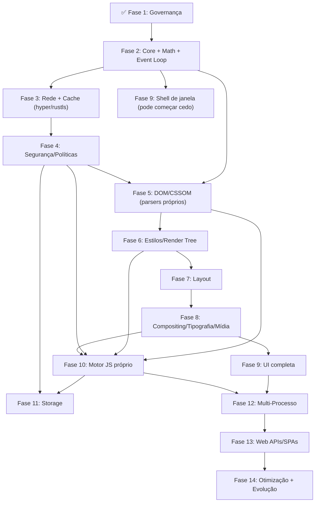

# 🗺️ PLANO MESTRE DE ENGENHARIA — ACE (Albedo Core Engine) & Browser

> **Versão:** 6.0 — *Paradigma Pragmático Consolidado*
> **Última atualização:** 2026-08-16
> **Propósito:** Roteiro exaustivo e técnico para a construção de um navegador web completo e competitivo, focado em inovação arquitetural de alto nível.
> **Status:** Documento vivo — cada fase concluída é marcada (✅/🚧), cada decisão relevante vira um ADR.

---

## 🧭 Filosofia

O **ACE (Albedo Core Engine)** constrói seu diferencial competitivo **do zero**: a árvore DOM/CSSOM, os complexos algoritmos de layout (Flex/Grid), a arquitetura multi-processo e o pipeline de renderização.

Contudo, para **infraestrutura fundacional** — I/O assíncrono, transporte de rede, criptografia, Unicode, concorrência, GPU e janelas —, **recusamos o princípio "Not Invented Here"** e orquestramos as crates mais maduras e testadas em batalha do ecossistema Rust.

> **A regra é simples:** se é *trabalho chato, perigoso ou já perfeitamente resolvido pela comunidade*, usamos a melhor crate. Se é *o que define um navegador* — parsing web, cascata, layout, pintura, JavaScript —, **nós forjamos**.

---

## 📚 Índice

- [0. Constituição do Projeto — Regras de Ouro](#0-constituição-do-projeto--regras-de-ouro)
- [1. Arquitetura e Nomenclatura — O Ecossistema ACE](#1-arquitetura-e-nomenclatura--o-ecossistema-ace)
- [2. A Metodologia da Engenharia Tridimensional (3D)](#2-a-metodologia-da-engenharia-tridimensional-3d)
- [3. Fases Detalhadas — Do Zero ao Infinito](#3-fases-detalhadas--do-zero-ao-infinito)
- [4. Dependências entre Fases (Visão 3D)](#4-dependências-entre-fases-visão-3d)
- [5. Estratégia de Testes e Validação Tridimensional](#5-estratégia-de-testes-e-validação-tridimensional)
- [6. Métricas e KPIs — O Termômetro do Projeto](#6-métricas-e-kpis--o-termômetro-do-projeto)
- [7. Experiência do Desenvolvedor (DX)](#7-experiência-do-desenvolvedor-dx)
- [8. Governança Contínua e ADRs](#8-governança-contínua-e-adrs)
- [9. Riscos Globais e Mitigações — O Plano B](#9-riscos-globais-e-mitigações--o-plano-b)
- [10. Próximos Passos Imediatos](#10-próximos-passos-imediatos)
- [11. O Custo da Glória — Conclusão](#11-o-custo-da-glória--conclusão)

---

## 0. Constituição do Projeto — Regras de Ouro

### Regra 1 — O Motor é Nosso, A Fundação é Compartilhada.

Não utilizamos motores de navegação pré-prontos (Blink, WebKit, Gecko, Servo) nem frameworks que ofusquem o controle do ciclo de vida da página (CEF, WebViews de sistema). A arquitetura central do navegador, o Layout, o Parsing Web e o DOM são **100% escritos e orquestrados por nós**. No entanto, utilizamos ativamente crates fundacionais e auditadas do ecossistema Rust.

### Regra 2 — Foco na Inovação Arquitetural (O Core Engine).

O diferencial do Albedo está em **como orquestramos** o layout, a pintura paralela e a interação com o usuário. Reescrever um parser TLS ou um event loop do zero não agrega valor ao browser — apenas introduz vulnerabilidades crônicas. Porém, construir um **Layout Engine massivamente paralelo que evita repaints desnecessários** muda completamente a performance. Focamos nossa engenharia naquilo que impacta a **Render Tree e a UI**.

### Regra 3 — Toda decisão arquitetural importante vira um ADR.

Architecture Decision Records versionados em `docs/adr/`.

### Regra 4 — Checklist para qualquer código novo:

- [ ] Está usando a melhor crate disponível para o trabalho "chato/inseguro" (em vez de reinventar a roda)?
- [ ] Tem testes unitários com cobertura mínima de 80%?
- [ ] Passa em `cargo clippy -- -D warnings` (sem exceções)?
- [ ] Está documentado com `///` doc comments (e doctests quando aplicável)?
- [ ] Foi revisado por pares?

---

### ⚖️ A Fronteira Pragmática (Fonte da Verdade)

Esta tabela é a referência definitiva. **Toda fase deste plano a respeita.**

| Domínio | 🧱 Fundação (crates que usamos) | 🔨 Alma (construímos do zero) |
| --- | --- | --- |
| **Async & Concorrência** | `tokio`, `rayon`, `crossbeam`, `loom` | Event Loop do navegador (task queues WHATWG), agendamento de micro/macrotasks |
| **Rede & Transporte** | `hyper`, `reqwest`, `rustls`, `hickory-dns`, `url` | ResourceFetcher, cache HTTP, fila de prioridade, detecção de encoding, redirects, `data:` URIs |
| **Segurança Web** | `rustls` (criptografia auditada) | SOP, CORS, CSP, Cookie Jar, Referrer Policy, **sandboxing nativo** |
| **Parsing Web** | — *(nenhuma)* | **HTML Tokenizer + Tree Builder**, **CSS Lexer + Parser** (100% nossos) |
| **Estilos & Layout** | — *(nenhuma)* | Cascata, especificidade, Render Tree, BFC/IFC/Flex/Grid, positioning |
| **Tipografia & i18n** | `icu4x` (UCD, bidi, line-break), `rustybuzz`/`harfbuzz` (shaping), `ttf-parser` + `ab_glyph` (rasterização de glifos) | Integração de text layout, glyph atlas, lógica de font fallback |
| **Gráficos & Mídia** | `wgpu` (Vulkan/Metal/D3D12), decodificadores de imagem da comunidade (`image`, `png`, `jpeg-decoder`, `webp`, `gif`) | Display List, Layer Tree, Compositor, orquestração de efeitos visuais |
| **Plataforma** | `winit` (janela/eventos), `windows-sys`/`libc` (syscalls pontuais) | Platform Abstraction Layer fino, mapeamento de input → eventos DOM, IME |
| **JavaScript** | — *(nenhuma)* | **ACE JS completo**: lexer, parser, bytecode, VM, GC, JIT |
| **Persistência** | — *(nenhuma)* | KV Store, cookies persistentes, histórico, bookmarks |

#### ✅ O que usamos e encorajamos (As Fundações)

- **Async & Concorrência:** `tokio`, `rayon`, `crossbeam`, `loom`
- **Rede & Segurança:** `rustls`, `hyper`, `url`, `reqwest`, `hickory-dns`
- **Tipografia & Unicode:** `icu4x`, `harfbuzz`, `rustybuzz`, `ttf-parser`, `ab_glyph`
- **Gráficos e Mídia:** `wgpu`, decodificadores de imagem padrão da comunidade
- **Plataforma:** `winit`
- **Estruturas de Dados:** HashMaps seguros e estruturas lock-free validadas pelo `loom`

#### ❌ O que é Estritamente Proibido (Os "Mata-Projetos")

- **Motores de renderização inteiros:** Blink, WebKit, Gecko, Servo.
- **Motores JavaScript prontos:** V8, SpiderMonkey, JavaScriptCore, QuickJS, Boa.
- **Encapsuladores / Webviews:** WebView2, WKWebView, Wry, Tauri, CEF, Electron.
- **Engines prontas de Layout/DOM/Cascata:** projetos que resolvam o layout web, a cascata CSS ou a árvore DOM completa por nós de forma opinativa (ex: `html5ever`, `cssparser`, `taffy` resolvendo a cascata). **Nós implementamos a lógica W3C de renderização.**

> **Nota sobre o limite:** `taffy` e similares são aceitáveis apenas como *referência de teste* para validar nosso layout, jamais como motor de produção. O parsing HTML/CSS e a cascata são inequivocamente **Alma**.

---

## 1. Arquitetura e Nomenclatura — O Ecossistema ACE

O projeto é unificado sob o guarda-chuva **ACE (Albedo Core Engine)**. Todas as crates internas são prefixadas com `ace_`, refletindo a identidade única do motor.

A arquitetura segue uma **pirâmide de camadas** (visão vertical), onde cada camada depende apenas das imediatamente inferiores, garantindo baixo acoplamento e alta coesão.

### Camadas (de baixo para cima)

| Camada | Crate | Responsabilidade |
| --- | --- | --- |
| **Foundation** | `ace_core` | Tipos fundamentais (`AceError`, IDs), matemática vetorial (2D/3D), Event Loop, logging, tempo |
| **Communication** | `ace_ipc` | Protocolo binário próprio, serialização, canais (pipes/sockets) |
| **Networking** | `ace_net` | ResourceFetcher, cache HTTP, fila de prioridade, encoding (orquestra `hyper`/`rustls`/`hickory`) |
| **Security** | `ace_core` + `ace_net` | URL/Origin, SOP, CORS, CSP, Cookie Jar, sandboxing |
| **Parsing** | `ace_dom`, `ace_style` | Tokenizers e parsers HTML5/CSS3 (100% próprios) |
| **Styling** | `ace_style` | Cascata, especificidade, valores computados, media queries |
| **Layout** | `ace_layout` | Box Model, BFC, IFC, Flexbox, Grid, Positioning, Overflow |
| **Media** | `ace_media` | Pipeline de exibição de imagens (orquestra decodificadores da comunidade) |
| **Rendering** | `ace_render` | Display List, Layer Tree, Compositor, tipografia, efeitos (via `wgpu`) |
| **JavaScript** | `ace_js` | Lexer, Parser, AST→Bytecode, VM, Garbage Collector, JIT próprio |
| **Persistence** | `ace_storage` | Cookie Jar persistente, LocalStorage, KV Store, Histórico |
| **Application** | `ace_browser` | Binário final: janela nativa, chrome, abas, DevTools, integração |

A comunicação entre camadas é feita via interfaces públicas bem definidas, com tipos de erro específicos (`AceError`) que encapsulam o contexto.

### Matriz de Maturidade (Módulos Base)

Para garantir a transição segura entre fases, componentes críticos recebem tags de maturidade:

- **`Experimental`:** passa em testes de unidade e estresse básicos. Aguarda validação via Miri, Loom ou Fuzzing. Proibido em produção.
  - *Módulos atuais:* `gc`, `ebr`, `deque`, `mpmc`, `arena`, `small_vec`.
- **`Validated`:** invariantes testadas com provas e ferramentas avançadas. APIs estabilizadas.
  - *Módulos atuais:* `math`, `bitset`, `slab`.
- **`Production-Candidate`:** auditado, otimizado e pronto para integração final.

---

## 2. A Metodologia da Engenharia Tridimensional (3D)

Para garantir que o plano seja robusto, adotamos a **Metodologia 3D**, que observa o projeto sob três eixos ortogonais simultaneamente. Cada decisão, tarefa e validação é mapeada nestes três eixos:

- **Eixo X — Integração Horizontal (Camadas e Módulos):**
  Representa a arquitetura em camadas (Foundation → Serviços → UI). Define as interfaces (APIs) entre as crates. O sucesso aqui é medido pela **pureza das fronteiras** (ex: `ace_layout` não chama `ace_net` diretamente).

- **Eixo Y — Profundidade Vertical (Algoritmos e Complexidade):**
  Representa a profundidade de implementação de cada componente. O layout não é apenas "caixas empilhadas", mas a implementação exata do algoritmo de resolução flexível do Flexbox (com suas 80 páginas de especificação). O sucesso aqui é a **conformidade matemática com as especificações** (WHATWG, W3C, ECMA).

- **Eixo Z — Horizonte Temporal (Fases e Iterações):**
  Representa o cronograma de entregas (Fases 1 a 14). Cada fase não é linear, mas uma fatia que atravessa os eixos X e Y, entregando valor funcional.

### A Matriz 3D de Validação

Para cada fase, definimos checkpoints que cruzam os três eixos:

- **Validação X:** Os módulos se comunicam corretamente? *(Testes de integração)*
- **Validação Y:** Os algoritmos estão corretos? *(Testes de conformidade, fuzzing)*
- **Validação Z:** Entregamos no prazo e com performance? *(Benchmarks, KPIs)*

---

## 3. Fases Detalhadas — Do Zero ao Infinito

### Fase 1 — Fundação e Governança ✅ *(concluída)*

Já entregue. Reforços pendentes (para garantir a aderência):

- [ ] **Estratégia de Pessoas:** plano de retenção, mentoria e sucessão para mitigação de fator-ônibus (Bus Factor).
- [ ] **MVP Escopo Estrito** (`docs/mvp-scope.md`): definição cirúrgica do que entra na v1.0. O que não for crítico será expurgado para "Pós-MVP".
- [ ] **SemVer e Ciclo de Releases:** lançamentos mensais com Versionamento Semântico.
- [ ] **Comunidade e Segurança:** criação de `CONTRIBUTING.md`, guia de estilo (`STYLEGUIDE.md`) e canal oficial de reporte de vulnerabilidades (Bug Bounty planejado).
- [ ] **`deny.toml` de Fronteira:** allowlist das Fundações aprovadas + banimento absoluto dos "Mata-Projetos" (via `bans` e `sources`).
- [ ] **Template de ADR** em `docs/adr/0000-template.md` com seções: Contexto, Opções Consideradas, Decisão, Consequências, Referências.
- [ ] **CI** com `cargo clippy -- -D warnings` e `cargo test --workspace` como gates obrigatórios.
- [ ] **`rustfmt`** com estilo consistente (`edition = "2024"`, `max_width = 100`).
- [ ] **`xtask`** com subcomandos: `setup`, `bench`, `doc`.

---

### Fase 2 — Core Engine, Infraestrutura e Fundação Matemática

🎯 **Objetivo:** Esqueleto do workspace + `ace_core` funcional + Event Loop + design do IPC + fundação matemática.

🧱 **Fundações utilizadas:** `tokio` (reactor de I/O e runtime assíncrono), `rayon` (paralelismo de dados para CPU), `crossbeam` (canais e primitivas lock-free), `loom` (validação de concorrência).

🔨 **Alma construída do zero:**

- **Hierarquia de `AceError`:** enum com variantes ricas (`Io`, `Parse`, `Network`, `Security`, `Layout`, `Js`, `Storage`) e contexto. Implementação manual de `std::fmt::Display` e `std::error::Error` (sem `thiserror`). Suporte a cadeia de causas (via `source()`).
- **IDs newtypes:** `TabId`, `RequestId`, `NodeId`, `ProcessId`, `CookieId`, `StorageKey` — todas com `Copy`, `Eq`, `Hash`, `Debug` e geração via contador atômico (`AtomicU64`).
- **Sistema de logging/telemetria interno:** macros `ace_log!`, `ace_trace!`, `ace_debug!`, `ace_info!`, `ace_warn!`, `ace_error!` com níveis e filtragem por crate (via `ACE_LOG`). Saída estruturada (JSON) para análise.
- **Módulo de matemática e tempo (`ace_core::math`, `ace_core::time`):**
  - `Point<T>`, `Size<T>`, `Rect<T>` com interseção, união, inflate, deflate, `contains`, `intersects`.
  - `Vec2<T>`, `Vec3<T>`, `Vec4<T>` com operações vetoriais completas.
  - `Matrix3x3<T>` (2D) e `Matrix4x4<T>` (3D, futuro WebGL/Canvas).
  - `Color` RGBA/HSLA com conversões e blend (`source-over`, `multiply`, `screen`).
  - Funções utilitárias: `lerp`, `clamp`, `min`, `max`, `abs`, `saturate`.
- **Relógio Virtual (Mock Clock):** temporizador determinístico injetável para testes de `setTimeout`, animações e ciclos do Event Loop.
- **Event Loop central (WHATWG-inspired):** estrutura `EventLoop` que mantém filas de tarefas por fonte (`UserInteraction`, `Networking`, `Timer`, `Rendering`, `Microtask`). Dirigido pelo reactor do `tokio` para I/O, mas com a semântica de ordenação **implementada por nós**: para cada iteração, processar uma macrotask, depois todas as microtasks (até esvaziar), depois verificar necessidade de renderização (~16.6ms).
- **Sistema de Feature Flags (Cargo `[features]`):** flags condicionais para módulos pesados ou ferramentas de depuração (`debug-tools`, `experimental-http3`).
- **Protocolo IPC (design):** envelope genérico `IpcMessage<M>` com `version`, `message_id`, `correlation_id`, `timestamp`, `payload`. Canais bidirecionais tipados `IpcSender<T>`/`IpcReceiver<T>` — in-process agora, sobre pipes reais na Fase 12.
- **Infraestrutura de Fuzzing e Profiling:** `cargo-fuzz` integrado + `Heaptrack`/Windows Performance Toolkit para detecção de vazamentos.

✅ **Tarefas detalhadas:**

- [ ] Criar `Cargo.toml` root com `workspace`, `resolver = "2"`, `edition = "2024"`, definir as 12 crates (`ace_*`).
- [ ] Criar cada crate com `lib.rs`/`main.rs` stub e dependências internas.
- [ ] Implementar `AceError` com pelo menos 15 variantes contextualizadas.
- [ ] Implementar IDs newtypes com geração via `AtomicU64`.
- [ ] Implementar módulo `math` com testes extensivos (propriedades: associatividade, comutatividade; casos extremos: overflow, NaN, subnormal).
- [ ] Implementar macros de logging com cores ANSI.
- [ ] Implementar `EventLoop` com reactor `tokio` e ordenação WHATWG.
- [ ] Implementar `ace_ipc` com serialização binária e canais in-process.
- [ ] Escrever `xtask setup` (instala `cargo-fuzz`, `criterion`, `cargo-deny`, hooks de pre-commit).
- [ ] Documentar cada item público com `///` e exemplos.

🧪 **Testes:** unit tests por crate; `cargo test --workspace` com cobertura ≥80%; integração do Event Loop com tarefas concorrentes verificando ordem.

🚩 **DoD:**
- `cargo build --workspace` e `cargo clippy -- -D warnings` verdes.
- Todas as 12 crates compilam.
- Event Loop despacha tarefas mantendo a ordem (microtasks antes de macrotasks).
- IPC in-process envia/recebe com serialização correta.
- Módulo `math` com 100% dos tipos testados e documentados.

⚠️ **Risco:** over-engineering do IPC antes de saber quais mensagens existem → definir 3-5 mensagens de exemplo (`Navigate`, `LoadResource`, `RenderFrame`, `MouseEvent`, `KeyEvent`) e iterar.

---

### Fase 3 — Motor de Rede e Cache HTTP

🎯 **Objetivo:** Buscar páginas da internet falando HTTP/HTTPS com transporte seguro e paralelismo massivo.

🧱 **Fundações utilizadas:** `hyper` (HTTP/1.1/2 framing), `reqwest` (cliente de alto nível quando conveniente), `rustls` (TLS 1.3 auditado), `hickory-dns` (resolução DNS), `tokio` (sockets assíncronos).

> **Por que não construir TLS/DNS do zero?** Regra 2: parser TLS caseiro não agrega valor ao browser, apenas introduz vulnerabilidades crônicas (RCE via ASN.1). `rustls` é criptografia auditada em produção. Herdar essa segurança é **obrigatório**.

🔨 **Alma construída do zero:**

- **`ResourceFetcher` com fila de prioridade:** prioridades HTML (0), CSS/JS bloqueante (1), fontes (2), imagens (3), outros (4). Fila via `BinaryHeap`, cancelamento por `RequestId`, suporte a `defer`/`async`.
- **Cache HTTP em memória:** LRU com tamanho configurável; respeita `Cache-Control`, `ETag`, `Last-Modified` (304 Not Modified).
- **Detecção de encoding:** header `Content-Type` → BOM → `<meta charset>` → heurísticas. Mínimo: UTF-8, ASCII, Latin-1, UTF-16.
- **Redirecionamentos:** seguir 3xx (até 5), detectar loops, relativos e absolutos.
- **Suporte a `data:` URIs:** parsear e decodificar base64, retornando bytes com MIME correto.
- **Tratamento de contenção:** `Retry-After` (429/503) e parsing de `Alt-Svc` para futuros upgrades HTTP/3.

✅ **Tarefas detalhadas:**

- [ ] Implementar `ResourceFetcher` com fila de prioridade sobre `tokio` + `hyper`.
- [ ] Implementar cache LRU: `HttpCache` com `get`, `put`, `evict`.
- [ ] Implementar parser/decoder de `data:` URIs.
- [ ] Implementar detecção de encoding.
- [ ] Implementar redirecionamentos com contador e detecção de loop.
- [ ] Testes de integração contra servidor HTTP local (escrito em Rust puro no `xtask`).

🧪 **Testes:** unitários de cache/encoding/redirect; integração com servidor mock (atrasos, erros, chunked); fuzzing do parser de `data:` URIs; benchmark de fetch.

🚩 **DoD:**
- Buscar uma página real via HTTPS (ex: `https://example.com`) e obter o conteúdo.
- Buscar subrecursos concorrentemente com prioridade.
- Cache hit funciona (segunda request usa cache).

📈 **Performance Budget:**
- Fetch de 1 HTML + 10 subrecursos: < 500ms (rede local, cache frio).
- Cache lookup: < 1ms por entrada.

---

### Fase 4 — Sandboxing Nativo e Políticas Web

🎯 **Objetivo:** Modelo de segurança que rede, DOM e JS precisam respeitar. Construído **antes** do DOM para não ser "adicionado depois".

🧱 **Fundações utilizadas:** `url` (parser WHATWG-compliant), `windows-sys`/`libc` (syscalls de sandbox).

🔨 **Alma construída do zero:**

- **Sandboxing Nativo:** integração profunda com `seccomp-bpf` (Linux) e `Job Objects`/`AppContainer` (Windows). Política de allowlist estrita gerada dinamicamente via perfis de `strace`. Restrição absoluta de File System para processos de parsing/renderização.
- **Same-Origin Policy (SOP):** struct `Origin` (`scheme`, `host`, `port`) com `same_origin`, `same_site`, `cross_origin`. Origin de `data:` URIs é `null`.
- **CORS:** validação de preflight (OPTIONS), headers `Access-Control-Allow-*`, simple requests, credenciais cross-origin.
- **CSP:** parser de diretivas (`default-src`, `script-src`, `style-src`, etc.) com suporte a `'self'`, `'none'`, `'unsafe-inline'`, `nonce-*`, `sha256-*`. Enforcer + reporte de violações.
- **Cookie Jar:** parsing de `Set-Cookie` (`Domain`, `Path`, `Secure`, `HttpOnly`, `SameSite`, `Max-Age`, `Expires`), matching por request, respeito a `HttpOnly`.
- **Referrer Policy:** regras `no-referrer`, `same-origin`, `strict-origin`, `strict-origin-when-cross-origin`, `unsafe-url` com redução de path.
- **Lógica de Origin e segurança** sobre a crate `url` (que faz o parsing WHATWG).

✅ **Tarefas detalhadas:**

- [ ] Struct `Origin` com métodos de comparação.
- [ ] Algoritmo CORS: `cors_check(request, response) -> bool`.
- [ ] Parser de CSP: `CspPolicy::parse(header) -> CspPolicy`.
- [ ] Enforcer: `csp_allows(policy, resource_type, url) -> bool`.
- [ ] Cookie jar: `add_cookie`, `get_cookies`, `remove_expired`.
- [ ] Referrer policy: `compute_referrer(policy, current, target) -> Option<String>`.
- [ ] Fuzzing do parser de CSP e da lógica de Origin.

🧪 **Testes:** unitários por política; integração simulando requests cross-origin; fuzzing; cookie matching com domínios/paths.

🚩 **DoD:**
- Request cross-origin bloqueada sem CORS headers; permitida com headers corretos.
- CSP bloqueia `<script>` inline se `script-src` não permitir.
- Cookies `HttpOnly` não vazam para JS.

---

### Fase 5 — Parsing (DOM e CSSOM)

🎯 **Objetivo:** Stream de bytes → Árvore DOM; stylesheet → CSSOM. **Tudo do zero** — sem `html5ever` ou `cssparser` (são a Alma).

🧱 **Fundações utilizadas:** — *(nenhuma; parsing web é 100% Alma)*.

🔨 **Alma construída do zero:**

- **Tokenizer HTML5 próprio:** state machine com 80+ estados conforme WHATWG; ~2000 named entities; recuperação de erros; DOCTYPE.
- **Speculative Parser / Preload Scanner:** thread secundária que varre bytes à frente do Tree Builder buscando `<script>`, ``, `<link>` para iniciar downloads em background. Sensível a encoding (aborta e reinicia se `<meta charset>` descoberto tardiamente).
- **WPT Runner (`ace_test_driver`):** harness acoplado para automatizar o Web Platform Tests. MVP com abstração In-Memory focada em DOM/Estilos. **Não há conformidade sem este runner desde o dia 1.**
- **Tree Builder HTML5 próprio:** insertion modes (Initial → AfterAfterFrameset); foster parenting; **Adoption Agency Algorithm** (sub-fase dedicada de 4 semanas, limite estrito de 8 iterações no loop externo contra DOS, bateria exaustiva contra testes `html5lib`); reconstruct active formatting elements; elementos implícitos; `srcdoc` para iframes.
- **Fundações para Web Components (Pós-MVP):** abstrações para `<template>`, `<slot>` e Shadow DOM desde cedo.
- **Arena de nós DOM (Heap Unificado JS ↔ DOM):** modelo de Memória Unificada e Coleta de Ciclos (semelhante ao Oilpan do Blink). A Arena se comunica nativamente com o GC do JS (Fase 10) para quebrar grafos cíclicos.
- **Web APIs Essenciais (MVP de SPAs):** `Fetch API`, `MutationObserver`, `IntersectionObserver`.
- **APIs de manipulação DOM em Rust:** `create_element`, `append_child`, `insert_before`, `set_attribute`, `get_element_by_id`, `query_selector(_all)`, `inner_html`, `text_content`, etc.
- **Lexer CSS próprio:** tokenização conforme CSS Syntax Module Level 3.
- **Parser CSS próprio:** `QualifiedRule` e `AtRule` (`@media`, `@import`, `@font-face`, `@keyframes`, `@supports`); seletores completos; declarações tipadas.
- **CSSOM:** `Stylesheet`, `CssRule`, `StyleRule`, `Declaration`; matching right-to-left.

✅ **Tarefas detalhadas:**

- [ ] HTML Tokenizer com estados principais + entity decoder.
- [ ] Tree Builder com insertion modes principais (≥15 para MVP).
- [ ] Arena de nós com índices geracionais.
- [ ] APIs de manipulação DOM com testes de mutação.
- [ ] CSS Lexer + CSS Parser (regras, seletores, declarações).
- [ ] CSSOM structs e matching de seletores.
- [ ] Fuzzing do tokenizer HTML e lexer CSS.

🧪 **Testes:** snapshot tests (HTML → árvore serializada); testes de encoding; fuzzing contínuo; matching de seletores.

🚩 **DoD:**
- Parsear uma página real (artigo simples da Wikipedia) em árvore DOM correta.
- Parsear CSS real sem panics.
- Detectar encoding em UTF-8, Latin-1 e via meta tag.

⚠️ **Risco:** o tree builder HTML5 tem complexidade absurda (Adoption Agency, foster parenting). Reserve o dobro do tempo estimado.

📈 **Performance Budget:**
- Parse de 1MB de HTML: < 200ms.
- Árvore DOM de 10k nós: < 50MB de RAM.
- Mutação de nó (`appendChild`): < 1ms.

---

### Fase 6 — Render Tree e Motor de Estilos

🎯 **Objetivo:** Aplicar CSSOM ao DOM (cascata) e construir a Render Tree.

🧱 **Fundações utilizadas:** — *(cascata e estilos são 100% Alma)*.

🔨 **Alma construída do zero:**

- **Algoritmo de cascata próprio:** prioridade por origem (user-agent → author → inline); `!important` reverte a ordem; especificidade `Specificity(a, b, c)` com comparador lexicográfico; ordem de aparição.
- **Herança de propriedades:** tabela herdadas vs não-herdadas; `inherit`, `initial`, `unset`.
- **Valores computados:** resolução de `em`, `rem`, `%`, `vw`, `vh`, `vmin`, `vmax`; comprimentos `px`, `pt`, `pc`, `in`, `cm`, `mm`.
- **Pseudo-classes de estado:** `:hover`, `:focus`, `:active`, `:visited`, `:first-child`, `:nth-child()`, `:not()`, `:root`, etc., com atualização dinâmica via eventos.
- **Pseudo-elementos:** `::before`, `::after` como nós na Render Tree com conteúdo textual ou imagem.
- **Construção da Render Tree:** poda de nós invisíveis; anonymous boxes; flags `needs_layout`/`needs_paint`.
- **Acessibilidade na Fundação (Accessibility Tree):** construída em paralelo à Render Tree; mapeamento ARIA → roles nativas (MSAA/UIA no Windows, ATK no Linux).
- **Media queries e Feature Queries:** `@media` (screen, print, max-width, prefers-color-scheme) e `@supports`.
- **Variáveis e Camadas (CSS Avançado MVP):** custom properties (`var(--x)`) e `@layer`.
- **Invalidação de estilo:** restyle completo como v1; otimização incremental futura.
- **Conjunto MVP de propriedades CSS suportadas** (lista expansiva): `display`, `position`, `margin`, `padding`, `border`, `width`/`height`/`min-*`/`max-*`, `color`, `background-*`, `font-*`, `text-*`, `line-height`, `letter-spacing`, `overflow`, `opacity`, `z-index`, `flex-*`, `border-radius`, `box-shadow`, `transform`, `cursor`, `visibility`, `white-space`, `vertical-align`.

✅ **Tarefas detalhadas:**

- [ ] `Specificity` com cálculo baseado em seletor.
- [ ] Cascata: `cascade(dom_node, parent_style, ua_styles, author_styles) -> ComputedStyle`.
- [ ] Tabela de herança.
- [ ] Resolução de valores computados.
- [ ] Pseudo-classes e pseudo-elementos.
- [ ] Construção da Render Tree.
- [ ] Media queries e `@supports`.
- [ ] Invalidação: `mark_dirty(node)` e `recompute_styles()`.

🧪 **Testes:** matriz de cascata por especificidade; valor computado por propriedade; media query com viewport simulado; pseudo-classes.

🚩 **DoD:**
- Dado DOM+CSSOM, produzir árvore estilizada com valores computados corretos, conferida contra DevTools de um browser de referência.
- Pseudo-elementos `::before`/`::after` inseridos.

---

### Fase 7 — Motor de Layout (Geometry Engine)

🎯 **Objetivo:** Geometria (X, Y, largura, altura) de cada caixa na tela. Tudo calculado pelo ACE — **sem `taffy`**.

🧱 **Fundações utilizadas:** `rayon` (paralelismo de subárvores independentes).

🔨 **Alma construída do zero:**

- **Box Model completo:** content → padding → border → margin, com **margin collapsing** (15+ edge cases, incluindo margens negativas).
- **Block Formatting Context (BFC):** empilhamento vertical, preenchimento horizontal, floats, clear.
- **Inline Formatting Context (IFC):** line boxes, baseline alignment, wrapping, `text-align`.
- **CSS Grid (Elevado para o MVP):** tracks (rows/columns), posicionamento explícito, `minmax()`. Sem Grid, a maioria dos layouts modernos colapsa.
- **Sizing Intrínseco e Matemática CSS:** `calc()`, `min-content`, `max-content`, `fit-content`.
- **Flexbox:** algoritmo completo de resolução flexível (spec W3C): eixo principal/cruzado, grow/shrink/basis, wrap, alignment.
- **Positioning:** `relative`, `absolute`, `fixed`, `sticky`.
- **Overflow:** `scroll`/`auto`/`hidden` com cálculo de scroll regions.
- **Paralelismo:** layout de subárvores independentes (ex: iframes) via `rayon`.

#### Sub-milestones da Fase 7

| Sub-milestone | Escopo | Risco | Prazo |
| --- | --- | --- | --- |
| **v7.0 — MVP** | Block layout + Box model sem margin collapsing | Baixo | 2 semanas |
| **v7.1 — Inline básico** | Inline LTR/Latim + stub de medição de texto + line boxes + baseline | Médio | 3 semanas |
| **v7.2 — Positioning** | relative/absolute/fixed/sticky + overflow + scroll | Médio | 2 semanas |
| **v7.3 — Margin collapsing** | Todos os 15+ edge cases da spec | Alto | 3 semanas |
| **v7.4 — Flexbox** | Algoritmo completo; validação massiva via suíte do WebKit | Extremo | 12 semanas |
| **v7.5 — Grid + Paralelismo** | Grid básico + layout paralelo de subárvores via `rayon` | Alto | 4 semanas |

✅ **Tarefas detalhadas:**

- [ ] v7.0: `LayoutBox` + `layout_block(node, constraints) -> Rect`.
- [ ] v7.1: `layout_inline` gerando line boxes; stub de text measurement.
- [ ] v7.2: positioning + overflow + scroll.
- [ ] v7.3: margin collapsing com todas as regras.
- [ ] v7.4: Flexbox conforme especificação.
- [ ] v7.5: Grid básico + paralelização via `rayon`.
- [ ] Golden tests (entrada DOM+estilos → coordenadas esperadas).

🧪 **Testes:** golden tests (JSON entrada/saída); benchmarks com árvores de 10 a 10.000 nós; regressão visual.

🚩 **DoD por sub-milestone:** posições calculadas batem com o esperado, tolerância ±1px.

📈 **Performance Budget:**
- Layout de 1.000 nós: < 50ms.
- Layout incremental (1 nó mudou): < 5ms.

---

### Fase 8 — Pintura, Compositing e Tipografia

🎯 **Objetivo:** Converter Render Tree + geometria em pixels visíveis. Pipeline orientado a GPU via `wgpu`, com fallback CPU suave para testes/headless.

🧱 **Fundações utilizadas:** `wgpu` (rasterização GPU: Vulkan/Metal/D3D12), decodificadores de imagem da comunidade (`image`, `png`, `jpeg-decoder`, `webp`, `gif`), `icu4x` (bidi, line-break UAX#14), `rustybuzz`/`harfbuzz` (shaping), `ttf-parser` + `ab_glyph` (parsing/rasterização de glifos).

🔨 **Alma construída do zero:**

- **Display List (Layer Tree & Compositing Ready):** lista intermediária organizada em Camadas (geradas via `transform`, `opacity`, `will-change`). Comandos: `FillRect`, `FillPath`, `DrawText`, `DrawImage`, `DrawShadow`, `PushClip`, `PopClip`, `Transform`.
- **Compositor:** rasteriza e blendeia camadas independentes em VRAM via `wgpu`; replayable para invalidação parcial.
- **Efeitos Visuais e Blending:** `opacity` (alpha blending), Porter-Duff, `mix-blend-mode`, `box-shadow` (blur gaussiano separável), `filter: drop-shadow()`/`blur()`, `text-shadow`, `text-stroke`.
- **Transform:** translação, escala, rotação, cisalhamento via matrizes (módulo `math` da Fase 2).
- **Integração de Text Layout:** orquestração de shaping (rustybuzz), glyph atlas (cache LRU em textura) e **lógica de font fallback** (FOIT vs FOUT com timeout de 3s).
- **Internacionalização profunda:** bidi (UAX#9) e line-break (UAX#14) via `icu4x`; suporte a CJK, RTL e emojis ZWJ através do shaping HarfBuzz.
- **Pipeline de Imagens:** decodificação assíncrona em Worker Pool + suporte estrito a `loading="lazy"` + `object-fit`/`object-position`.

#### Sub-milestones da Fase 8

| Sub-milestone | Escopo | Risco | Prazo |
| --- | --- | --- | --- |
| **v8.0 — MVP** | Display list + retângulos coloridos + texto simples LTR/Latim via `wgpu` | Médio | 3 semanas |
| **v8.1 — Tipografia** | Shaping (rustybuzz) + glyph atlas + font fallback básico | Alto | 6 semanas |
| **v8.2 — Imagens** | Pipeline de decodificação assíncrona (crates) + lazy load + `object-fit` | Médio | 3 semanas |
| **v8.3 — Efeitos visuais** | border-radius, box-shadow, opacity, transform, anti-aliasing | Médio | 3 semanas |
| **v8.4 — Scroll** | Scroll regions + scroll otimizado | Médio | 2 semanas |
| **v8.5 — Texto avançado** | Bidi, CJK, emojis ZWJ, font fallback multi-script | Alto | 4 semanas |

✅ **Tarefas detalhadas:**

- [ ] v8.0: Frame Buffer/target `wgpu`; rasterizador de retângulos; display list (`PaintCommand` enum); pintor que itera a display list.
- [ ] v8.1: integração rustybuzz + glyph atlas + fallback.
- [ ] v8.2: pipeline de imagens assíncrono + lazy load.
- [ ] v8.3: efeitos visuais via shaders `wgpu`.
- [ ] v8.4: scroll regions + scroll otimizado.
- [ ] Fuzzing da integração de decodificadores.

🧪 **Testes:** regressão visual multi-DPI; benchmark de FPS; robustez com imagens corrompidas.

🚩 **DoD (MVP):** renderizar uma página com texto, cores, bordas, imagens e scroll funcional. FPS estável (≥30 fps para páginas simples).

📈 **Performance Budget:**
- Paint de 1.000 nós: < 16ms (60fps).
- Decodificação de PNG 1920x1080: < 100ms.

---

### Fase 9 — Janela Nativa e Interface do Browser (Browser Chrome)

🎯 **Objetivo:** Janela do SO + chrome do navegador, com dogfooding obrigatório.

🧱 **Fundações utilizadas:** `winit` (criação de janela e eventos cross-platform), `wgpu` (superfície de apresentação).

🔨 **Alma construída do zero:**

- **Platform Abstraction Layer (PAL) fino:** isola lógica de janela/eventos atrás de traits (`dyn Window`, `dyn OS`), sobre `winit`. FormFactor dinâmico (Touch vs Mouse).
- **Mapeamento de input e IME:** traduz eventos do SO (`keydown`, `mousemove`, `wheel`) para eventos DOM; teclas modificadoras; **IME nativo** para dead keys (á, ã) e composição CJK.
- **Gestão de abas:** criar, fechar, reordenar, duplicar; cada aba com estado isolado (URL, histórico, scroll, DOM, JS runtime).
- **Dogfooding Obrigatório:** a partir desta fase, a equipe usa o ACE no dia-a-dia para ler documentação e acessar issues.
- **Omnibox:** heurística "é URL ou busca?"; sugestões de histórico/bookmarks; indicador de segurança (cadeado HTTPS).
- **Navegação:** pilha back/forward com tracking de scroll; botões voltar/avançar/recarregar/stop; barra de progresso.
- **Viewport, Escala e Mobile-Ready:** interpretação de `<meta name="viewport">`; detecção de DPI e escala do Frame Buffer.
- **Popups e Diálogos:** `window.open()`/`window.close()` com popup blocking; modais `alert`, `confirm`, `prompt`.
- **DevTools MVP:** código-fonte HTML com syntax highlighting; console de erros/logs; lista de requests de rede.
- **HTTP/2 e HPACK (Elevado para o MVP):** multiplexing sobre `hyper`.

✅ **Tarefas detalhadas:**

- [ ] Criar janela via `winit` + superfície `wgpu`.
- [ ] Mapear eventos do `winit` para eventos DOM.
- [ ] Barra de abas renderizada pelo próprio ACE (dogfooding da engine).
- [ ] Omnibox: detectar URL vs busca e disparar navegação.
- [ ] Pilha voltar/avançar com restauração de scroll.
- [ ] Detecção de DPI e escala.
- [ ] DevTools: source, console, network.

🧪 **Testes e Benchmarks Reais:** checklist manual de QA; ciclo de vida de aba; **benchmarks com páginas reais** (Wikipedia, Google, site de notícias pesado) medindo FPS, load time e RAM.

🚩 **DoD:**
- Navegar para URL (HTTPS), renderizar, voltar/avançar, abrir/fechar abas, redimensionar janela.
- Teclado e mouse funcionam.

---

### Fase 10 — Motor JavaScript Próprio (ACE JS)

🎯 **Objetivo:** Interatividade dinâmica, com motor JS de alto nível (IR e GC Geracional). **Tudo do zero — sem V8, sem Boa, sem QuickJS.**

🧱 **Fundações utilizadas:** — *(o motor JS é 100% Alma; é o coração do diferencial)*.

🔨 **Alma construída do zero:**

- **Garbage Collector (Geracional e Incremental):** Nursery para objetos novos, Old Generation para promovidos — desde o design inicial (Mark-and-Sweep stop-the-world causa jank inaceitável).
- **Arquitetura JIT em Tiers:**
  - **Tier 0 (Interpretador):** baseline rápido para execução inicial.
  - **Tier 1 (Baseline JIT):** compilação simples para funções "quentes" (projeto de 2 anos).
  - **Tier 2 (Optimizing JIT com IR/SSA):** otimizações pesadas (DCE, Inline Caching) — Pós-MVP.
- **Política de Heurística (ADR Exigido):** trampolines configuráveis (`--jit-threshold=100`) com fallback seguro para o interpretador.
- **Lexer ECMAScript:** identifiers, keywords, literals, template strings, regex, ASI, Unicode escapes.
- **Parser → AST:** recursive descent com variáveis (`var`/`let`/`const` + hoisting/TDZ), funções (declarações, expressões, arrow), controle de fluxo, objetos/arrays/classes ES6, `async`/`await`, destructuring, spread/rest.
- **Primitivas Modernas:** `Proxy` e `Reflect` (obrigatório para reatividade Vue.js), `Symbol` (incluindo `Symbol.iterator`), `BigInt`, `WeakMap`/`WeakSet`, `globalThis`, `import.meta`.
- **Compilador AST → Bytecode:** `LOAD_CONST`, `LOAD_LOCAL`, `STORE_LOCAL`, `CALL`, `RETURN`, `NEW`, `JUMP`, `JUMP_IF_FALSE`, operações aritméticas/lógicas, `GET_PROP`/`SET_PROP`, `CREATE_ARRAY`/`CREATE_OBJECT`, `GET_ITER`/`ITER_NEXT`.
- **Máquina Virtual (Stack-based VM):** call stack, closure environment, prototype chain, `this` binding, `new.target`.
- **Bindings DOM↔JS:** expor `window`, `document`, `navigator`, `location`, `console`. A VM invoca funções Rust na arena DOM.
- **Event system e Microtasks:** `addEventListener`, bubbling/capturing, `preventDefault`; Microtask Queue rigoroso (crucial para Promises).
- **Timers:** `setTimeout`, `setInterval`, `requestAnimationFrame` integrados ao Event Loop.
- **`fetch()` API:** conectada ao `ace_net`, retorna Promise.
- **Integração com segurança:** CSP enforcement em `eval()` e scripts inline.

#### 🔮 JIT-Albedo (Totalmente Próprio)

- Compilador JIT emitindo código de máquina nativo (x86_64/ARM64) diretamente, **sem LLVM ou Cranelift**.
- **JIT Sandbox (Crucial):** emitir bytes em buffers `mmap`/`VirtualAlloc` marcados imediatamente como W^X (`RX`), com Code Validation pré-execução.
- Otimizações: inlining, constant folding, dead code elimination, type specialization.

#### Sub-milestones da Fase 10

| Sub-milestone | Escopo | Risco | Prazo |
| --- | --- | --- | --- |
| **v10.0 — Lexer + Parser** | Tokenização + AST para subset de ES6 | Médio | 4 semanas |
| **v10.1 — VM básica** | Compilador de bytecode + VM stack-based | Alto | 6 semanas |
| **v10.2 — Objetos e Closures** | Prototype chain, closures, `this`, classes ES6 | Alto | 4 semanas |
| **v10.3 — GC** | Mark-and-Sweep → gerencial | Alto | 4 semanas |
| **v10.4 — DOM Bindings** | `document`, `window`, `console` + APIs DOM básicas | Médio | 3 semanas |
| **v10.5 — Event Loop** | Microtasks, macrotasks, `requestAnimationFrame` | Alto | 3 semanas |
| **v10.6 — Async** | `async`/`await`, Promises nativas, `fetch()` | Muito Alto | 4 semanas |
| **v10.7 — JIT Tier 1** | Emissão x86_64/ARM64 baseline (sem SSA) | Extremo | 2 anos |

✅ **Tarefas detalhadas:**

- [ ] v10.0: Lexer JS completo + parser recursive descent com recuperação de erros.
- [ ] v10.1: Compilador AST → bytecode + VM stack-based.
- [ ] v10.2: Objetos, prototype chain, closures, classes.
- [ ] v10.3: GC Mark-and-Sweep com raízes.
- [ ] v10.4: Bindings DOM na arena.
- [ ] v10.5: Timers + eventos com bubbling.
- [ ] v10.6: Promises, async/await, fetch.
- [ ] v10.7: JIT com seleção de hotspots e fallback.
- [ ] Enforcement de CSP em scripts inline e `eval()`.

🧪 **Testes:** subset do Test262; ponta a ponta (`<script>` que muta DOM → re-render); eventos (click → handler); benchmarks do JIT vs interpretador.

🚩 **DoD:**
- Script inline mutando o DOM atualiza renderização.
- `fetch()` funciona e retorna dados.
- CSP bloqueia `eval()`.
- Promise e async/await funcionam.

⚠️ **Risco:** a spec ECMAScript tem 800+ páginas. Escopo MVP documentado em `docs/web-api-scope.md`.

---

### Fase 11 — Armazenamento e Persistência

🎯 **Objetivo:** Cookies persistentes, web storage, dados de perfil.

🧱 **Fundações utilizadas:** — *(persistência é Alma)*.

🔨 **Alma construída do zero:**

- **Cookie persistence:** salvar/restaurar cookie jar entre sessões (formato binário próprio).
- **Modelagem de Dados Centralizada (`ace_data_models`):** crate para unificar schemas binários (Histórico, Cache, Bookmarks).
- **LocalStorage e SessionStorage:** quota por origem (5MB padrão), persistido no KV Store.
- **File API e CacheStorage:** blob/uploads locais; cache acoplado a Service Worker para offline-first.
- **Banco chave-valor próprio:** formato binário compacto com transações simples e concorrência via `Mutex`.
- **Diretório de perfil (XDG Base Directory):** Linux/macOS `~/.config/albedo/` + `~/.local/share/albedo/`; Windows `%APPDATA%/Albedo/` + `%LOCALAPPDATA%/Albedo/`. Subpastas: `cookies.dat`, `local_storage/`, `history.dat`, `bookmarks.dat`, `config.toml`.
- **Migração de Perfil Antigo:** lógica de startup que migra `~/.albedo/` para os locais XDG.
- **Histórico de navegação:** URLs com timestamps, título, tempo de visita.
- **Bookmarks:** adicionar/remover/listar com pastas hierárquicas.

✅ **Tarefas detalhadas:**

- [ ] `KVStore` com `get`, `set`, `delete`, `scan(prefix)`.
- [ ] Persistência do cookie jar.
- [ ] LocalStorage + SessionStorage com quota.
- [ ] Diretório de perfil estruturado.
- [ ] Histórico e bookmarks.

🧪 **Testes:** persistência (salvar/carregar + checksum); quota (`QuotaExceededError`); concorrência (múltiplas abas).

🚩 **DoD:**
- Cookies persistem entre reinícios.
- localStorage funciona e respeita quotas.
- Histórico é salvo e recuperado.

---

### Fase 12 — Arquitetura Multi-Processo e Isolamento

🎯 **Objetivo:** Separar componentes em processos reais para segurança e estabilidade.

🧱 **Fundações utilizadas:** `tokio`/`crossbeam` (canais), `windows-sys`/`libc` (spawn e IPC).

🔨 **Alma construída do zero:**

- **Process Manager:** `CreateProcessW` (Windows) / `fork`+`exec` (Unix) para processos filhos.
- **IPC real e Triple Buffering Fences:** Named Pipes (Windows) / Unix Domain Sockets; Frame Buffer via Shared Memory; **Triple Buffering** coordenado por `futex`/`Event` (zero-copy sem tearing); fallback para cópia via pipes.
- **Modelo de processos:**
  - **Browser Process (Source of Truth):** Estado Global (Cookies, Sessões, Histórico); sincroniza abas via Pub/Sub.
  - **Renderer Process (por aba):** DOM, estilo, layout, pintura, JS — isolado.
  - **Network Process:** todas as requests HTTP/DNS passam por aqui.
- **Resource Limits:** CPU e memória por aba via `cgroups`/`Job Objects`; OOM Kill com recarga e mensagem de erro.
- **Monitoramento Ativo (Heartbeat):** PING/PONG IPC a cada 5s; Browser mata e reinicia Renderer que não responder.
- **Sandboxing:** `seccomp-bpf` (Linux), `Job Objects`+`AppContainer` (Windows).

✅ **Tarefas detalhadas:**

- [ ] `Channel` sobre Named Pipes / Unix Sockets com mensagens tipadas.
- [ ] Process Manager: `spawn`, `monitor`.
- [ ] Mover `ace_net` para Network Process.
- [ ] Renderer Process isolado por aba.
- [ ] Detecção de crash e cleanup.
- [ ] Sandboxing básico.

🧪 **Testes:** crash (forçar panic em um renderer e ver recuperação); comunicação entre processos; performance (latência IPC vs in-process).

🚩 **DoD:**
- Duas abas abertas, uma crashando não afeta a outra.
- Navegação e renderização funcionam com processo separado.

---

### Fase 13 — Web APIs Modernas e Suporte a SPAs

🎯 **Objetivo:** Completar o ecossistema de APIs web para rodar React, Vue e SPAs pesadas.

🧱 **Fundações utilizadas:** camada de rede da Fase 3 (`hyper`/`rustls`) para WebSockets.

🔨 **Alma construída do zero:**

- **Service Workers (Ciclo de Vida Completo):** Install → Activate → Fetch; troca de mensagens; interceptação offline-first.
- **WebSockets:** protocolo WS/WSS sobre o handshake HTTP e TLS já construídos.
- **IndexedDB Avançado:** banco de objetos sobre o KV Store da Fase 11, com Índices e Transações Multiobjeto.
- **APIs de Plataforma:** `Notifications API` nativa; `Geolocation API` com permissão por origem.
- **WebRTC (Stubs):** stubs estritos (`RTCPeerConnection`) lançando `NotSupportedError`, evitando quebras silenciosas.

✅ **Tarefas detalhadas:**

- [ ] Framework de Service Workers integrado ao Event Loop.
- [ ] Handshake WebSocket + framing protocol.
- [ ] IndexedDB sobre o KV Store.

🧪 **Testes:** Service Worker interceptando requests offline; WebSockets contra servidores echo.

🚩 **DoD:** aplicação React complexa com Service Worker roda sem erros.

---

### Fase 14 — Otimizações, Conformidade e Evolução

🎯 **Objetivo:** Hardening, conformidade com specs, expansão de funcionalidades.

🧱 **Fundações utilizadas:** `icu4x` (bidi/CJK avançado), decodificadores `webp`/`gif` da comunidade, `rustybuzz` (shaping complexo).

🔨 **Alma construída do zero / backlog priorizado:**

- [ ] **CSS Avançado:** `content-visibility: auto`, `filter: blur()`, `backdrop-filter` (glassmorphism).
- [ ] **CSS Grid completo:** spec de 400+ páginas.
- [ ] **Animações CSS e Transitions:** `@keyframes`, `transition`, `animation`.
- [ ] **Integração de EME (Widevine DRM):** carregar o binário proprietário Widevine CDM via FFI, estritamente enjaulado.
- [ ] **Consolidação de JIT:** inline caching, polymorphic inline caching, otimizações de loop.
- [ ] **WebAssembly:** runtime próprio (parse, validação, interpretação ou AOT/JIT).
- [ ] **Canvas 2D API:** desenho em `<canvas>` (retângulos, arcos, paths, imagens, text).
- [ ] **Sistema de extensões:** formato próprio (zip/pasta), sandbox via API restrita.
- [ ] **Conformidade WPT:** dashboard contínuo de conformidade.

---

## 4. Dependências entre Fases (Visão 3D)

---

## 5. Estratégia de Testes e Validação Tridimensional

| Tipo de Teste | Escopo | Eixos | Ferramenta | Frequência |
| --- | --- | --- | --- | --- |
| **Unitários** | Cada função/módulo | X, Y | `cargo test` | A cada PR |
| **Integração** | Comunicação entre crates | X | `tests/integration` | A cada milestone |
| **Fuzzing** | Parsers, decodificadores | Y | `cargo fuzz` | Diário (CI noturno) |
| **Regressão Visual (Multi-DPI)** | Renderização forçando 125%, 150%, 200% | X, Y | Comparador de imagens próprio | A cada PR de layout/paint |
| **Conformidade (TDD via WPT)** | **(MANDATÓRIO)** desde o Dia 1 da Fase 5 | Y | WPT oficial | A cada PR |
| **Análise de Memória (ASan/Miri)** | Blocos `unsafe` do JIT e syscalls | Y | `cargo-miri` + AddressSanitizer | CI Obrigatório |
| **Benchmarks** | Parse, layout, paint com páginas reais | Z | `criterion` | Semanal |
| **Longa Duração (Monkey Testing)** | Navegação aleatória 24h (panics + leaks) | X, Y, Z | Automação em Rust | Contínuo (24h) |
| **Internacionalização (i18n)** | Complex Text Layout + IME | Y | Conjuntos Coreanos/Árabes | A cada PR de Paint |
| **Segurança** | CSP, CORS, SOP | X, Y | Unitários + integração | A cada fase |

---

## 6. Métricas e KPIs — O Termômetro do Projeto

| Métrica | Alvo | Eixo | Frequência |
| --- | --- | --- | --- |
| Tempo de inicialização até a primeira paint | < 1s (página simples) | Z | Cada release |
| FPS médio em página com 1000 nós | ≥ 30 fps | Z | Benchmarks semanais |
| Uso de memória para página média | < 200 MB | Z | Testes de longa duração |
| Conformidade com HTML5 (WPT) | > 90% | Y | A cada milestone |
| Conformidade com CSS (nível 3) | > 80% das propriedades | Y | A cada milestone |
| Conformidade com ECMAScript (Test262) | > 70% dos testes | Y | A cada milestone |
| Tempo de fetch de página com 10 recursos | < 500 ms (rede local) | Z | Benchmarks |
| Número de crashes por hora | 0 | Z | Testes de longa duração |
| Cobertura de código | ≥ 80% | X, Y | CI |
| Latência de IPC (round-trip) | < 1ms | X | Benchmarks Fase 12 |

---

## 7. Experiência do Desenvolvedor (DX)

### Guia de Primeiros Passos (Quick Start)

Obrigatório manter na raiz um `CONTRIBUTING.md` para novos engenheiros (reduzindo tempo de rampa):

- **Build:** instruções exatas de compilação cruzada e setup.
- **Run & Test:** como rodar testes isolados e a suíte WPT completa.
- **Debug:** como plugar LLDB/GDB ou VSCode para debugar uma falha de layout.
- **Mapa:** árvore explicada com a função de cada crate.

### Build Times

- Incremental build (1 arquivo): < 10 segundos.
- Full clean build: < 3 minutos (com otimizações).
- Ferramenta: `cargo build` com `--release` para testes de performance.

### Debugging

- Variável `ACE_LOG` filtrada por crate e nível (ex: `ACE_LOG=ace_layout=debug,ace_net=trace`).
- `RUST_BACKTRACE=1` para panics.
- Configurações de debugger (VSCode `launch.json`) versionadas no repositório.

### Testing Rápido

- `cargo test --workspace`: < 5 minutos (em CI, com paralelismo).
- `cargo test -p ace_dom`: < 30 segundos.
- `cargo bench`: < 10 minutos.

### Ferramentas de Desenvolvimento

- **Linter:** `cargo clippy` (com `-D warnings`).
- **Formatador:** `cargo fmt`.
- **Documentação (Rustdoc Rigoroso):** padrão absoluto para APIs públicas e internas usando `///`. Ausência de comentários/doctests resulta em falha no CI. Geração local via `cargo doc --open`.
- **Cobertura:** `cargo tarpaulin` (ou `cargo-llvm-cov`).

---

## 8. Governança Contínua e ADRs

### Ciclo de Revisão do Plano (Retroalimentação)

Este documento (`PLANO.md`) **não é estático**. A cada 2 Fases concluídas, a equipe fará uma parada formal (**Post-Mortem Arquitetural**) para:

- Validar as estimativas de tempo reais contra o planejado.
- Cortar ou repriorizar escopos que se provarem inviáveis ou desnecessários.
- Atualizar a viabilidade técnica dos componentes futuros com base no aprendizado.

### Regras de Governança

- `deny.toml` de fronteira (allowlist de fundações + banimento de motores prontos), revisado a cada PR via `cargo deny check`.
- Toda decisão arquitetural → ADR em `docs/adr/`.
- Template de ADR: Contexto → Opções consideradas → Decisão → Consequências → Referências.
- Cada Fase concluída → post-mortem em `docs/postmortems/`.
- Documentos de escopo (`docs/css-mvp-properties.md`, `docs/web-api-scope.md`) escritos antes de iniciar a fase correspondente.

### ADRs pendentes (prioridade máxima)

- `0001-rust-edition.md` — Edition 2021 vs 2024.
- `0002-gpu-vs-software-renderer.md` — Pipeline `wgpu` agora, fallback CPU para testes/headless.
- `0003-js-vm-architecture.md` — Stack-based vs Register-based VM.
- `0004-font-rendering-strategy.md` — Integração rustybuzz + glyph atlas.
- `0005-ipc-binary-protocol.md` — Formato do envelope IPC (`IpcMessage`).
- `0006-network-stack-choice.md` — Confirmação de `hyper`/`rustls`/`hickory` como fundações de rede.
- `0007-gc-cycle-collection-strategy.md` — GC Unificado: handles vs ponteiros crus, algoritmo White/Gray/Black para ciclos JS↔DOM.
- `0008-jit-sandbox-wx.md` — Estratégia W^X e Code Validation para o JIT.
- `0009-layer-tree-compositing.md` — Arquitetura de Compositing, GPU e Display List Replayable.
- `0010-pal-architecture.md` — Platform Abstraction Layer sobre `winit` (isolamento para mobile futuro).
- `0011-ipc-fences.md` — Sincronização de Memória Compartilhada e Triple Buffering.

---

## 9. Riscos Globais e Mitigações — O Plano B

| Risco | Probabilidade | Impacto | Mitigação (Plano B) |
| --- | --- | --- | --- |
| Complexidade do HTML5 Tree Builder | Alta | Alto | Implementar em etapas com testes extensivos + fuzzing; priorizar modos principais. Em caso de falha, retroceder a um parser mais simples. |
| Desempenho de renderização GPU | Média | Médio | Otimizações: display list, dirty regions, multithreading. Se insuficiente, perfilar shaders e reduzir efeitos no MVP. |
| Vazamento de memória | Média | Médio | Testes de longa duração + Valgrind/Dr. Memory. Corrigir vazamentos imediatamente. |
| Falta de conformidade com padrões | Alta | Médio | Executar suítes oficiais continuamente; priorizar correções. Aceitar que 100% é objetivo de longo prazo. |
| JIT complexo e instável | Alta | Alto | Manter o interpretador como fallback (baseline). JIT como otimização opcional. Desativar JIT se bugs críticos aparecerem. |
| IPC entre processos (Fase 12) | Média | Alto | Começar in-process e migrar gradualmente. Usar canais simples. Se complexo, adiar para pós-MVP. |
| Dependência de fundações (supply chain) | Baixa | Médio | `cargo deny` + auditoria de crates aprovadas; pinar versões; manter allowlist mínima. |

---

## 10. Próximos Passos Imediatos

### Fase 1 — Governança (reforço)

- [ ] Configurar `Cargo.toml` root com workspace e as 12 crates (prefixo `ace_`).
- [ ] Criar `deny.toml` de fronteira (allowlist de fundações + banimento de motores prontos).
- [ ] Criar template de ADR em `docs/adr/0000-template.md`.
- [ ] Escrever `docs/css-mvp-properties.md`.
- [ ] Escrever `docs/web-api-scope.md`.

### Fase 2 — Core Engine

- [ ] `AceError` com `Display`/`Error` implementados manualmente.
- [ ] IDs newtypes (`TabId`, `NodeId`, `RequestId`, `ProcessId`).
- [ ] Módulo `ace_core::math` (`Point`, `Size`, `Rect`, `Vec2`, `Color`, `Matrix3x3`, `Matrix4x4`).
- [ ] Macros de logging (`ace_log!`, `ace_warn!`, `ace_error!`).
- [ ] `EventLoop` sobre reactor `tokio` com ordenação WHATWG.
- [ ] `ace_ipc`: serialização binária + canais in-process.

### Fase 3 — Rede

- [ ] `ResourceFetcher` com fila de prioridade sobre `hyper`/`rustls`.
- [ ] Cache HTTP LRU.
- [ ] Detecção de encoding + redirects.

---

## 11. O Custo da Glória — Conclusão

O ACE assume um compromisso claro: **forjar a alma e orquestrar as melhores fundações**. Proibimos terminantemente motores prontos (Blink, WebKit, Gecko, Servo, V8, webviews), mas abraçamos com pragmatismo as crates que resolvem, com excelência e auditoria, o trabalho chato e perigoso — criptografia, transporte, Unicode, GPU e concorrência.

É essa fronteira que nos permite concentrar a genialidade do time naquilo que realmente define um navegador: **parsing web, cascata, layout massivamente paralelo, compositing e um motor JavaScript próprio**.

O prazo do MVP — carregar e renderizar uma página HTML moderna com HTTPS, text shaping complexo e interatividade via JIT — é de **5 a 10 anos de trabalho intensivo** para uma equipe pequena e altamente especializada.

A recompensa: domínio absoluto sobre a alma do navegador — cada nó do DOM, cada caixa de layout, cada pixel composto, cada instrução do nosso motor JavaScript. Conhecimento de protocolos, matemática gráfica, compiladores e sistemas que coloca o time no topo dos 0.1% dos engenheiros do planeta.

Este plano é um documento vivo: cada Fase concluída deve ser marcada como tal (✅/🚧), cada decisão importante gera um ADR, e cada milestone recebe um post-mortem. O plano cresce com o projeto — nunca será "final".

> **Este é o manifesto do ACE. Não importamos a alma do navegador — nós a forjamos. E usamos as melhores ferramentas do mundo para isso.**