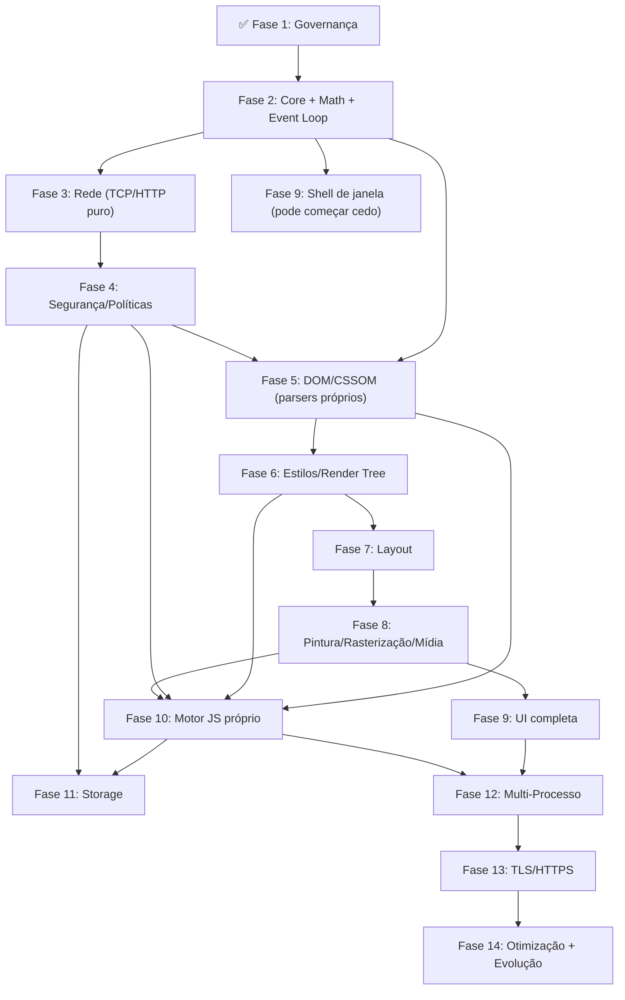

# 🗺️ Plano Mestre de Engenharia — ACE (Albedo Core Engine) & Browser

> **Versão:** 4.6 — *O Ecossistema Vivo*  
> **Última atualização:** 2026-08-10  
> **Propósito:** Roteiro exaustivo, técnico e imutável para a construção de um navegador web completo e soberano — 100% código próprio, sem uma única dependência externa.  
> **Filosofia:** O ACE (Albedo Core Engine) não usa bibliotecas. Cada parser, cada algoritmo de layout, cada decodificador de imagem, cada byte de criptografia, cada pixel rasterizado, **cada instrução de máquina emitida pelo JIT** é forjado internamente. A única concessão são os bindings brutos para chamadas de sistema (`libc` no Unix, `windows-sys` no Windows) — pois não há como falar com o kernel sem pedir permissão.

---

## Índice

1. [Constituição do Projeto — Regras de Ouro](#0-constituição-do-projeto--regras-de-ouro)
2. [Arquitetura e Nomenclatura — O Ecossistema ACE](#1-arquitetura-e-nomenclatura--o-ecossistema-ace)
3. [A Metodologia da Engenharia Tridimensional (3D)](#2-a-metodologia-da-engenharia-tridimensional-3d)
4. [Fases Detalhadas — Do Zero ao Infinito](#3-fases-detalhadas--do-zero-ao-infinito)
   - [Fase 1 — Fundação e Governança](#fase-1--fundação-e-governança-concluída)
   - [Fase 2 — Core Engine, Infraestrutura e Fundação Matemática](#fase-2--core-engine-infraestrutura-e-fundação-matemática)
   - [Fase 3 — Motor de Rede e Criptografia Base (TLS 1.3)](#fase-3--motor-de-rede-e-criptografia-base-tls-13)
   - [Fase 4 — Sandboxing Nativo e Políticas Web](#fase-4--sandboxing-nativo-e-políticas-web)
   - [Fase 5 — Parsing (DOM e CSSOM)](#fase-5--parsing-dom-e-cssom)
   - [Fase 6 — Render Tree e Motor de Estilos](#fase-6--render-tree-e-motor-de-estilos)
   - [Fase 7 — Motor de Layout (Geometry Engine)](#fase-7--motor-de-layout-geometry-engine)
   - [Fase 8 — Pintura, Rasterização e Tipografia Avançada (Baseline CPU → Futuro GPU)](#fase-8--pintura-rasterização-e-tipografia-avançada-baseline-cpu--futuro-gpu)
   - [Fase 9 — Janela Nativa e Interface do Browser (Browser Chrome)](#fase-9--janela-nativa-e-interface-do-browser-browser-chrome)
   - [Fase 10 — Motor JavaScript Próprio (ACE JS)](#fase-10--motor-javascript-próprio-ace-js)
   - [Fase 11 — Armazenamento e Persistência](#fase-11--armazenamento-e-persistência)
   - [Fase 12 — Arquitetura Multi-Processo e Isolamento](#fase-12--arquitetura-multi-processo-e-isolamento)
   - [Fase 13 — Web APIs Modernas e Suporte a SPAs](#fase-13--web-apis-modernas-e-suporte-a-spas)
   - [Fase 14 — Otimizações, Conformidade e Evolução](#fase-14--otimizações-conformidade-e-evolução)
5. [Dependências entre Fases (Visão 3D)](#4-dependências-entre-fases-visão-3d)
6. [Estratégia de Testes e Validação Tridimensional](#5-estratégia-de-testes-e-validação-tridimensional)
7. [Métricas e KPIs — O Termômetro do Projeto](#6-métricas-e-kpis--o-termômetro-do-projeto)
8. [Experiência do Desenvolvedor (DX)](#7-experiência-do-desenvolvedor-dx)
9. [Governança Contínua e ADRs](#8-governança-contínua-e-adrs)
10. [Riscos Globais e Mitigações — O Plano B](#9-riscos-globais-e-mitigações--o-plano-b)
11. [Próximos Passos Imediatos](#10-próximos-passos-imediatos)
12. [O Custo da Glória — Conclusão](#11-o-custo-da-glória--conclusão)

---

## 0. Constituição do Projeto — Regras de Ouro

**Regra 1 — Zero Dependências Externas.**  
A seção `[dependencies]` de qualquer `Cargo.toml` do workspace pode conter **apenas** bindings de syscall do SO. Nenhuma crate de terceiros — por mais "primitiva" que pareça — é permitida.

Lista de bloqueio permanente (exemplos, não exaustiva):
- **Async/Runtime:** `tokio`, `async-std`, `smol`, `rayon`
- **Serialização:** `serde`, `serde_json`, `bincode`, `protobuf`, `rmp`
- **Rede:** `reqwest`, `hyper`, `rustls`, `native-tls`, `hickory-dns`, `quinn`
- **Parsing Web:** `html5ever`, `cssparser`, `selectors`, `markup5ever`
- **GPU/Gráficos:** `wgpu`, `skia-safe`, `tiny-skia`, `vello`, `glutin`, `glow`
- **Tipografia:** `rustybuzz`, `harfrust`, `swash`, `fontdue`, `skrifa`, `parley`
- **Imagens:** `image`, `png`, `jpeg-decoder`, `resvg`
- **JavaScript e JIT:** `rusty_v8`, `boa_engine`, `rquickjs`, `deno_core`, **`cranelift`**, **`llvm`** (proibidos!)
- **Windowing:** `winit`, `glfw`, `sdl2`, `tao`
- **UI:** `egui`, `iced`, `druid`, `slint`
- **Erros/Logging:** `thiserror`, `anyhow`, `eyre`, `tracing`, `log`, `env_logger`
- **Utilitários:** `regex`, `url`, `encoding_rs`, `unicode-bidi`, `unicode-linebreak`
- **Navegadores/Webviews:** `wry`, `webview`, `cef`, `sciter-rs`, `ultralight-rs`

**Exceção única:** `libc` (Linux/macOS) e `windows-sys` (Windows) para chamadas de sistema brutas (criar janelas, sockets, threads de SO, etc.).

**Regra 2 — Tudo é do ACE.**  
Arquitetura, DOM, CSSOM, algoritmos de layout, pipeline de pintura, motor JavaScript, parser HTTP, decodificador de imagens, rasterizador de fontes, gerência de threads/processos, modelo de segurança, UI nativa e **compilador JIT** — **tudo é código próprio, sem exceção.** O JIT não utiliza LLVM, Cranelift ou qualquer biblioteca de geração de código; ele emite bytes de máquina (x86_64/ARM64) diretamente em buffers de memória executável.

**Regra 3 — Toda decisão arquitetural importante vira um ADR (Architecture Decision Record) versionado em `docs/adr/`.**

**Regra 4 — Checklist para qualquer código novo:**
- [ ] Usa apenas `std` e bindings de syscall aprovados?
- [ ] Tem testes unitários com cobertura mínima de 80% (linhas e branches)?
- [ ] Passa em `cargo clippy -- -D warnings` (sem exceções)?
- [ ] Está documentado com `///` doc comments (todos os itens públicos)?
- [ ] Inclui pelo menos um exemplo de uso (em doc-test ou em `examples/`)?
- [ ] Foi revisado por pelo menos um outro engenheiro do time?

---

## 1. Arquitetura e Nomenclatura — O Ecossistema ACE

O projeto é unificado sob o guarda-chuva **ACE (Albedo Core Engine)**. Todas as crates internas são prefixadas com `ace_`, refletindo a identidade única do motor.

A arquitetura segue uma pirâmide de camadas (visão vertical), onde cada camada depende apenas das imediatamente inferiores, garantindo baixo acoplamento e alta coesão.

**Camadas (de baixo para cima):**

| Camada | Crate | Responsabilidade |
|---|---|---|
| **Syscall Abstraction** | (embutido no `ace_core`/`ace_browser`) | Bindings brutos para `libc`/`windows-sys`. Isolamento das chamadas de sistema. |
| **Foundation** | `ace_core` | Tipos fundamentais (`AceError`, IDs), matemática vetorial (2D/3D), Event Loop, Thread Pool, Logging, Alocadores. |
| **Communication** | `ace_ipc` | Protocolo binário próprio, serialização, canais (pipes/sockets). |
| **Networking** | `ace_net` | DNS, HTTP/1.1, Pool de conexões, Cache, Resource Fetcher. |
| **Security** | `ace_core` + `ace_net` | URL parser, SOP, CORS, CSP, Cookie Jar. |
| **Parsing** | `ace_dom`, `ace_style` | Tokenizers e parsers HTML5/CSS3. |
| **Styling** | `ace_style` | Cascata, especificidade, valores computados, media queries. |
| **Layout** | `ace_layout` | Box Model, BFC, IFC, Flexbox, Positioning, Overflow. |
| **Media** | `ace_media` | Decodificadores PNG, BMP, JPEG, GIF, inflate/zlib próprio. |
| **Rendering** | `ace_render` | Rasterizador CPU, Frame Buffer, Tipografia (TrueType/OpenType), Efeitos. |
| **JavaScript** | `ace_js` | Lexer, Parser, Compilador AST→Bytecode, VM, Garbage Collector, **JIT próprio**. |
| **Persistence** | `ace_storage` | Cookie Jar persistente, LocalStorage, KV Store, Histórico. |
| **Application** | `ace_browser` | Binário final: janela nativa, chrome, abas, DevTools, integração de todas as crates. |

A comunicação entre camadas é feita via interfaces públicas bem definidas, com tipos de erro específicos (`AceError`) que encapsulam o contexto sem dependências externas.

---

## 2. A Metodologia da Engenharia Tridimensional (3D)

Para garantir que o plano seja 100% infalível, adotamos a **Metodologia 3D**, que observa o projeto sob três eixos ortogonais simultaneamente. Cada decisão, tarefa e validação é mapeada nestes três eixos:

- **Eixo X (Integração Horizontal — Camadas e Módulos):**  
  Representa a arquitetura em camadas (Syscall → Foundation → Serviços → UI). Define as interfaces (APIs) entre as crates. O sucesso aqui é medido pela pureza das fronteiras (ex: `ace_layout` não chama `ace_net` diretamente).

- **Eixo Y (Profundidade Vertical — Algoritmos e Complexidade):**  
  Representa a profundidade de implementação de cada componente. Por exemplo, o layout não é apenas "caixas empilhadas", mas envolve a implementação exata do algoritmo de resolução flexível do Flexbox (com suas 80 páginas de especificação). O sucesso aqui é a conformidade matemática com as especificações (WHATWG, W3C, ECMA).

- **Eixo Z (Horizonte Temporal — Fases e Iterações):**  
  Representa o cronograma de entregas (Fases 1 a 14). Cada fase não é linear, mas uma fatia que atravessa os eixos X e Y, entregando valor funcional (ex: na Fase 7, implementamos o Layout nos eixos X e Y, mas limitamos o escopo no eixo Z para o MVP).

**A Matriz 3D de Validação:**  
Para cada fase, definimos checkpoints que cruzam os três eixos:
- **Validação X:** Os módulos se comunicam corretamente? (Testes de integração)
- **Validação Y:** Os algoritmos estão corretos? (Testes de conformidade, fuzzing)
- **Validação Z:** Entregamos no prazo e com performance? (Benchmarks, KPIs)

---

## 3. Fases Detalhadas — Do Zero ao Infinito

### Fase 1 — Fundação e Governança ✅ (concluída)

Já entregue. Reforços pendentes (para garantir a aderência):
- [ ] **Estratégia de Pessoas:** Plano de retenção, mentoria e sucessão de engenheiros para mitigação de fator-ônibus (*Bus Factor*).
- [ ] **MVP Escopo Estrito (docs/mvp-scope.md):** Definição cirúrgica do que entra na v1.0. O que não for crítico será expurgado para "Pós-MVP".
- [ ] **SemVer e Ciclo de Releases:** Implementação de lançamentos mensais com Versionamento Semântico.
- [ ] **Comunidade e Segurança:** Criação de `CONTRIBUTING.md`, guia de estilo (`STYLEGUIDE.md`) e canal oficial de reporte de vulnerabilidades pré-lançamento (Bug Bounty planejado).
- [ ] `deny.toml` com bloqueio absoluto de todas as crates externas (usando `bans` e `sources`).
- [ ] Template de ADR em `docs/adr/0000-template.md` com seções: Contexto, Opções Consideradas, Decisão, Consequências, Referências.
- [ ] CI com `cargo clippy -- -D warnings` e `cargo test --workspace` como gates obrigatórios.
- [ ] Configuração de `rustfmt` com estilo consistente (ex: `edition = "2024"`, `max_width = 100`).
- [ ] Criação do `xtask` com subcomandos: `setup` (instala dependências de dev), `bench` (roda benchmarks), `doc` (gera documentação interna).

---

### Fase 2 — Core Engine, Infraestrutura e Fundação Matemática

**🎯 Objetivo:** Esqueleto do workspace + `ace_core` funcional + Event Loop + design do IPC + fundação matemática para todo o projeto.

**🔨 Construído do zero (tudo):**
- **Infraestrutura de Fuzzing de Grau de Produção:**
  - Configuração de `cargo-fuzz` (libFuzzer/afl) integrada. Manutenção de corpora inicial, minimização de entradas para reduzir o tempo de teste, e pipeline de triagem de crashes. Cobertura-guiada contínua.
- **Ferramentas de Perfilhamento de Memória (Profiling):**
  - Integração com `Heaptrack` (Linux) e `Windows Performance Toolkit` para detecção de vazamentos. Geração de *heap dumps* nativos para análise profunda de SPAs.
- **Hierarquia de `AceError`:** Enum com variantes ricas (`Io`, `Parse`, `Network`, `Security`, `Layout`, `Js`, `Crypto`, `Storage`) e contexto. Implementação manual de `std::fmt::Display` e `std::error::Error` (sem `thiserror`). Suporte a cadeia de causas (via `source()`).
- **IDs newtypes:** `TabId`, `RequestId`, `NodeId`, `ProcessId`, `CookieId`, `StorageKey` — todas com suporte a `Copy`, `Eq`, `Hash`, `Debug` e geração via contador atômico (`AtomicU64`).
- **Sistema de logging/telemetria interno:** Macros `ace_log!`, `ace_trace!`, `ace_debug!`, `ace_info!`, `ace_warn!`, `ace_error!` baseadas em `std::io::Write` para stdout/arquivo, com níveis e filtragem por crate (através de variável de ambiente `ACE_LOG`). Suporte a saída estruturada (JSON) para análise posterior.
- **Módulo de matemática e Tempo (`ace_core::math`, `ace_core::time`):** 
  - `Point<T>`, `Size<T>`, `Rect<T>` com operações de interseção, união, inflate, deflate, `contains`, `intersects`.
  - `Vec2<T>`, `Vec3<T>`, `Vec4<T>` com operações vetoriais (soma, subtração, produto escalar, produto vetorial, normalização, comprimento, distância).
  - `Matrix3x3<T>` para transformações 2D (translação, escala, rotação, cisalhamento) e `Matrix4x4<T>` para 3D (futuro, para WebGL/Canvas).
  - `Color` com representação RGBA (u8 ou f32) e HSLA, métodos de conversão, mistura (blend: `source-over`, `multiply`, `screen`), e manipulação de canais (escurecer, clarear).
  - **Relógio Virtual (Mock Clock):** Implementação de um temporizador determinístico injetável para testes que envolvem `setTimeout`, animações e ciclos do Event Loop, garantindo que testes complexos não sejam reféns da latência real da CPU.
  - Funções utilitárias: `lerp`, `clamp`, `min`, `max`, `abs`, `saturate`.
  - **Testes:** 100% de cobertura para todas as operações, incluindo casos extremos (overflow, NaN, subnormal), testados com propriedades (ex: associatividade da soma vetorial).
- **Sistema de Feature Flags (Cargo `[features]`):**
  - Implementação de flags condicionais de compilação para ativar/desativar módulos pesados em P&D ou ferramentas de depuração (ex: `debug-tools`, `experimental-http2`), garantindo builds mínimas e testes seletivos.
- **Thread Pool manual:** 
  - Estrutura `ThreadPool` com número fixo de workers (configurável via env `ACE_THREADS` ou padrão = número de CPUs lógicas).
  - Fila de trabalho (`Mutex<VecDeque<Job>>`) e `Condvar` para notificar workers.
  - `Job` é um `Box<dyn FnOnce() + Send + 'static>`.
  - Shutdown gracioso: `join` de todas as threads após drenar a fila (com timeout para forçar fechamento).
  - **Testes:** Criação de pool, envio de 10.000 jobs, término correto, stress com panics (capturar e propagar).
- **Multiplexador de I/O Assíncrono Nativo:**
  - O projeto rejeita dependências assíncronas (como `tokio` e `mio`), portanto construirá um multiplexador próprio para I/O não-bloqueante via chamadas diretas do sistema operacional: `epoll_create`/`epoll_ctl` (Linux), `CreateIoCompletionPort` (Windows) e `kqueue` (macOS).
- **Event Loop central (WHATWG-inspired):** 
  - Estrutura `EventLoop` que mantém filas de tarefas por fonte (`UserInteraction`, `Networking`, `Timer`, `Rendering`, `Microtask`).
  - Baseado no Multiplexador de I/O para gerenciar centenas de conexões de rede de forma simultânea (despertando threads apenas quando dados estiverem prontos no socket).
  - Algoritmo: para cada iteração, processar uma macrotask, depois todas as microtasks (até esvaziar), depois verificar se há necessidade de renderização (a cada ~16.6ms).
  - **Testes:** Verificar ordem de execução (microtasks antes de macrotasks), temporização (setTimeout vs setInterval), cancelamento de tarefas.
- **Protocolo IPC (design):** 
  - Envelope genérico `IpcMessage<M>` com campos: `version: u8`, `message_id: u64`, `correlation_id: Option<u64>`, `timestamp: u64`, `payload: M`.
  - Serialização binária manual: escrever campos em ordem fixa (big-endian) para garantir interoperabilidade entre arquiteturas.
  - Canais bidirecionais tipados: `IpcSender<T>` e `IpcReceiver<T>` que podem ser usados in-process (via `mpsc`) ou sobre pipes reais (Fase 12).
  - **Testes:** Serialização/deserialização de mensagens de exemplo, verificação de integridade (checksum simples), versionamento (compatibilidade entre versões).

**✅ Tarefas detalhadas:**
- [ ] Criar `Cargo.toml` root com `workspace`, `resolver = "2"`, `edition = "2024"`, definir as 13 crates (todas `ace_*`).
- [ ] Criar cada crate com `lib.rs`/`main.rs` stub, `Cargo.toml` com dependências internas.
- [ ] Implementar `AceError` com pelo menos 15 variantes, com contexto (ex: `Io { source: std::io::Error, path: PathBuf }`).
- [ ] Implementar IDs newtypes usando `struct Id(u64)` com geração via contador atômico (`AtomicU64`).
- [ ] Implementar módulo `math` com todos os tipos, com testes extensivos (incluindo propriedades como associatividade, comutatividade).
- [x] Implementar macros de logging: usar `std::fmt` para formatação, suporte a cores no terminal (ANSI).
- [x] Implementar `ThreadPool` com testes de stress (1000 jobs).
- [x] Implementar `EventLoop` com um exemplo simples: agendar uma tarefa, executar, e sair.
- [ ] Implementar `ace_ipc` com serialização binária e canais in-process.
- [ ] Escrever o `xtask setup` para instalar `cargo-fuzz`, `criterion`, `cargo-deny`, configurar hooks de pre-commit (via `pre-commit` ou script).
- [ ] Documentar cada item público com `///` e exemplos.

**🧪 Testes:** 
- Unit tests por crate (cada módulo).
- `cargo test --workspace` deve passar com cobertura ≥80%.
- Teste de integração do Event Loop com threads: agendar tarefas concorrentes e verificar ordem.

**🚩 Critério de Conclusão (DoD):** 
- `cargo build --workspace` e `cargo clippy -- -D warnings` verdes.
- Todas as 13 crates compilam.
- Event Loop despacha tarefas e mantém ordem.
- IPC in-process envia e recebe mensagens com serialização correta.
- Módulo de math tem 100% dos tipos com testes e documentação.

**⚠️ Risco:** 
- Over-engineering do IPC antes de saber quais mensagens existem → definir 3-5 mensagens de exemplo e iterar (ex: `Navigate`, `LoadResource`, `RenderFrame`, `MouseEvent`, `KeyEvent`).
- Dependência de `std::sync::mpsc` que pode não ser adequada para alto desempenho → avaliar se precisamos de um canal próprio baseado em `Mutex`/`Condvar` (deixar para a Fase 12).

---

### Fase 3 — Motor de Rede e Criptografia Base (TLS 1.3)

**🎯 Objetivo:** Buscar páginas da internet falando HTTP/1.1 diretamente nos sockets.

**🔨 Construído do zero (tudo):**
- **Resolução DNS própria:** 
  - Construir queries DNS tipo A (e AAAA) via `UdpSocket` na porta 53.
  - Parsear respostas DNS: header (ID, flags, QDCOUNT, ANCOUNT, NSCOUNT, ARCOUNT) + seção de perguntas + seção de respostas (registros `A`, `CNAME`, etc.).
  - Tratar timeouts (retry com backoff exponencial: 1s, 2s, 4s), CNAME chains (resolver recursivamente até obter um IP).
  - Cache de resoluções com TTL (respeitar o TTL do registro).
- **Parser HTTP/1.1 manual:** 
  - State machine com estados: `Method`, `Uri`, `Version`, `StatusCode`, `ReasonPhrase`, `HeaderName`, `HeaderValue`, `BodyChunkLength`, `BodyChunkData`, `BodyTrailer`.
  - Parseia status line (`HTTP/1.1 200 OK`), headers (case-insensitive, valores com espaços), e extrai body.
  - Suporte a `Connection: close` e `keep-alive`.
  - Detecção de fim de mensagem: quando `Content-Length` ou chunked termina, ou quando a conexão é fechada.
- **Gerador de requests HTTP:** 
  - Construir a string de request: `GET /path HTTP/1.1\r\nHost: host\r\nUser-Agent: ACE/0.1\r\nAccept: */*\r\nConnection: keep-alive\r\n\r\n`.
  - Suporte a métodos: `GET`, `POST`, `HEAD`, `OPTIONS` (para CORS preflight).
  - Tratamento nativo de `Retry-After` para lidar corretamente com contenções (respostas `429 Too Many Requests` e `503 Service Unavailable`).
  - Parsing da diretiva `Alt-Svc` (Alternative Services) para mapear rotas predatórias de HTTP/3 e QUIC para upgrades futuros.
- **Pool de conexões e Sockets Não-Bloqueantes:** 
  - Sockets devem obrigatoriamente operar de forma assíncrona (`O_NONBLOCK`) usando o Multiplexador de I/O (Fase 2).
  - Manter `TcpStream`s abertos para reutilização (HTTP keep-alive).
  - Limite de conexões paralelas para evitar esgotamento de recursos.
- **`ResourceFetcher` com fila de prioridade:** 
  - Prioridades: HTML (0), CSS/JS bloqueante (1), fontes (2), imagens (3), outros (4).
  - Fila baseada em `BinaryHeap` com prioridade (max-heap).
  - Suporte a cancelamento de requests (via `RequestId`).
  - Suporte a `defer` e `async` para scripts (baixa prioridade).
- **Cache HTTP em memória:** 
  - LRU cache com tamanho máximo configurável (ex: 50MB).
  - Respeitar `Cache-Control: max-age`, `no-cache`, `no-store`, `must-revalidate`, `private`, `public`.
  - Suporte a `ETag` e `Last-Modified` para validação (304 Not Modified).
  - Armazenar resposta completa (headers + body) com metadados.
- **Suporte a `data:` URIs:** 
  - Parsear `data:[<mediatype>][;base64],<data>`.
  - Decodificar base64 manualmente (sem crate, usando tabela de 64 caracteres).
  - Retornar o conteúdo como bytes com o MIME type correto.
- **Detecção de encoding:** 
  - Identificar charset via header HTTP `Content-Type` → BOM (`EF BB BF`) → `<meta charset>` → heurísticas (ex: análise de bytes para UTF-8 vs Latin-1, usando validação de sequências UTF-8).
  - Suporte mínimo: UTF-8, ASCII, Latin-1 (ISO-8859-1), UTF-16 (com BOM).
- **Redirecionamentos:** 
  - Seguir redirecionamentos 3xx (até 5 redirecionamentos).
  - Tratar loops de redirecionamento (detectar URL já visitada na cadeia).
  - Suporte a redirecionamentos relativos e absolutos.
- **Criptografia e TLS 1.3 (Antecipado da antiga Fase 13):** 
  - *Justificativa:* 99% da web é HTTPS. Sem TLS, não conseguimos testar o layout em sites reais.
  - TLS 1.3 Handshake (ClientHello, ServerHello, Certificate, Finished).
  - Criptografia própria: X25519 (Diffie-Hellman), AES-GCM, SHA-256/384, HKDF. **Obrigatório Execução em Tempo Constante (Constant-Time)**: Para prevenir *Timing Attacks*, os algoritmos matemáticos não podem apresentar branches dependentes de segredos nem acessar tabelas de forma variável em memória.
  - Testes matemáticos contínuos integrando os vetores do *Project Wycheproof*.
  - **Validação de Revogação:** Suporte a **OCSP Stapling** e validação básica de CRL. Obrigatoriedade de **Certificate Transparency (SCTs)** para confiar em certificados pós-2018.
  - **X.509 e ASN.1 Defensivo:** Parser manual para validação de certificados implementado estritamente como máquina de estados. Mínimo de `unsafe`, com verificação implacável no CI usando `Miri` e `AddressSanitizer`. **Alerta Crítico:** Erros de ASN.1 geram RCE. Uma auditoria externa (ou lib de fallback via ADR) será considerada antes do release.

**✅ Tarefas detalhadas:**
- [ ] Implementar resolvedor DNS: `DnsResolver` com `resolve(host: &str) -> Result<IpAddr>`.
- [ ] Implementar `HttpRequest` builder com métodos para adicionar headers.
- [ ] Implementar `HttpResponseParser` com testes unitários com respostas simuladas (incluindo chunked).
- [ ] Implementar suporte a `Transfer-Encoding: chunked` (parser de tamanhos hex).
- [ ] Implementar pool de conexões: `ConnectionPool` com `get(host: &str) -> Option<TcpStream>`.
- [ ] Implementar `ResourceFetcher` com fila de prioridade e threads (usando ThreadPool da Fase 2).
- [ ] Implementar cache LRU: `HttpCache` com `get(key)`, `put(key, response)`, `evict()`.
- [ ] Implementar parser e decoder de `data:` URIs.
- [ ] Implementar detecção de encoding (via inspeção de bytes e busca por `<meta charset>`).
- [ ] Implementar redirecionamentos (loop com contador).
- [ ] Testes de integração contra servidor HTTP local (escrito em Rust puro no `xtask`): servidor que responde com status, headers, chunked, etc.

**🧪 Testes:** 
- Unitários: parser de respostas com casos extremos (headers malformados, chunked incompleto, content-length incorreto).
- Integração: servidor mock que gera respostas com atrasos, redirecionamentos, erros (500, 404).
- Fuzzing: do parser HTTP (usando `cargo fuzz`).
- Benchmark: tempo de fetch de 1 HTML + 10 subrecursos.

**🚩 DoD:** 
- Buscar uma página HTML real (ex: `http://example.com`) via HTTP (não HTTPS ainda) e obter o conteúdo.
- Buscar subrecursos (CSS, imagens) concorrentemente com prioridade.
- Cache hit funciona (segunda request usa cache).
- DNS resolve nomes reais (ex: `google.com`).

**⚠️ Risco:** 
- DNS sobre UDP é complexo (timeouts, retries, CNAME chains). Implementar com testes de rede real.
- HTTP/2 e HTTP/3 ficam como backlog de longo prazo (Fase 14).
- O parser HTTP pode ser vulnerável a ataques de negação de serviço (fuzzing mitigará).

**📈 Performance Budget:**
- Fetch de 1 HTML + 10 subrecursos: < 500ms em rede local (com cache frio).
- Cache lookup: < 1ms por entrada.
- Resolução DNS: < 200ms (com cache).

---

### Fase 4 — Sandboxing Nativo e Políticas Web

**🎯 Objetivo:** Modelo de segurança que rede, DOM e JS precisam respeitar. Construído antes do DOM para não ser "adicionado depois".

**🔨 Construído do zero (tudo):**
- **Sandboxing Nativo (Antecipado e Restrito):** 
  - *Justificativa:* Como todos os parsers (HTML, Imagens, ASN.1) são "feitos em casa", eles estarão cheios de bugs iniciais. O sandbox impede comprometimento do SO.
  - Integração profunda com `seccomp-bpf` (Linux) e `Job Objects` / `AppContainer` (Windows). No caso do Windows, imporemos **restrição absoluta de File System** usando SID Isolation.
  - **Política de Allowlist Estrita Automática (seccomp):** Todas as syscalls são bloqueadas por padrão. A lista de chamadas permitidas será gerada dinamicamente via testes que gravam perfis de `strace`, automatizando a libseccomp e eliminando adivinhação.
  - Restrição absoluta de leitura/escrita no File System para os processos de parsing/renderização.
- **Same-Origin Policy (SOP):** 
  - Struct `Origin` com `scheme` (String), `host` (String), `port` (u16).
  - Comparações: `same_origin` (scheme + host + port), `same_site` (scheme + host + port, ignorando subdomínios? Não, definição rigorosa), `cross_origin`.
  - Origin para `data:` URIs é `null`.
- **CORS (Cross-Origin Resource Sharing):** 
  - Validação de preflight requests (OPTIONS) para requests não-simples.
  - Headers permitidos: `Access-Control-Allow-Origin`, `Access-Control-Allow-Methods`, `Access-Control-Allow-Headers`, `Access-Control-Allow-Credentials`, `Access-Control-Max-Age`.
  - Simple requests: GET, HEAD, POST com certos content-types.
  - Tratar credenciais (cookies) em requests cross-origin.
- **CSP (Content Security Policy):** 
  - Parser de diretivas: `default-src`, `script-src`, `style-src`, `img-src`, `connect-src`, `font-src`, `object-src`, `frame-src`, `manifest-src`, `worker-src`, `base-uri`, `form-action`, `frame-ancestors`, `report-uri`, etc.
  - Suporte a `'self'`, `'none'`, `'unsafe-inline'`, `'unsafe-eval'`, `'strict-dynamic'`, `nonce-*`, `sha256-*`.
  - Enforcer: verificar se um recurso (URL, inline script, eval) é permitido pela política.
  - Reporte de violações (para console/log e, futuramente, para um endpoint de reporte).
- **Cookie Jar:** 
  - Armazenamento em memória com persistência futura (Fase 11).
  - Parsing de `Set-Cookie` header: atributos `Domain`, `Path`, `Secure`, `HttpOnly`, `SameSite` (Strict, Lax, None), `Max-Age`, `Expires`, `Priority`.
  - Matching de cookies para requests: enviar apenas cookies que correspondem ao domínio, path, scheme, e política SameSite.
  - Respeitar `HttpOnly` (não acessível via JS).
- **Referrer Policy:** 
  - Regras de quando enviar/omitir `Referer`: `no-referrer`, `same-origin`, `strict-origin`, `strict-origin-when-cross-origin`, `unsafe-url`.
  - Implementar lógica de redução (ex: remover path quando cross-origin).
- **Parser de URL próprio (WHATWG-compliant):** 
  - Suporte a `http:`, `https:`, `data:`, `javascript:`, `blob:`, `about:blank`, `ws:`, `wss:`.
  - IDN/punycode básico (conversão de Unicode para ASCII usando algoritmo Punycode próprio).
  - Resolução de URLs relativas (base URL + relativa).
  - Tratar edge cases: `///`, `http:?query`, `http://?query` (comportamento conforme spec).

**✅ Tarefas detalhadas:**
- [ ] Implementar parser de URL: `Url::parse(input: &str) -> Result<Url>` com campos: scheme, username, password, host, port, path, query, fragment.
- [ ] Struct `Origin` com `new(url: &Url)` e métodos de comparação.
- [ ] Algoritmo CORS: `cors_check(request, response) -> bool`.
- [ ] Parser de CSP: `CspPolicy::parse(header: &str) -> CspPolicy`.
- [ ] Enforcer: `csp_allows(policy, resource_type, url) -> bool`.
- [ ] Cookie jar: `CookieJar` com `add_cookie(header, url)`, `get_cookies(url)`, `remove_expired()`.
- [ ] Referrer policy: `ReferrerPolicy::from_header(header)` e `compute_referrer(policy, current_url, target_url) -> Option<String>`.
- [ ] Fuzzing do parser de URL e do parser de CSP.
- [ ] Testes de fronteira: origens com portas diferentes, `null` origins, `data:` URIs.

**🧪 Testes:** 
- Unitários para cada política.
- Integração: simular requests cross-origin com/sem CORS headers.
- Fuzzing: parser de URL, parser de CSP.
- Testes de cookie matching com domínios e paths.

**🚩 DoD:** 
- Request cross-origin bloqueada sem CORS headers; permitida com headers corretos.
- CSP bloqueia `<script>` inline se `script-src` não permitir.
- Cookies `HttpOnly` não vazam para JS (quando JS estiver presente).

---

### Fase 5 — Parsing (DOM e CSSOM)

**🎯 Objetivo:** Stream de bytes → Árvore DOM; stylesheet → CSSOM. Tudo do zero, sem `html5ever` ou `cssparser`.

**🔨 Construído do zero (tudo):**
- **Tokenizer HTML5 próprio:** 
  - State machine com 80+ estados conforme a especificação WHATWG (Data state, Tag Open, Tag Name, Before Attribute Name, Attribute Name, After Attribute Name, Before Attribute Value, Attribute Value (double-quoted, single-quoted, unquoted), Self-Closing Start Tag, End Tag Open, etc.).
  - Suporte a entidades de caracteres: `&amp;`, `&#x27;`, `&#x2022;`, `&nbsp;`, etc. (tabela de ~2000 named entities gerada a partir da especificação).
  - Tratamento de erros (ex: tags malformadas) com recuperação (inserir caracteres faltantes, fechar tags abertas).
  - Suporte a DOCTYPE (com parsing de Public ID, System ID).
- **Speculative Parser / Preload Scanner:** 
  - Uma thread secundária que lê os bytes brutos da rede de forma independente (à frente do Tree Builder), varrendo o stream apenas em busca de tags críticas (`<script>`, ``, `<link>`). Inicia os downloads em background antes mesmo da construção da árvore DOM chegar nesses nós, resolvendo o gargalo de bloqueio de I/O de HTML.
  - **Sensibilidade de Encoding:** Opera com heurística de detecção via BOM (`EF BB BF`). Se houver falha na adivinhação do encoding (ex: `<meta charset="Shift_JIS">` descoberto tardiamente), o scanner aborta e reinicia no encoding correto.
- **WPT Runner (`ace_test_driver`):**
  - Harness (mini-servidor/devtools wrapper) acoplado para automatizar a execução do Web Platform Tests (WPT). Para o MVP, adotaremos uma **abstração In-Memory**, executando um subconjunto focado estritamente em DOM/Estilos (sem o overhead de um driver WebDriver/HTTP completo). Não há conformidade sem este runner desde o dia 1.
- **Tree Builder HTML5 próprio:** 
  - Insertion modes: Initial, BeforeHtml, BeforeHead, InHead, InHeadNoscript, AfterHead, InBody, InTable, InTableBody, InRow, InCell, InCaption, InSelect, InSelectInTable, AfterBody, InFrameset, AfterAfterBody, AfterAfterFrameset.
  - Foster parenting (quando um nó é inserido em um local errado, ele é "adotado" pelo elemento mais próximo).
  - **Adoption Agency Algorithm (AAA):** O Colosso do parser HTML. Dada a complexidade quadrática (O(n²)) e *active formatting elements*, o AAA ganhará uma sub-fase dedicada de 4 semanas, com garantia estrita do limite de 8 iterações no loop externo (prevenindo DOS) e bateria exaustiva contra os testes `html5lib`.
  - Reconstruct active formatting elements (quando um elemento formatador é encontrado, ele é reconstruído).
  - Suporte a elementos implícitos (html, head, body) quando ausentes.
  - Tratamento estrito do atributo `srcdoc` para renderização imediata de conteúdo em iframes sem dependência de rede.
  - **Fundações para Web Components (Pós-MVP):** O parsing já considerará desde cedo as abstrações espaciais requeridas para `<template>`, `<slot>` e o conceito estrutural da *Shadow DOM* para não exigir uma reescrita do parser na Fase 14.
- **Arena de nós DOM (Heap Unificado JS ↔ DOM):** 
  - Substitui o conceito de referências fortes por um modelo de **Memória Unificada e Coleta de Ciclos (Cycle Collection)**, semelhante ao *Oilpan* (usado pelo Blink).
  - Essencial para impedir vazamentos de memória massivos (ex: um Objeto JS aponta para um DOM Node que tem um Event Listener que aponta de volta para o JS).
  - A Arena DOM se comunica nativamente com o GC do JS (Fase 10) para varrer e quebrar grafos cíclicos entre o layout C++(Rust) e o runtime JavaScript.
- **Web APIs Essenciais (MVP de SPAs):**
  - Implementação inicial da `Fetch API` (conectada ao motor de rede).
  - `MutationObserver` e `IntersectionObserver` (fundamentais para React/Vue/Angular não quebrarem).
- **APIs de manipulação DOM em Rust:** 
  - `create_element(tag)`, `create_text_node(data)`, `create_comment(data)`, `create_document_fragment()`.
  - `append_child(parent, child)`, `remove_child(parent, child)`, `insert_before(parent, new, ref)`, `replace_child(parent, new, old)`.
  - `set_attribute(element, name, value)`, `get_attribute(element, name)`, `remove_attribute`.
  - `get_element_by_id`, `get_elements_by_class_name`, `get_elements_by_tag_name`.
  - `query_selector`, `query_selector_all` (matching de seletores, usando `ace_style`).
  - `inner_html`, `outer_html`, `text_content` (serialização e parsing).
- **Lexer CSS próprio:** 
  - Tokenização conforme CSS Syntax Module Level 3 (ident, function, at-keyword, hash, string, number, dimension, percentage, url, unicode-range, etc.).
  - Suporte a comentários `/* */` e escapes (ex: `\26`).
- **Parser CSS próprio:** 
  - Transformar tokens em regras: `QualifiedRule` (seletor + declarações) e `AtRule` (`@media`, `@import`, `@font-face`, `@keyframes`, `@supports`).
  - Parsear seletores: type, class, id, attribute (`[attr]`, `[attr=value]`, `[attr^=value]`, `[attr$=value]`, `[attr*=value]`), pseudo-class (`:hover`, `:nth-child`), pseudo-element (`::before`, `::after`), combinators (descendant ` `, child `>`, adjacent sibling `+`, general sibling `~`).
  - Parsear declarações: `property: value` com valor tipado (ex: `Length`, `Color`, `Keyword`, `Url`, `Number`, `Percentage`, `Angle`, `Time`).
- **CSSOM:** 
  - Estruturas: `Stylesheet` (origem, rules), `CssRule` (enum: Style, Media, Import, FontFace, Keyframes, etc.), `StyleRule` (selector + declarations), `Declaration` (property, value, important, line/column para debug).
- **Matching de seletores próprio:** 
  - Algoritmo right-to-left para eficiência (começa pelo seletor mais à direita e vai subindo na árvore).
  - Suporte a combinadores e pseudo-classes simples (estado).

**✅ Tarefas detalhadas:**
- [ ] Implementar HTML Tokenizer com estados principais e testes com strings HTML (incluindo casos de erro).
- [ ] Implementar entity reference decoder (tabela de ~2000 entidades).
- [ ] Implementar Tree Builder com insertion modes principais (pelo menos 15 modos para MVP).
- [ ] Implementar Arena de nós com índices geracionais e métodos seguros.
- [ ] Implementar APIs de manipulação DOM com testes de mutação (append, remove, insert).
- [ ] Implementar CSS Lexer com testes de tokenização (incluindo tokens inválidos).
- [ ] Implementar CSS Parser com regras, seletores, declarações.
- [ ] Implementar CSSOM structs e serialização (para debug).
- [ ] Implementar matching de seletores (com testes de casos comuns e edge cases).
- [ ] Fuzzing do tokenizer HTML e do lexer CSS.

**🧪 Testes:** 
- Snapshot tests: parsear HTML de exemplo e comparar árvore DOM serializada (em formato JSON próprio).
- Testes de encoding: BOM, meta charset, detecção heurística.
- Fuzzing contínuo dos parsers.
- Testes de matching de seletores com árvores DOM construídas.

**🚩 DoD:** 
- Parsear uma página real (ex: artigo simples da Wikipedia) em árvore DOM correta.
- Parsear CSS real (ex: folha de estilo de um site) sem panics.
- Detectar encoding em UTF-8, Latin-1, e via meta tag.

**⚠️ Risco:** 
- O tree builder do HTML5 tem complexidade absurda (adoption agency algorithm, foster parenting). Reserve o dobro do tempo estimado.
- A tabela de entidades HTML é enorme; gerar a partir de dados da especificação.

**📈 Performance Budget:**
- Parse de 1MB de HTML: < 200ms.
- Árvore DOM de 10k nós: < 50MB de RAM.
- Mutação de nó (appendChild): < 1ms.

---

### Fase 6 — Render Tree e Motor de Estilos

**🎯 Objetivo:** Aplicar CSSOM ao DOM (cascata) e construir a Render Tree.

**🔨 Construído do zero (tudo):**
- **Algoritmo de cascata próprio:** 
  - Prioridade por origem: user-agent (estilos do navegador) → author (site) → inline (`style` attribute).
  - Importância: `!important` reverte a ordem (origem author com !important > user-agent com !important > author normal > user-agent normal).
  - Especificidade: Struct `Specificity(u32, u32, u32)` (a, b, c) com comparador lexicográfico (a = #id, b = .class, c = tag).
  - Ordem de aparição (última declaração ganha, respeitando a ordem na folha de estilo).
- **Herança de propriedades:** 
  - Tabela de quais propriedades são herdadas (ex: `color`, `font-size`, `line-height`) vs não (ex: `border`, `margin`, `background`).
  - Valores `inherit`, `initial`, `unset` (com lógica de fallback).
- **Valores computados:** 
  - Resolução de unidades relativas: `em` (base no font-size do pai), `rem` (base no font-size do elemento raiz), `%` (base no pai para largura/altura, ou no próprio elemento para font-size), `vw`, `vh` (base no viewport), `vmin`, `vmax`.
  - Cálculo de comprimentos: `px`, `pt` (1pt = 1/72in, convertido para px via DPI), `pc`, `in`, `cm`, `mm`.
- **Pseudo-classes de estado:** 
  - `:hover`, `:focus`, `:active`, `:visited`, `:link`, `:first-child`, `:last-child`, `:nth-child()`, `:nth-of-type()`, `:empty`, `:not()`, `:root`.
  - Atualização dinâmica via eventos (mouseover, focus, blur).
- **Pseudo-elementos:** 
  - `::before`, `::after` como nós na Render Tree, com conteúdo textual (`content: "..."` ou `content: attr(href)`) ou imagem (`content: url(...)`).
  - Estilização separada (podem ter próprias propriedades de layout).
- **Construção da Render Tree:** 
  - Poda de nós invisíveis: `<head>`, `<script>`, `display: none`, `visibility: hidden`.
  - Geração de anonymous boxes para texto inline dentro de block containers (ex: `
texto
` gera um anonymous inline box para "texto").
  - Cada nó da Render Tree contém: nó DOM associado (ou anônimo), estilo computado (herdado + específico), e flags (ex: `needs_layout`, `needs_paint`).
- **Acessibilidade na Fundação (Accessibility Tree):**
  - Construída em paralelo e de forma síncrona à Render Tree.
  - **Mapeamento de Estados e ARIA:** Tradução estrita de papéis ARIA (ex: `role="button"`) para roles nativas (ex: `ROLE_SYSTEM_PUSHBUTTON`) e disparo de eventos (ex: `EVENT_OBJECT_STATECHANGE` ao alterar `aria-checked`). Mapeamento nativo para APIs do sistema (MSAA/UIA no Windows, ATK no Linux). Isso evita ter que refazer todo o layout no final do projeto para adicionar suporte a leitores de tela.
- **Media queries e Feature Queries:** 
  - Suporte a `@media screen`, `@media print`, `@media (max-width: ...)`, `@media (prefers-color-scheme: dark)`.
  - Suporte a `@supports` (Feature Queries) para detecção progressiva de funcionalidades.
  - Avaliar com base nas dimensões atuais da viewport e preferências do sistema (obtidas via API do SO).
- **Variáveis e Camadas (CSS Avançado MVP):**
  - Resolução dinâmica de *CSS Custom Properties* (`var(--theme-color)`) durante a cascata.
  - Suporte ao `@layer` para controle rigoroso de especificidade e reset de estilos.
- **Invalidação de estilo:** 
  - Restyle completo "força bruta" como v1 (recalcular todos os estilos quando qualquer mudança).
  - Otimização incremental em fases futuras (marcar subárvores sujas via dirty flags, usando o algoritmo de "style invalidator").

**Conjunto MVP de propriedades CSS suportadas (lista expansiva):**
`display` (block, inline, inline-block, flex, none, contents) | `position` (static, relative, absolute, fixed, sticky) | `margin` (top, right, bottom, left, auto) | `padding` | `border` (width, style, color, radius, top/right/bottom/left) | `width`, `height`, `min-*`, `max-*` | `color` | `background-color`, `background-image` (url) | `font-family`, `font-size`, `font-weight`, `font-style`, `font-stretch` | `text-align`, `text-decoration` (underline, line-through, overline), `text-transform` | `line-height`, `letter-spacing`, `word-spacing` | `overflow` (visible, hidden, scroll, auto) | `opacity` | `z-index` | `flex-direction`, `justify-content`, `align-items`, `flex-wrap`, `flex-grow`, `flex-shrink`, `flex-basis`, `align-self` | `border-radius` (top-left, etc.) | `box-shadow` | `transform` (translate, scale, rotate, matrix) | `cursor` | `visibility` | `white-space` | `vertical-align`.

**✅ Tarefas detalhadas:**
- [ ] Implementar `Specificity` com cálculo baseado em seletor.
- [ ] Implementar cascata: `cascade(dom_node, parent_computed_style, user_agent_stylesheet, author_stylesheets) -> ComputedStyle`.
- [ ] Tabela de herança (mapa de propriedade → bool).
- [ ] Resolução de valores computados: `resolve_value(declared_value, context) -> ComputedValue`.
- [ ] Pseudo-classes: detectar estado a partir do DOM e eventos (ex: hover via mouse tracking).
- [ ] Pseudo-elementos: criar nós de renderização adicionais.
- [ ] Construção da Render Tree: `build_render_tree(dom_root, styles) -> RenderTree`.
- [ ] Media queries: avaliar `@media` com base na viewport.
- [ ] Invalidação: `mark_dirty(node)` e `recompute_styles()`.
- [ ] Testes de cascata com matriz (inline > id > class > tag).

**🧪 Testes:** 
- Matriz de cascata com combinações de especificidade.
- Testes de valor computado por propriedade (ex: `font-size: 2em` em contexto).
- Testes de media query com viewport simulado.
- Testes de pseudo-classes (hover, focus).

**🚩 DoD:** 
- Dado DOM+CSSOM, produzir árvore de nós estilizados com valores computados corretos, conferida manualmente contra DevTools de um browser de referência (ex: Firefox/Chrome).
- Pseudo-elementos `::before` e `::after` são inseridos.

---

### Fase 7 — Motor de Layout (Geometry Engine)

**🎯 Objetivo:** Geometria (X, Y, largura, altura) de cada caixa na tela. Tudo calculado pelo ACE.

**🔨 Construído do zero (tudo, sem `taffy` ou `glam`):**
- **Box Model completo:** content → padding → border → margin, com margin collapsing (15+ edge cases entre irmãos e entre pai/filho, incluindo margens negativas).
- **Block Formatting Context (BFC):** Empilhamento vertical (margens colapsam), preenchimento horizontal (width/height automáticos), floats (posicionamento à esquerda/direita com wrap de texto), clear.
- **Inline Formatting Context (IFC):** Line boxes, baseline alignment (alinhamento vertical de inline-blocks), wrapping de texto (quebra de linha em espaços), alinhamento horizontal (`text-align: left/center/right/justify`).
- **CSS Grid (Elevado para o MVP):** Algoritmo básico de tracks (rows/columns) e posicionamento explícito. Sem Grid, a maioria dos layouts modernos colapsa. Suporte imediato a `minmax()`.
- **Sizing Intrínseco e Matemática CSS:**
  - Resolução algébrica imperativa da função `calc()` (adição, subtração, multiplicação, divisão).
  - Suporte aos keywords complexos de sizing: `min-content`, `max-content` e `fit-content` para dimensões horizontais e verticais.
- **Flexbox:** Eixo principal/cruzado, grow/shrink/basis, wrap, alignment (`justify-content`, `align-items`, `align-content`, `align-self`). Implementação completa do algoritmo de resolução de flexíveis (especificação W3C).
- **Positioning:** `relative` (deslocamento sem afetar o fluxo), `absolute` (em relação ao ancestral posicionado mais próximo), `fixed` (em relação à viewport), `sticky` (híbrido entre relative e fixed).
- **Overflow:** `scroll`/`auto`/`hidden` e cálculo de scroll regions (largura/altura do conteúdo vs container). Criação de áreas de scroll com barras de rolagem nativas (desenhadas pelo renderer).
- **Margin collapsing:** Regras completas: irmãos adjacentes, pai e primeiro filho, pai e último filho, colapso de margens negativas (soma algébrica), colapso de margens de floats.

#### Sub-milestones da Fase 7

| Sub-milestone | Escopo | Risco | Prazo estimado |
|---|---|---|---|
| **v7.0 — MVP** | Block layout (empilhamento vertical + preenchimento horizontal) + Box model sem margin collapsing | Baixo | 2 semanas |
| **v7.1 — Inline básico** | Inline layout LTR/Latim com stub de medição de texto (usando fonte monospace) + line boxes + baseline | Médio | 3 semanas |
| **v7.2 — Positioning** | `position: relative/absolute/fixed/sticky` + `overflow` + scroll | Médio | 2 semanas |
| **v7.3 — Margin collapsing** | Todos os 15+ edge cases da spec | Alto | 3 semanas |
| **v7.4 — Flexbox** | Algoritmo completo (eixo principal/cruzado, grow/shrink, wrap, alignment). Validação massiva via suíte do WebKit. | Extremo | 12 semanas |
| **v7.5 — Paralelismo** | Thread Pool manual para subárvores independentes (ex: diferentes iframes) | Médio | 2 semanas |

**✅ Tarefas detalhadas:**
- [ ] v7.0: `LayoutBox` com content, padding, border, margin; `layout_block(node, constraints) -> Rect`.
- [ ] v7.1: `layout_inline(node, constraints)` gerando line boxes; stub de text measurement (largura = número de caracteres * largura_fonte).
- [ ] v7.2: Implementar `position: relative` (offset), `absolute` (ancestral), `fixed` (viewport), `sticky` (com scroll).
- [ ] v7.3: Implementar margin collapsing com todas as regras (testes com exemplos da spec).
- [ ] v7.4: Implementar Flexbox conforme especificação (algoritmo de resolução de espaço).
- [ ] v7.5: Paralelizar layout de subárvores usando ThreadPool (cada subárvore pode ser layoutada em paralelo se não houver dependências).
- [ ] Testes: golden tests com entrada DOM+estilos → saída esperada de coordenadas.

**🧪 Testes:** 
- Golden tests (arquivos JSON com entrada e saída esperada).
- Benchmarks com árvores de 10 a 10.000 nós.
- Testes de regressão visual (renderizar layout e comparar com referência).

**🚩 DoD por sub-milestone:** Posições calculadas batem com o esperado, tolerância ±1px.

**📈 Performance Budget:**
- Layout de 1.000 nós: < 50ms.
- Layout incremental (1 nó mudou): < 5ms.

---

### Fase 8 — Pintura, Rasterização e Tipografia Avançada (Baseline CPU → Futuro GPU)

**🎯 Objetivo:** Converter Render Tree + geometria em pixels visíveis na tela. Tudo na CPU, sem GPU, sem Skia, sem wgpu.

- **Evolução de Rendering (CPU vs GPU):**
  - O MVP começa com Software Rasterizer (CPU) por pragmatismo de zero dependências.
  - *Choque de Realidade:* A web moderna (animações CSS, transformações 3D) é impossível a 60 FPS apenas na CPU. O plano arquitetural deve prever o *Compositing* via GPU (Vulkan/Metal via syscalls locais) logo após o MVP.

**🔨 Construído do zero (tudo):**
- **Frame Buffer:** `Vec<u32>` representando pixels ARGB na memória (ordem little-endian, canal A no byte mais significativo). Acesso rápido via índice `x + y * width`.
- **Rasterizador de primitivas:** 
  - Retângulos preenchidos (com bordas e preenchimento, suporte a gradientes? Apenas cores sólidas no MVP).
  - Linhas (algoritmo de Bresenham para linhas finas, com antialiasing opcional).
  - Retângulos com cantos arredondados (`border-radius`) usando subdivisão ou aproximação por arcos de elipse.
  - Círculos/elipses (algoritmo de midpoint).
  - Polígonos e Curvas (Bézier quadráticas/cúbicas) via scanline fill, com rasterizador reutilizável projetado estruturalmente para atender tanto glifos quanto futuras APIs de **SVG e Canvas 2D**.
- **Anti-aliasing:** Supersampling (2x ou 4x) ou coverage-based anti-aliasing (usando subpixel masks) para bordas suaves.
- **Efeitos Visuais e Blending:** 
  - Suporte a `opacity` (alpha blending), composição Porter-Duff (source-over, destination-over).
  - Implementação avançada de `mix-blend-mode` para elementos sobrepostos.
  - Box-shadow (blur gaussiano separável) e `filter: drop-shadow()` e `blur()`.
  - Tipografia artística: `text-shadow` e `text-stroke`.
- **Transform:** Translação, escala, rotação, cisalhamento via multiplicação de matrizes (módulo math da Fase 2). Aplicado a comandos de pintura via transformação de coordenadas.
- **Display List (Layer Tree & Compositing Ready):** Lista intermediária organizada em **Camadas (Layers)** separadas (geradas via CSS `transform`, `opacity` ou `will-change`). Ao migrar para GPU no futuro, o Compositor rasterizará e blendeará as camadas independentemente em VRAM. Cada comando é uma enumeração com parâmetros (retângulo, cor, textura, transformação, clipping).
  - Comandos: `FillRect`, `FillPath`, `DrawText`, `DrawImage`, `DrawShadow`, `PushClip`, `PopClip`, `Transform`.
- **Parser de fontes TrueType/OpenType (.ttf/.otf):**
  - Ler tabelas: `cmap` (formato 4, 12), `glyf` (contornos), `loca` (índices), `head` (unidades por em), `hhea`/`hmtx` (métricas horizontais), `maxp` (número de glifos), `name` (nome da fonte), `OS/2` (peso, panose), `kern` (kerning, opcional).
  - Decodificar contornos de glifos: pontos on-curve e off-curve, curvas de Bézier quadráticas (TrueType) ou cúbicas (OpenType CFF) — converter curvas cúbicas em quadráticas ou lineares para simplificar.
  - Rasterizar glifos em bitmaps via scanline fill das curvas (usando o rasterizador de polígonos).
  - **Atlas de glifos:** Cache de glifos rasterizados em uma textura (matriz de pixels) com LRU, para reutilização.
  - **Text Shaping e Emojis ZWJ (Dilema FFI):** Para o MVP, construiremos um Shaper próprio simplificado (focado em Latin e fallback básico). Contudo, a complexidade insana do HarfBuzz (GSUB/GPOS/Scripts complexos como Árabe) exigirá um **ADR Crítico** pós-MVP para decidir se o projeto quebra a regra de *Zero Dependências* e incorpora o HarfBuzz em C via FFI, ou se tenta o impossível.
  - **UCD e Quebra de Linha (UAX #14):** Integração profunda com o Unicode Character Database. O layout não pode apenas quebrar espaços para idiomas como Chinês e Japonês; deve implementar o *Line Breaking Algorithm* completo (UAX #14) para evitar overflow e quebras no meio de palavras CJK.
  - **Font fallback (FOIT vs FOUT):** Timeout de 3 segundos no bloqueio de rede para carregar Web Fonts. Caso estoure, implementa FOUT (Flash of Unstyled Text) exibindo o texto com uma fonte embutida padrão e re-renderizando assim que o download finalizar.
  - **Kerning:** Aplicar kerning entre pares de glifos (usando tabela `kern` ou GPOS).
- **Decodificador PNG próprio:**
  - Parser de chunks: IHDR, PLTE, IDAT, IEND.
  - Implementação de inflate/deflate (zlib) do zero.
  - **Decodificação Assíncrona e Lazy Load:** Imagens não bloquearão a pintura da *Render Tree*. A decodificação ocorrerá em threads separadas (Worker Pool). Suporte estrito ao atributo `loading="lazy"` para deferir requisições de rede.
  - Suporte a paletas (color type 3), grayscale (0, 4), RGB (2, 6), RGBA (6). A exibição final implementará `object-fit` (cover/contain) e `object-position`.
- **Decodificador BMP/ICO próprio:** Parser de headers (BITMAPFILEHEADER, BITMAPINFOHEADER) e pixel data (com suporte a compressão RLE, bitfields).
- **Decodificador JPEG próprio (stretch goal):** Huffman decode + IDCT (Inverse Discrete Cosine Transform) — extremamente complexo, provavelmente postergado para Fase 14.
- **Scroll composto:** Otimizar scroll movendo o buffer (blit) em vez de repintar tudo, usando `memcpy` para deslocar o conteúdo existente e pintar apenas a nova região exposta.

#### Sub-milestones da Fase 8

| Sub-milestone | Escopo | Risco | Prazo estimado |
|---|---|---|---|
| **v8.0 — MVP** | Retângulos coloridos + texto simples LTR/Latim (fonte monospace fixa) + display list | Médio | 3 semanas |
| **v8.1 — Tipografia** | Parser TrueType completo + rasterização de glifos + atlas + font fallback básico | Muito Alto | 6 semanas |
| **v8.2 — Imagens** | Decodificador PNG (inflate próprio!) + BMP + pipeline de exibição | Alto | 4 semanas |
| **v8.3 — Efeitos visuais** | `border-radius`, `box-shadow`, `opacity`, `transform`, anti-aliasing | Médio | 3 semanas |
| **v8.4 — Scroll** | Scroll regions + scroll otimizado (buffer offset) | Médio | 2 semanas |
| **v8.5 — Texto avançado (pós-MVP)** | Bidi (RTL), CJK, emojis, font fallback multi-script | Extremo | (pós-MVP) |

**✅ Tarefas detalhadas:**
- [ ] v8.0: Frame Buffer (`Framebuffer` struct com `pixels: Vec<u32>`, largura, altura). Rasterizador de retângulos. Display list (`PaintCommand` enum). Pintor que itera sobre a display list.
- [ ] v8.1: Parser de tabelas TrueType: abrir arquivo .ttf, ler tabelas, decodificar curvas. Rasterizador de glifos (scanline). Atlas de glifos (LRU cache). Font fallback (se glifo não encontrado, usar fonte padrão).
- [ ] v8.2: Implementar inflate/deflate do zero (usando código Huffman fixo e dinâmico). Decodificador PNG completo com filtros. Integrar com o pipeline: quando encontrar ``, carregar e decodificar.
- [ ] v8.3: `border-radius` usando clipping de retângulo com cantos arredondados. `box-shadow` com blur gaussiano (2 passes). `opacity` aplicada a toda subárvore (composição). `transform` usando matrizes. Anti-aliasing (supersampling em bordas).
- [ ] v8.4: Scroll regions: detectar overflow, criar área de scroll, e ao rolar, deslocar o buffer (blit) e pintar a nova área.
- [ ] Fuzzing de todos os decodificadores de imagem (PNG, BMP) com imagens corrompidas.

**🧪 Testes:** 
- Regressão visual: renderizar uma página conhecida e comparar com imagem de referência (usando biblioteca de diferença de pixels própria).
- Benchmark de FPS: renderizar 60 frames por segundo.
- Testes de robustez com imagens corrompidas (não deve panicar).

**🚩 DoD (MVP):** Renderizar uma página com texto, cores, bordas, imagens PNG, e scroll funcional. FPS estável (≥30 fps para páginas simples).

**⚠️ Risco Crítico:** Implementar inflate/deflate (zlib) do zero é um projeto em si. O parser de TrueType é vasto (a especificação tem 600+ páginas). JPEG do zero pode demorar meses.

**📈 Performance Budget:**
- Paint de 1.000 nós: < 16ms (60fps).
- Decodificação de PNG 1920x1080: < 100ms.
- Rasterização de glifo individual: < 0.5ms.

---

### Fase 9 — Janela Nativa e Interface do Browser (Browser Chrome)

**🎯 Objetivo:** Janela do SO criada diretamente via syscalls + chrome do navegador.

**🔨 Construído do zero (tudo, sem `winit` ou `egui`):**
- **Platform Abstraction Layer (PAL):**
  - Isolamento de toda lógica de criação de janelas, contexto gráfico e eventos do SO atrás de `traits` Rust dinâmicos (`dyn Window`, `dyn OS`).
  - **FormFactor Dinâmico:** A interface abstrai `Touch Events` vs `Mouse Events` e dimensões de tela. Um backend móvel exigirá da UI Omniboxes e barras de ferramentas com botões maiores e design de grade.
- **Windows (Backend PAL):** 
  - `CreateWindowExW` via `windows-sys` para criar janela com classe registrada (WNDCLASS).
  - Message loop (`GetMessageW`/`DispatchMessageW`) com suporte a `WM_PAINT`, `WM_SIZE`, `WM_DESTROY`, `WM_CLOSE`.
  - Pintura via `SetDIBitsToDevice` ou `StretchDIBits` para enviar o Frame Buffer para a janela (compatível com GDI).
  - Tratar redimensionamento: redimensionar Frame Buffer e re-layout.
- **Linux (Backend PAL):** 
  - Conexão X11 via sockets Unix (protocolo X11 manual) — criar janela usando `xcb` ou protocolo direto, evento de exposição (`Expose`), teclado (`KeyPress`), mouse (`ButtonPress`, `MotionNotify`).
  - Alternativa Wayland (compositor protocol) — mais complexo, stretch goal.
  - Usar `shm` (memória compartilhada) para compartilhar o Frame Buffer com o servidor X11 (XShm).
- **macOS (Backend PAL):** 
  - Bindings Cocoa/AppKit mínimos (via `objc` e `CoreFoundation`) para criar janela (NSWindow) e contexto de desenho (NSView). Stretch goal.
- **Mapeamento de input e IME:** 
  - Traduzir mensagens do SO (`WM_KEYDOWN`, `WM_CHAR`, `WM_MOUSEMOVE`, `WM_LBUTTONDOWN`, `WM_LBUTTONUP`, `WM_MOUSEWHEEL`) para eventos DOM (`keydown`, `keyup`, `keypress`, `mousemove`, `mousedown`, `mouseup`, `click`, `wheel`).
  - Suporte a teclas modificadoras (Shift, Ctrl, Alt, Meta) e teclas especiais (Enter, Tab, Escape, Setas).
  - Suporte a **Input Method Editor (IME)** nativo para digitação de *dead keys* (acentos: á, ã) e composição de ideogramas asiáticos (CJK). Sem IME, o navegador falha para metade do mundo.
- **Gestão de abas:** 
  - Criar, fechar, reordenar (drag-and-drop), duplicar.
  - Cada aba tem seu próprio estado: URL, histórico (pilha de navegação), scroll position, DOM, JS runtime (isolado).
- **Dogfooding Obrigatório:**
  - A partir desta fase, torna-se mandatório que toda a equipe use o ACE no dia-a-dia para ler a documentação interna, acessar issues do projeto no repositório, e realizar navegação básica. Bugs devem ser descobertos via uso diário (dogfooding) e não apenas via testes.
- **Omnibox:** 
  - Heurística "é URL ou é busca?": presença de `.`, `:`, `/` → URL; senão → busca (usando motor de busca padrão, ex: DuckDuckGo, configurável).
  - Sugestões de histórico e bookmarks (autocomplete).
  - Exibição de indicador de segurança (cadeado para HTTPS, alerta para HTTP).
- **Navegação:** 
  - Pilha de histórico back/forward com tracking de scroll position e dados de formulário.
  - Botões voltar/avançar/recarregar/stop.
  - Barra de progresso de carregamento.
- **Viewport, Escala e Mobile-Ready:** 
  - Interpretação da meta tag `<meta name="viewport">` para ajustar a *Render Tree* e Media Queries dinamicamente (crucial para sites responsivos).
  - Detectar DPI do monitor (via API do SO) e escalar o Frame Buffer (ex: scale factor 1.25, 1.5, 2.0). Aplicar escala a todo o chrome.
- **Navegação Popup e Diálogos:**
  - Suporte a `window.open()` e `window.close()` restritos pelas diretrizes de segurança de *popup blocking*.
  - Renderização nativa de popups modais de alerta (`alert`, `confirm`, `prompt`).
- **DevTools MVP:** 
  - Visualizar código-fonte HTML (renderizado em uma aba, com syntax highlighting básico).
  - Console de erros/logs (mensagens do JavaScript e do navegador, com filtros).
  - Lista de requests de rede (URL, status, método, tempo, tamanho).
  - Inspetor de elementos (selecionar elemento no DOM e ver estilos computados) — futuramente.
- **HTTP/2 e HPACK (Elevado para o MVP):** 
  - Trazido da Fase 14 devido à inviabilidade do HTTP/1.1 na web moderna. Suporte a Multiplexing e parser Huffman Estático para headers, validados contra vetores da RFC 7541.

**✅ Tarefas detalhadas:**
- [ ] Criar janela Win32: registrar classe, criar HWND, loop de mensagens.
- [ ] Enviar Frame Buffer para a janela via `SetDIBitsToDevice` (teste com buffer colorido).
- [ ] Mapear WM_KEYDOWN, WM_CHAR, WM_MOUSEMOVE, WM_LBUTTONDOWN, WM_LBUTTONUP, WM_MOUSEWHEEL para eventos DOM.
- [ ] Barra de abas renderizada pelo próprio ACE (dogfooding da engine): renderizar retângulos com texto e fechar botão (usando o mesmo pipeline de renderização).
- [ ] Barra de endereço + botões voltar/avançar/recarregar/stop (renderizados como elementos HTML internos? Ou desenhados diretamente no chrome? Decisão ADR: renderizados via engine para consistência).
- [ ] Omnibox: detectar URL vs busca, e disparar navegação ao pressionar Enter.
- [ ] Pilha de voltar/avançar com restauração de scroll (armazenar posição por histórico).
- [ ] Detecção de DPI: `GetDpiForWindow` (Windows) ou Xft.dpi (X11).
- [ ] DevTools: janela separada (ou painel) mostrando source, console, network.

**🧪 Testes e Benchmarks Reais:** 
- Checklist manual de QA: abrir URL, clicar em links, voltar, redimensionar, abrir/fechar abas.
- Teste automatizado de ciclo de vida de aba.
- **Benchmarks com Páginas Reais:** Fim dos testes sintéticos. Medir FPS, tempo de load e uso de RAM processando cópias locais de *Wikipedia, Google e site de notícias pesado*.

**🚩 DoD:** 
- Navegar para URL (HTTP), renderizar, voltar/avançar, abrir/fechar abas, redimensionar janela no Windows.
- Teclado e mouse funcionam.

**⚠️ Risco:** 
- A API Win32 é verbosa e cheia de armadilhas (wide strings, HINSTANCE, HWND). Linux via X11 direto é igualmente complexo.
- DPI scaling pode causar problemas de renderização (texto borrado).

---

### Fase 10 — Motor JavaScript Próprio (ACE JS)

**🎯 Objetivo:** Interatividade dinâmica nas páginas web, com motor JS de alto nível (IR e GC Geracional).

**🔨 Construído do zero (tudo, sem V8, sem Boa, sem QuickJS):**
- **Garbage Collector (Geracional e Incremental):**
  - *Pragmatismo:* Um Mark-and-Sweep simples com "Stop-the-World" causa "jank" inaceitável em aplicações web pesadas.
  - Implementação de um GC geracional (Nursery para objetos novos, Old Generation para promovidos) desde o design inicial.
- **Arquitetura JIT em Tiers (Obrigatória):**
  - *Tier 0 (Interpretador):* Baseline rápido (stack-based ou register-based) para execução inicial com baixíssima latência de compilação.
  - *Tier 1 (Baseline JIT):* Compilação simples (sem SSA) para funções "quentes". Projeto de 2 anos.
  - *Tier 2 (Optimizing JIT com IR/SSA):* Otimizações pesadas (DCE, Inline Caching). Oficialmente movido para Pós-MVP.
  - **Política de Heurística (ADR Exigido):** Uso de *Trampolines* configuráveis (ex: `--jit-threshold=100`) para transição de Tiers. Se a compilação falhar ou o código for efêmero demais, fallback seguro para o interpretador.
- **Lexer ECMAScript:** Tokenização de JS conforme a spec (identifiers, keywords, literals, operators, template strings, regex literals, ASI — Automatic Semicolon Insertion). Suporte a Unicode (escapes `\u{...}`).
- **Parser → AST:** Recursive descent parser produzindo uma Abstract Syntax Tree. Suporte a:
  - Variáveis: `var`, `let`, `const` (com hoisting e TDZ).
  - Funções: declarações, expressões, arrow functions (`=>`).
  - Controle de fluxo: `if`, `else`, `for` (3 expressões, `for...in`, `for...of`), `while`, `do-while`, `switch`, `try/catch/finally`, `throw`.
  - Objetos literais, arrays, classes (ES6), `async`/`await`, destructuring (arrays, objetos), spread/rest (`...`), modules (`import`/`export`) — escopo MVP: ES6 sem modules (será adicionado depois).
  - **Proxy e Reflect:** Suporte estrito a meta-programação (traps e handlers), obrigatório para a reatividade de frameworks modernos como Vue.js.
  - **Primitivas Modernas:** Suporte estrito a `Symbol` (incluindo propriedades iteráveis como `Symbol.iterator`), `BigInt` genérico.
  - **Memória Fraca:** `WeakMap` e `WeakSet` (integrados intimamente ao ciclo do Garbage Collector).
  - **Escopos Módulos:** `globalThis` e `import.meta`.
- **Compilador AST → Bytecode:** Traduzir a AST para instruções de uma VM compacta. Instruções exemplo:
  - `LOAD_CONST` (carrega constante), `LOAD_LOCAL` (carrega variável local), `STORE_LOCAL`, `LOAD_GLOBAL`, `STORE_GLOBAL`.
  - `CALL` (chamada de função), `RETURN`, `NEW` (cria objeto).
  - `JUMP`, `JUMP_IF_FALSE` (saltos condicionais).
  - Operações aritméticas e lógicas: `ADD`, `SUB`, `MUL`, `DIV`, `MOD`, `EQ`, `NE`, `LT`, `GT`, `LE`, `GE`, `AND`, `OR`, `NOT`, `BITWISE_AND`, etc.
  - `GET_PROP`, `SET_PROP`, `DELETE_PROP` (acesso a propriedades).
  - `CREATE_ARRAY`, `CREATE_OBJECT`, `GET_ITER`, `ITER_NEXT`.
- **Máquina Virtual (Stack-based VM):** Executar bytecodes, com call stack (frames), closure environment (captura de variáveis), prototype chain para herança de objetos. Suporte a `this` binding e `new.target`.
- **Garbage Collector:** Mark-and-Sweep como v1 (parar o mundo, marcar objetos alcançáveis a partir das raízes — globais, pilha de chamadas, closures, weak refs, varrer os não marcados). Futuramente: GC generacional (young/old gen) para melhor performance.
- **Bindings DOM↔JS:** Expor `window`, `document`, `navigator` (userAgent, platform), `location` (href, pathname, search), `console` (log, error, warn) para o runtime. Quando JS chama `document.getElementById("x")`, a VM invoca a função Rust correspondente na arena DOM.
- **Event system e Microtasks:** `addEventListener`, event bubbling/capturing, `preventDefault`. Implementação **rigorosa** do *Microtask Queue* (esvaziamento completo antes da próxima macrotask), crucial para estabilidade de Promises.
- **Timers:** `setTimeout`, `setInterval`, `requestAnimationFrame` integrados ao Event Loop.
- **`fetch()` API:** Conectada ao `ace_net` (retorna Promise). Suporte a headers e body.
- **Integração com segurança:** CSP enforcement em `eval()` e scripts inline (se `script-src` não permitir, bloquear e reportar).

**🔮 JIT-Albedo (Totalmente Próprio):**  
Quando o interpretador estiver estável, construiremos um compilador JIT que emita código de máquina nativo (x86_64/ARM64) diretamente, sem depender de LLVM ou Cranelift.  
- **Estratégia:** Compilação em tempo de execução de traços (trace-based JIT) ou método-based.  
- **JIT Sandbox (Crucial):** Isolamento de memória mandatório. Emitir bytes de máquina em buffers alocados com `mmap`/`VirtualAlloc` e marcá-los imediatamente como W^X (`RX` - Read/Execute), impedindo escrita posterior. Acompanhado de **Code Validation** pré-execução para evitar emissões maliciosas.  
- **Otimizações:** Inlining, constant folding, remoção de dead code, type specialization.  
- **Desafio:** A implementação do JIT sozinha é um projeto de P&D de 6 meses, mas é 100% do ACE.

#### Sub-milestones da Fase 10

| Sub-milestone | Escopo | Risco | Prazo estimado |
|---|---|---|---|
| **v10.0 — Lexer + Parser** | Tokenização + AST para subset de ES6 (variáveis, funções, if/for/while, objetos, arrays) | Médio | 4 semanas |
| **v10.1 — VM básica** | Compilador de bytecode + VM stack-based executando operações aritméticas, controle de fluxo, funções | Alto | 6 semanas |
| **v10.2 — Objetos e Closures** | Prototype chain, closures, `this` binding, classes ES6 | Alto | 4 semanas |
| **v10.3 — GC** | Mark-and-Sweep garbage collector | Alto | 4 semanas |
| **v10.4 — DOM Bindings** | Expor `document`, `window`, `console` + APIs DOM básicas (`getElementById`, `querySelector`, `createElement`, `appendChild`, `innerHTML`, `textContent`, `style.*`) | Médio | 3 semanas |
| **v10.5 — Event Loop** | Microtasks (Promises), macrotasks (setTimeout), requestAnimationFrame | Alto | 3 semanas |
| **v10.6 — Async** | `async`/`await`, Promises nativas, `fetch()` | Muito Alto | 4 semanas |
| **v10.7 — JIT Tier 1** | Emissão x86_64/ARM64 baseline (sem SSA) para hot functions | Extremo | 2 anos |

**✅ Tarefas detalhadas:**
- [ ] v10.0: Lexer JS completo (com suporte a regex literais, template strings, ASI). Parser recursive descent com recuperação de erros.
- [ ] v10.1: Compilador AST → bytecode (gerar código para cada nó). VM stack-based com frame de chamada.
- [ ] v10.2: Objetos JS (propriedades, prototype chain, `this`). Closures (capturar variáveis do escopo pai). Classes (syntactic sugar).
- [ ] v10.3: Garbage Collector Mark-and-Sweep com raízes (globais, pilha, closures). Coleta cíclica? Futuro.
- [ ] v10.4: Bindings DOM: implementar funções nativas em Rust que manipulam a arena DOM. Expor no objeto global.
- [ ] v10.5: Timers integrados ao Event Loop. Eventos: adicionar listeners, disparar eventos (bubbling).
- [ ] v10.6: Promises (then, catch, finally). `async/await` como açúcar sintático. `fetch()` que retorna Promise.
- [ ] v10.7: JIT: seleção de hotspots, emissão de código, fallback para interpretador.
- [ ] Enforcement de CSP em scripts inline e `eval()`.

**🧪 Testes:** 
- Subset do Test262 (testes de conformidade ECMAScript) — executar os testes que não usam recursos externos.
- Testes ponta a ponta: `<script>` que muta DOM → re-render.
- Testes de eventos: click em botão → executa handler.
- Benchmarks do JIT (vs interpretador).

**🚩 DoD:** 
- Script inline mutando o DOM atualiza renderização.
- `fetch()` funciona e retorna dados.
- CSP bloqueia `eval()`.
- Promise e async/await funcionam.
- (v10.7) JIT emite código e acelera loops.

**⚠️ Risco:** 
- A especificação ECMAScript tem 800+ páginas. O escopo MVP deve ser documentado em `docs/web-api-scope.md` para não virar infinito.
- O GC mark-and-sweep pode causar pausas longas; otimizações futuras.
- O JIT é um projeto de P&D monumental; manter o interpretador como fallback.

---

### Fase 11 — Armazenamento e Persistência

**🎯 Objetivo:** Cookies persistentes, web storage, dados de perfil.

**🔨 Construído do zero (tudo):**
- **Cookie persistence:** Salvar/restaurar cookie jar entre sessões (formato binário próprio: header com versão + lista de cookies com campos serializados).
- **Modelagem de Dados Centralizada (`ace_data_models`):** Crate exclusiva para unificar os schemas binários (Histórico, Cache, Bookmarks), prevenindo divergências de I/O estrutural entre o disco e a RAM.
- **LocalStorage e SessionStorage:** Implementação com quota por origem (5MB padrão), persistido no KV Store.
- **Armazenamento File API e Cache:**
  - Suporte à `File API` nativa para manipulação de *blob* e uploads locais.
  - **CacheStorage:** Implementação acoplada ao Service Worker e cache HTTP para experiências *offline-first*.
- **Banco chave-valor próprio:** Formato binário compacto (header + bucket table + entries) para persistir dados no disco — usado para localStorage, histórico, bookmarks. Suporte a transações (simples, sem rollback complexo) e concorrência (via `Mutex` no processo).
- **Diretório de perfil (XDG Base Directory):** Adoção estrita de padrões de sistema. Linux/macOS: `~/.config/albedo/` (config), `~/.local/share/albedo/` (dados). Windows: `%APPDATA%/Albedo/` e `%LOCALAPPDATA%/Albedo/`.
  - Subpastas: `cookies.dat`, `local_storage/` (arquivos por origem), `history.dat`, `bookmarks.dat`, `config.toml` (preferências: homepage, search engine).
  - **Migração de Perfil Antigo:** Lógica de inicialização (startup) que busca pela pasta legada `~/.albedo/` e a migra silenciosamente para os locais XDG corretos.
- **Histórico de navegação:** Lista de URLs com timestamps, título da página, e tempo de visita.
- **Bookmarks:** Adicionar/remover/listar com pastas (hierárquico).

**✅ Tarefas detalhadas:**
- [ ] Banco chave-valor próprio: `KVStore` com operações `get(key)`, `set(key, value)`, `delete(key)`, `scan(prefix)`.
- [ ] Persistência do cookie jar: `CookieJar::save(path)` e `load(path)`.
- [ ] LocalStorage: integração com `KVStore` (cada origem um bucket), verificação de quota.
- [ ] SessionStorage: mapa em memória por aba (associado a `TabId`).
- [ ] Diretório de perfil: criar se não existir, estruturar.
- [ ] Histórico: adicionar entrada, listar (com paginação), pesquisar.
- [ ] Bookmarks: adicionar, remover, listar, criar pastas.

**🧪 Testes:** 
- Testes de persistência: salvar e carregar, verificar integridade (checksum).
- Testes de quota: exceder limite e capturar exceção (`QuotaExceededError`).
- Testes de concorrência: múltiplas abas acessando localStorage.

**🚩 DoD:** 
- Cookies persistem entre reinícios.
- localStorage funciona e respeita quotas.
- Histórico é salvo e recuperado.

---

### Fase 12 — Arquitetura Multi-Processo e Isolamento

**🎯 Objetivo:** Separar componentes em processos reais para segurança e estabilidade.

**🔨 Construído do zero (tudo):**
- **Process Manager:** `CreateProcessW` (Windows) / `fork`+`exec` (Unix) para criar processos filhos. Gerenciamento de handles/PIDs.
- **IPC real e Triple Buffering Fences:** 
  - Comunicação via Named Pipes (Windows) ou Unix Domain Sockets (AF_UNIX) para envio de mensagens (`IpcMessage`).
  - Transferência de Frame Buffer do Renderer para o Browser via Shared Memory (`/dev/shm` / `CreateFileMapping`).
  - **Sincronização Estrita:** Protocolo de `Triple Buffering` coordenado por `futex` (Linux) ou `Event` (Windows) (Zero-copy sem *tearing*). O Renderer avisa quando termina de escrever, o Browser consome, liberando o buffer antigo.
  - **Fallback de Transporte:** Fallback obrigatório para cópia de buffer via Pipes nomeados, caso o ambiente não permita Shared Memory (ex: Docker restrito, embarcados).
- **Modelo de processos:**
  - **Browser Process (Source of Truth):** Detém o Estado Global (Cookies, Sessões, Histórico). Sincroniza abas via Pub/Sub pelo IPC para evitar inconsistências.
  - **Renderer Process (por aba):** DOM, estilo, layout, pintura, JS — isolado em um processo separado.
  - **Network Process:** Todas as requests HTTP/DNS passam por aqui (isolado para segurança).
  - **GPU Process?** Futuro (se houver aceleração gráfica).
- **Resource Limits (Isolamento Severo):** 
  - Limite estrito de CPU e Memória por aba via `cgroups` (Linux) ou `Job Objects` (Windows). Abas que excederem a quota (ex: 512MB RAM) sofrerão "OOM Kill" e serão recarregadas com mensagem de erro, impedindo que um site malicioso derrube o host.
- **Monitoramento de Processos Ativo (Heartbeat):**
  - Protocolo de `heartbeat` bidirecional IPC (PING/PONG) a cada 5 segundos. O Browser Process matará e reiniciará instantaneamente qualquer Renderer (Aba) que não responder.
- **Sandboxing:** (Futuro) Usar `seccomp-bpf` no Linux, `Job Objects` + `AppContainer` no Windows para restringir privilégios do renderer.

**✅ Tarefas detalhadas:**
- [ ] Implementação de `Channel` sobre Named Pipes / Unix Sockets com mensagens tipadas (usando `ace_ipc`).
- [ ] Process Manager: `spawn(executable, args) -> ProcessHandle`, `monitor(handle, callback)`.
- [ ] Mover `ace_net` para processo separado (Network Process) — comunicar com Browser via IPC.
- [ ] Renderer Process isolado por aba: cada aba é um processo filho que recebe o URL e retorna frames renderizados (ou comando de pintura, ou diretamente o Frame Buffer via shared memory).
- [ ] Detecção de crash e cleanup (fechar abas, mostrar mensagem).
- [ ] Segurança: sandboxing básico (usar `seccomp` no Linux, `Job Objects` no Windows) — futuro.

**🧪 Testes:** 
- Teste de crash: forçar panic em um renderer e ver se o browser se recupera.
- Teste de comunicação: enviar mensagens entre processos (ex: navegar, capturar eventos).
- Teste de performance: comparar latência IPC vs in-process.

**🚩 DoD:** 
- Duas abas abertas, uma crashando não afeta a outra.
- Navegação e renderização funcionam com processo separado.

**⚠️ Risco:** 
- Complexidade de IPC e sincronização (ex: compartilhar o Frame Buffer entre processos).
- Overhead de desempenho (comunicação entre processos).

---

### Fase 13 — Web APIs Modernas e Suporte a SPAs

**🎯 Objetivo:** Completar o ecossistema de APIs web necessárias para rodar frameworks como React, Vue e SPAs pesadas.

**🔨 Construído do zero:**
- **Service Workers (Ciclo de Vida Completo):** Implementação rigorosa do pipeline *Install -> Activate -> Fetch*, incluindo sistema de troca de mensagens. Interceptação de rede offline-first.
- **WebSockets:** Protocolo WS/WSS (usando o handshake HTTP e camada TLS já construída).
- **IndexedDB Avançado:** API de banco de dados baseado em objetos construído sobre o KV Store da Fase 11, mas com suporte atômico a **Índices** e **Transações Multiobjeto** isoladas por escopo.
- **APIs de Plataforma:**
  - `Notifications API` nativa acoplada aos balões do Sistema Operacional.
  - `Geolocation API` (futuro) com requisições explícitas de permissão de Origem.
- **WebRTC (Stubs):** O motor JavaScript proverá stubs estritos das APIs de WebRTC (ex: `RTCPeerConnection`) que lançarão sempre exceções visíveis (`NotSupportedError`), evitando quebras silenciosas em sites como Google Meet. (A implementação real de WebRTC foi removida por ser equivalente a construir outro navegador).

**✅ Tarefas detalhadas:**
- [ ] Implementar framework de Service Workers integrado com o Event Loop.
- [ ] Implementar handshake WebSocket (Upgrade header) e framing protocol.
- [ ] Implementar IndexedDB sobre a engine KV Store.

**🧪 Testes:** 
- Testar Service Worker interceptando requests de navegação offline.
- Testar WebSockets contra servidores echo (`wss://`).

**🚩 DoD:** 
- Aplicação React complexa com Service Worker roda sem erros.

**⚠️ Risco:** 
- IndexedDB tem uma API assíncrona baseada em eventos muito densa.

---

### Fase 14 — Otimizações, Conformidade e Evolução

**🎯 Objetivo:** Hardening, conformidade com specs, expansão de funcionalidades.

**✅ Backlog priorizado (ordem sugerida):**
- [ ] **CSS Avançado (Performance & Efeitos):** Suporte mandatório a `content-visibility: auto` (skip de subárvores inteiras) e filtros visuais (`filter: blur()`, `backdrop-filter`). Essencial para páginas longas e designs em *glassmorphism*.
- [ ] **CSS Grid:** Motor de layout adicional (spec de 400+ páginas).
- [ ] **Animações CSS e Transitions:** Suporte a `@keyframes`, `transition` (propriedade, duração, timing-function), `animation`.
- [ ] **Integração de EME (Widevine DRM):** O elefante na sala. Reconhecemos que reproduzir Netflix exigirá violar o isolamento absoluto e carregar o binário proprietário *Widevine CDM* via FFI. Isso será estritamente enjaulado.
- [ ] **JPEG decoder próprio:** Huffman + IDCT (inverse discrete cosine transform) — implementar usando aritmética de ponto fixo para performance.
- [ ] **WebP decoder próprio:** (suporte a VP8 lossy/lossless) — decoder complexo, baseado em especificação.
- [ ] **GIF decoder próprio:** LZW + animação (suporte a múltiplos frames com delays).
- [ ] **Texto Bidi (Árabe/Hebraico):** Algoritmo UAX#9 (Unicode Bidirectional Algorithm) implementado na mão — reordenação de caracteres para escrita da direita para esquerda.
- [ ] **CJK e font fallback multi-script:** Suporte a chinês, japonês, coreano (fontes como Noto Sans CJK) e fallback inteligente.
- [ ] **JIT-Albedo (consolidação):** Melhorias no JIT: inline caching, polymorphic inline caching, otimizações de loop.
- [ ] **WebAssembly:** Implementação própria de runtime WASM (parse de módulo, validação, interpretação ou compilação AOT/JIT).
- [ ] **Canvas 2D API:** API de desenho em `<canvas>` (retângulos, arcos, paths, imagens, text).
- [ ] **Acessibilidade:** Integração com APIs do SO (ex: MSAA no Windows, ATK no Linux) para leitores de tela.
- [ ] **Sistema de extensões:** Formato próprio (baseado em zip ou pasta), sandbox via API restrita.
- [ ] **Conformidade WPT:** Rodar suite Web Platform Tests (WPT) e manter dashboard de conformidade.

---

## 4. Dependências entre Fases (Visão 3D)

---

## 5. Estratégia de Testes e Validação Tridimensional

Utilizando a metodologia 3D, os testes são mapeados para garantir cobertura total:

- **Eixo X (Integração):** Testes de API entre crates. Garantir que `ace_layout` chama `ace_style` corretamente.
- **Eixo Y (Profundidade):** Testes de conformidade com especificações (HTML5, CSS3, ECMAScript). Fuzzing de parsers.
- **Eixo Z (Tempo):** Benchmarks contínuos e testes de regressão a cada commit.

| Tipo de Teste | Escopo | Eixos Cobertos | Ferramenta | Frequência |
|---|---|---|---|---|
| **Unitários** | Cada função/módulo | X, Y | `cargo test` | A cada PR |
| **Integração** | Comunicação entre crates | X | Testes manuais em `tests/integration` | A cada milestone |
| **Fuzzing** | Parsers, decodificadores | Y | `cargo fuzz` | Diário (CI noturno) |
| **Regressão Visual (Multi-DPI)** | Renderização final comparativa forçando escalas de 125%, 150%, 200%. | X, Y | Comparador de imagens próprio | A cada PR que toca layout/paint |
| **Conformidade (TDD via WPT)** | **(MANDATÓRIO)** Test-Driven Development baseado na suíte **Web Platform Tests (WPT)**. Aplicado desde o Dia 1 da Fase 5 (Parsing) para evitar reescrita de código no futuro. | Y | WPT oficial | A cada PR |
| **Análise de Memória (ASan/Miri)** | Prevenir Use-After-Free (UAF) e Data Races nos blocos de `unsafe` do JIT e chamadas de SO. | Y | `cargo-miri` e `AddressSanitizer` | CI Obrigatório |
| **Benchmarks** | Performance (parse, layout, paint) com páginas estáticas HTML baixadas. | Z | `criterion` | Semanal |
| **Longa Duração (Monkey Testing)** | Navegação Aleatória autônoma de 24h para induzir *Panics* e vazar memória sob stress (Memory Leaks). | X, Y, Z | Automação de Cliques em Rust | Contínuo (24h) |
| **Internacionalização (i18n)** | Testes específicos para renderização de *Complex Text Layout* (CTL) via HarfBuzz e entrada via IME (Input Method Editor). | Y | Conjuntos Coreanos/Árabes | A cada PR de Paint |
| **Segurança** | CSP, CORS, SOP | X, Y | Testes unitários + integração | A cada fase |

---

## 6. Métricas e KPIs — O Termômetro do Projeto

| Métrica | Alvo | Eixo | Frequência de medição |
|---|---|---|---|
| **Tempo de inicialização até a primeira paint** | < 1s (página simples) | Z | Cada release |
| **FPS médio em página com 1000 nós** | ≥ 30 fps | Z | Benchmarks semanais |
| **Uso de memória para página média** | < 200 MB | Z | Testes de longa duração |
| **Conformidade com HTML5 (percentual de testes aprovados)** | > 90% | Y | A cada milestone |
| **Conformidade com CSS (percentual de propriedades suportadas)** | > 80% das propriedades do nível 3 | Y | A cada milestone |
| **Conformidade com ECMAScript (Test262)** | > 70% dos testes | Y | A cada milestone |
| **Tempo de fetch de página com 10 recursos** | < 500 ms (rede local) | Z | Benchmarks |
| **Número de crashes por hora** | 0 | Z | Testes de longa duração |
| **Cobertura de código** | ≥ 80% | X, Y | CI |
| **Latência de IPC (mensagem round-trip)** | < 1ms | X | Benchmarks Fase 12 |

---

## 7. Experiência do Desenvolvedor (DX) e Integração de Equipe

### Guia de Primeiros Passos (Quick Start)
Obrigatório manter na raiz do repositório um `CONTRIBUTING.md` para novos engenheiros (Reduzindo o tempo de rampa):
- **Build:** Instruções exatas de compilação cruzada e setup.
- **Run & Test:** Como rodar testes isolados e a suíte WPT completa.
- **Debug:** Exemplo de como plugar o LLDB/GDB ou usar o VSCode para debugar uma falha de layout.
- **Mapa:** Árvore explicada com a função de cada crate.

### Build Times
- Incremental build (1 arquivo): < 10 segundos.
- Full clean build: < 3 minutos (com otimizações).
- **Ferramenta:** `cargo build` com `--release` para testes de performance.

### Debugging
- Variável `ACE_LOG` filtrada por crate e nível (ex: `ACE_LOG=ace_layout=debug,ace_net=trace`).
- Suporte a `RUST_BACKTRACE=1` para panics.
- Configurações de debugger (VSCode `launch.json`) versionadas no repositório, com breakpoints em pontos críticos (ex: layout, paint).

### Testing Rápido
- `cargo test --workspace`: < 5 minutos (em CI, com paralelismo).
- `cargo test -p ace_dom`: < 30 segundos.
- `cargo bench`: < 10 minutos.

### Ferramentas de Desenvolvimento
- **Linter:** `cargo clippy` (com `-D warnings`).
- **Formatador:** `cargo fmt` (estilo consistente).
- **Documentação (Rustdoc Rigoroso):** Padrão absoluto para APIs públicas e internas usando `///`. A ausência de comentários ou exemplos testáveis (doctests) resultará em falha no CI. Geração local via `cargo doc --open`.
- **Análise de cobertura:** `cargo tarpaulin` (ou `cargo-llvm-cov`).

---

## 8. Governança Contínua e ADRs

### Ciclo de Revisão do Plano (Retroalimentação)
Este documento (`PLANO.md`) não é estático. A cada **2 Fases concluídas**, a equipe fará uma parada formal (Post-Mortem Arquitetural) para:
- Validar as estimativas de tempo reais contra o planejado.
- Cortar ou repriorizar escopos que se provarem inviáveis ou desnecessários.
- Atualizar a viabilidade técnica dos componentes futuros com base no aprendizado.

- `deny.toml` bloqueando **todas** as dependências externas, revisado a cada PR (via `cargo deny check`).
- Toda decisão arquitetural → ADR em `docs/adr/`.
- Template de ADR: **Contexto → Opções consideradas → Decisão → Consequências → Referências**.
- Cada Fase concluída → post-mortem em `docs/postmortems/` detalhando desafios, lições aprendidas e ajustes no plano.
- Documentos de escopo (`docs/css-mvp-properties.md`, `docs/web-api-scope.md`) escritos **antes** de iniciar a fase correspondente.

### ADRs pendentes (prioridade máxima):
1. `0001-rust-edition.md` — Edition 2021 vs 2024.
2. `0002-gpu-vs-software-renderer.md` — Software renderer agora, GPU quando?
3. `0003-js-vm-architecture.md` — Stack-based vs Register-based VM.
4. `0004-font-rendering-strategy.md` — TrueType parser próprio vs fonte embutida.
5. `0005-ipc-binary-protocol.md` — Formato do envelope IPC (`IpcMessage`).
6. `0006-tls-fallback-contingency.md` — Plano de contingência para TLS 1.3 via lib C (mbedTLS) se parser nativo provar-se inviável (Risco de RCE).
7. `0007-gc-cycle-collection-strategy.md` — Estratégia de GC Unificado: handles vs ponteiros crus e algoritmo White/Gray/Black para coleta de ciclos JS↔DOM.
8. `0008-font-shaping-ffi.md` — Incorporação do HarfBuzz em C via FFI pós-MVP para suportar RTL e CJK e não perder 15 anos refazendo isso.
9. `0009-layer-tree-compositing.md` — Arquitetura de Compositing, GPU e Display List Replayable.
9. `0009-pal-architecture.md` — Platform Abstraction Layer (Isolamento de OS para mobile futuro).
10. `0010-ipc-fences.md` — Sincronização de Memória Compartilhada e Triple Buffering.

---

## 9. Riscos Globais e Mitigações — O Plano B

| Risco | Probabilidade | Impacto | Mitigação (Plano B) |
|---|---|---|---|
| **Complexidade do HTML5 Tree Builder** | Alta | Alto | Implementar em etapas, com testes extensivos; usar fuzzing; priorizar modos principais. Em caso de falha, usar um parser mais simples e retroceder. |
| **Implementação de inflate/deflate (PNG)** | Média | Alto | Construir uma biblioteca de compressão própria com testes contra zlib; começar com deflate fixo. Se falhar, integrar uma implementação de referência de domínio público. |
| **TLS/criptografia insegura** | Média | Crítico | Auditoria externa obrigatória; implementar com testes de vetores; usar apenas após validação. Se inseguro, manter HTTP-only até correção. |
| **Desempenho de renderização software** | Alta | Médio | Otimizações: display list, dirty regions, multithreading (paint paralelo). Se insuficiente, considerar aceleração GPU (Vulkan/OpenGL) em Fase 14. |
| **Vazamento de memória** | Média | Médio | Testes de longa duração; usar ferramentas como Valgrind (Linux) ou Dr. Memory (Windows). Corrigir vazamentos imediatamente. |
| **Falta de conformidade com padrões** | Alta | Médio | Executar suites de teste oficiais continuamente; priorizar correções. Aceitar que 100% de conformidade é um objetivo de longo prazo. |
| **JIT complexo e instável** | Alta | Alto | Manter o interpretador como fallback (baseline). JIT como otimização opcional. Desativar JIT se bugs críticos aparecerem. |
| **IPC entre processos (Fase 12)** | Média | Alto | Começar com in-process e depois migrar gradualmente. Usar canais simples (pipes). Se complexo, adiar para pós-MVP. |

---

## 10. Próximos Passos Imediatos

**Fase 1 — Governança (reforço):**
- [ ] Configurar `Cargo.toml` root com workspace e as 13 crates (prefixo `ace_`).
- [ ] Criar `deny.toml` bloqueando todas as dependências externas.
- [ ] Criar template de ADR em `docs/adr/0000-template.md`.
- [ ] Escrever `docs/css-mvp-properties.md`.
- [ ] Escrever `docs/web-api-scope.md`.

**Fase 2 — Core Engine:**
- [ ] `AceError` com `Display`/`Error` implementados manualmente.
- [ ] IDs newtypes (`TabId`, `NodeId`, `RequestId`, `ProcessId`).
- [ ] Módulo `ace_core::math` (`Point`, `Size`, `Rect`, `Vec2`, `Color`, `Matrix3x3`, `Matrix4x4`).
- [ ] Macros de logging (`ace_log!`, `ace_warn!`, `ace_error!`).
- [ ] `ThreadPool` baseado em `std::thread` + `Mutex` + `Condvar`.
- [ ] Protótipo do Event Loop.
- [ ] `ace_ipc`: serialização binária manual + canais in-process.

**Fase 3 — Rede:**
- [ ] Resolvedor DNS via `UdpSocket`.
- [ ] Parser HTTP/1.1 (state machine).
- [ ] `ResourceFetcher` com fila de prioridade.

---

## 11. O Custo da Glória — Conclusão

Ao proibir 100% das dependências externas, o ACE assume um compromisso com a engenharia pura que poucos projetos no mundo tiveram coragem de fazer. O prazo do MVP (carregar e renderizar uma página HTML moderna com HTTPS, Text Shaping e JIT otimizado) é de **5 a 10 anos de trabalho intensivo** para uma equipe pequena e altamente especializada.

A recompensa: domínio absoluto sobre cada byte, cada pacote de rede, cada pixel e cada instrução de máquina que compõem um navegador web. Conhecimento de protocolos de rede, matemática gráfica, compiladores, criptografia e sistemas operacionais que coloca o time no topo dos 0.1% dos engenheiros do planeta.

---

*Este plano é um documento vivo: cada Fase concluída deve ser marcada como tal (✅/🚧), cada decisão importante gera um ADR, e cada milestone recebe um post-mortem. O plano cresce com o projeto — nunca será "final".*

*Este é o manifesto do ACE. Não importamos conhecimento, nós o forjamos.*