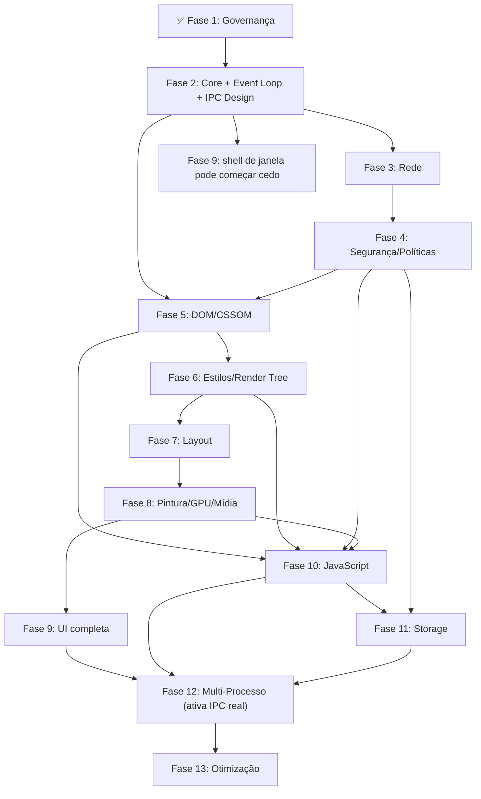

# 🗺️ Plano Mestre de Engenharia — Albedo Browser & Engine

> **O que é este documento:** o roteiro completo de construção do Albedo Browser e do Albedo Engine.
> Cada fase responde três perguntas: *quais crates externas são permitidas*, *o que é 100% código próprio* e *quando a fase está "pronta"*.
> Este plano é a fonte da verdade para a execução — todas as tarefas de implementação derivam dele.

---

## 0. Constituição do Projeto — 5 Regras de Ouro

O README define a filosofia ("Bibliotecas Sim, Motor Pronto Jamais"). Esta seção a transforma em regras que qualquer PR precisa passar.

**Regra 1 — Nenhuma engine de navegador, renderer pronto ou webview entra no workspace.**
Lista de bloqueio permanente (nunca aceitar como dependência, direta ou transitiva controlável): `wry`, `tao` (como shell completo), `webview`/`webview2`, `cef`/`cef-rs`, `sciter-rs`, `ultralight-rs`, bindings de `litehtml`, `headless_chrome`, `chromiumoxide`, `thirtyfour`/`fantoccini` como motor de renderização (ok como *teste externo*, nunca como dependência do produto), qualquer binding para WebKitGTK, Servo embutido como um todo (ver Regra 5 sobre usar *pedaços* do Servo).

**Regra 2 — Crate externa só entra como primitiva isolada.**
Uma crate é "primitiva" quando resolve um problema fechado e bem especificado (tokenizar texto, falar HTTP, multiplicar matrizes, mandar comando pra GPU) e **não decide** como o Albedo se comporta como navegador. Se a crate importada já contém a *lógica de produto* (cascata CSS, algoritmo de layout completo, quebra de linha de texto), ela é uma "zona cinzenta" — ver Seção 2.

**Regra 3 — Arquitetura, DOM/CSSOM, algoritmos de layout, pipeline de pintura paralela, gerência de threads/processos, modelo de segurança e UI nativa são 100% código do Albedo.** Isso é o que o README chama de "o que construímos do zero" e é inegociável.

**Regra 4 — Checklist antes de mergear qualquer dependência nova:**
- [ ] Ela resolve um problema isolado (parser, driver, matemática), não uma decisão de produto?
- [ ] Se ela sumisse amanhã, o time conseguiria reescrever o equivalente em poucas semanas sem comprometer segurança? (Se a resposta for "não, seria meses", ela provavelmente é "demais" para o manifesto.)
- [ ] Licença compatível com MIT (Apache-2.0, BSD, MIT — cuidado redobrado com MPL-2.0 e qualquer coisa GPL)?
- [ ] Passa em `cargo deny check` e `cargo audit` sem exceções silenciosas?

**Regra 5 — Toda decisão de "zona cinzenta" vira um ADR (Architecture Decision Record) versionado em `/docs/adr/`, discutido e aprovado antes do merge.** Nada de decisão de arquitetura enterrada em um PR de 40 arquivos.

---

## 1. Estrutura do Workspace — Arquitetura Completa

Um navegador real não é apenas "parse + layout + pintura". Após pesquisa profunda nas arquiteturas do **Chromium**, **Ladybird** e **Servo**, identificamos módulos críticos: segurança/políticas web, decodificação de mídia, armazenamento persistente (cookies, storage), IPC multi-processo e o event loop central. O Albedo precisa de **12 crates**.

| Crate | Responsabilidade | Depende de |
|---|---|---|
| `albedo_core` | Tipos fundamentais, `AlbedoError`, IDs (newtypes), telemetria (`tracing`), event loop principal | — |
| `albedo_ipc` | Comunicação inter-processos, serialização de mensagens, protocolo de canais entre processos do navegador | `albedo_core` |
| `albedo_net` | Fetch, cache, TLS, DNS, prioridade de carregamento, gerenciamento de conexões | `albedo_core` |
| `albedo_security` | Same-Origin Policy, CORS, CSP, cookie jar, permissões, sandboxing | `albedo_core`, `albedo_net` |
| `albedo_dom` | Tokenizer/parser HTML → árvore DOM pura, detecção de encoding, API de manipulação | `albedo_core` |
| `albedo_style` | Parser CSS → CSSOM, cascata, especificidade, valores computados, construção da Render Tree | `albedo_core`, `albedo_dom` |
| `albedo_layout` | Box model, block/inline, flexbox, grid, paralelismo de layout | `albedo_style` |
| `albedo_media` | Decodificação de imagens (PNG, JPEG, WebP, SVG, GIF), futuramente áudio/vídeo | `albedo_core` |
| `albedo_render` | Pintura, compositing, GPU, tipografia/text shaping, atlas de glifos | `albedo_layout`, `albedo_media` |
| `albedo_js` | Runtime JS, bindings de DOM/Web APIs, event loop de tarefas JS | `albedo_dom`, `albedo_style` |
| `albedo_storage` | Cookies, LocalStorage, SessionStorage, IndexedDB, gerenciamento de perfil/dados do usuário | `albedo_core`, `albedo_security` |
| `albedo_browser` | Binário principal, janela, chrome, abas, DevTools, bridge engine↔UI | todas acima |

### Diagrama de diretórios

```
albedo/
├── Cargo.toml                  # workspace root, resolver = "2"
├── deny.toml                   # política do cargo-deny (Regra 4)
├── xtask/                      # cargo xtask (setup, benchmarks, etc.)
├── docs/
│   ├── adr/                    # Architecture Decision Records (Regra 5)
│   ├── postmortems/            # post-mortems por fase concluída
│   ├── css-mvp-properties.md   # conjunto MVP de propriedades CSS suportadas
│   └── web-api-scope.md        # escopo MVP das Web APIs expostas ao JS
├── crates/
│   ├── albedo_core/
│   ├── albedo_ipc/
│   ├── albedo_net/
│   ├── albedo_security/
│   ├── albedo_dom/
│   ├── albedo_style/
│   ├── albedo_layout/
│   ├── albedo_media/
│   ├── albedo_render/
│   ├── albedo_js/
│   ├── albedo_storage/
│   └── albedo_browser/         # bin
├── fuzz/                       # targets de cargo-fuzz centralizados
├── benches/                    # benchmarks cross-crate (criterion)
└── tests/
    ├── wpt/                    # subset do Web Platform Tests
    ├── fixtures/               # HTML/CSS de teste próprios
    ├── visual-regression/      # imagens de referência para testes visuais
    └── site-compat/            # testes contra sites reais (top-N Tranco)
```

---

## 2. Zona de Atenção do Manifesto

Crates do ecossistema Rust que são boas o bastante para tentar alguém a "trapacear" na Regra 3. Vale nomear cada uma e deixar a decisão explícita.

| Crate | O que é | Por que tenta | Por que fica de fora por padrão |
|---|---|---|---|
| **Taffy** | Motor de layout completo (Block, Flexbox, CSS Grid) usado pelo Dioxus, Bevy UI e Zed | Implementa exatamente o que a Fase 7 pede, testado em produção | É a "lógica de produto" do Albedo — o roadmap já diz que o algoritmo de layout é para ser implementado progressivamente pelo time |
| **Stylo** | O motor de estilos paralelo do Firefox/Servo (cascata + resolução completa), hoje extraído como crate | É literalmente o motor de CSS de um navegador de produção | É, por definição, um "motor de navegador pronto" para a parte de estilos — viola a Regra 1/3 |
| **Parley** | Motor de layout de texto (quebra de linha, bidi, itemização de script) da Linebender | Resolve um dos problemas mais difíceis de um navegador | Quebra de linha e bidi são parte do algoritmo de layout — zona cinzenta pelo mesmo motivo do Taffy |

**Recomendação padrão:** usar apenas as *primitivas* dentro dessas pilhas (ex.: `cssparser` e `selectors` do ecossistema Servo para tokenizar CSS e casar seletores; `rustybuzz`/`harfrust` para shaping de glifos; `skrifa` para leitura de métricas de fonte; `swash`/`fontdue` para rasterização) e escrever a lógica de cascata, layout e quebra de linha dentro de `albedo_style`/`albedo_layout`/`albedo_render`. `unicode-bidi` e `unicode-linebreak` são exemplos de "primitiva de espec isolada" (implementam só UAX#9 e UAX#14, respectivamente) que **não** violam a Regra 2.

Se em algum momento o time decidir que a velocidade de desenvolvimento importa mais que a pureza do manifesto para uma dessas três, isso vira um ADR explícito — não uma decisão tomada silenciosamente por um único PR.

---

## 3. Fases Detalhadas

### Fase 1 — Fundação e Governança ✅ (concluída)
Já entregue. Sugestões de reforço:
- [ ] `deny.toml` com lista de bloqueio da Regra 1 (nomes de crate banidos via `[bans]`)
- [ ] Template de ADR em `docs/adr/0000-template.md`
- [ ] Badge de cobertura de testes no README

---

### Fase 2 — Core Engine, Infraestrutura e Design de IPC

**🎯 Objetivo:** esqueleto do workspace + `albedo_core` funcional + design do event loop + **design do protocolo IPC** (não a implementação multi-processo, mas sim a definição de como os componentes vão se comunicar quando forem separados em processos diferentes).

> **Por que IPC design já aqui?** Se você implementar tudo single-process e depois tentar migrar para multi-process na Fase 12, vai reescrever 60-70% do código. O Chromium, Ladybird e Servo ensinam: o *design do protocolo de comunicação* precisa existir desde o início. A *implementação multi-processo real* (fork, sandboxing) fica na Fase 12, mas todos os componentes são escritos já pensando em fronteiras de IPC.

**📦 Crates aprovadas:** `thiserror`/`anyhow` (erros), `tracing` + `tracing-subscriber` (telemetria), `url` (parsing WHATWG-compliant), `serde` + `serde_json` (serialização para config/cache/IPC), `metrics` + `metrics-exporter-prometheus` (métricas de performance).

**🔨 Construído do zero:**
- Hierarquia de `AlbedoError` com contexto rico (não apenas strings)
- IDs newtype (`TabId`, `RequestId`, `NodeId`, `ProcessId`) para evitar trocar índices por engano
- Wrapper sobre `url::Url` com regras próprias (tratamento explícito de `javascript:`/`data:`/`blob:` conforme contexto)
- **Event Loop central (WHATWG-compliant):** Task queues por source (`UserInteraction`, `Networking`, `Timer`), microtask checkpoint após cada macrotask, e rendering opportunity a cada frame (~16.6ms). Estruturado sobre `tokio::sync::mpsc`.
- **Protocolo IPC (design):** Mensagens encapsuladas em um envelope genérico (`IpcMessage<M>`) contendo `version`, `correlation_id` e `timestamp`. Canais bidirecionais tipados (`Channel<Req, Resp>`) que suportam `send()` e `spawn_handler()`. 
- **ADR 0005 (Serialização IPC):** Usar `bincode` para hot-paths (layout, paint) devido à alta velocidade e baixo footprint, e `protobuf`/`serde_json` para mensagens de controle.
- **Infraestrutura de observability:** setup de `tracing` com spans hierárquicos por request (propagação de correlation ID) + `metrics` com counters/gauges/histograms por componente

**✅ Tarefas**
- [ ] `Cargo.toml` root com `resolver = "2"`; ADR: Edition 2021 vs **2024**
- [ ] Criar as 12 crates com `lib.rs`/`main.rs` stub e README próprio
- [ ] Setup de `tracing` com saída JSON em CI e "pretty" em dev + spans hierárquicos
- [ ] Setup de `metrics` com export para Prometheus (dev) e stdout (CI)
- [ ] Testes de URL cobrindo IDN/punycode, `data:` URIs e entradas malformadas
- [ ] Protótipo do event loop (`EventLoop` trait + implementação base)
- [ ] Definir formato de mensagem de IPC (ADR: protobuf vs bincode vs serde + próprio)
- [ ] `albedo_ipc`: trait `Channel<M>` + implementação in-process via `tokio::sync::mpsc`
- [ ] `cargo xtask setup` — instala dependências, configura hooks, IDE settings

**🧪 Testes:** unit tests por crate; `cargo test --workspace` como gate obrigatório de CI.

**🚩 DoD:** `cargo build --workspace` e `cargo clippy --workspace -- -D warnings` verdes; todas as 12 crates existem e compilam; event loop aceita e despacha tarefas; IPC in-process envia e recebe mensagens tipadas em um teste unitário; `cargo xtask setup` funciona do zero em Linux/macOS/Windows.

**⚠️ Risco:** engenharia excessiva do IPC/erros antes de saber quais mensagens/erros realmente existem — defina 3-5 mensagens de exemplo e itere.

---

### Fase 3 — Motor de Rede

**🎯 Objetivo:** runtime assíncrono + *resource fetcher* + cache + gerenciamento de conexões.

**📦 Crates aprovadas:** `tokio` (runtime), `reqwest` **ou** `hyper` (decisão via ADR — `reqwest` acelera o MVP, `hyper` dá controle fino depois), `rustls` (TLS 100% Rust, evita depender de OpenSSL em C), `hickory-dns` (resolução DNS assíncrona pura Rust), `moka` ou `lru` (cache em memória), `encoding_rs` (detecção e conversão de encoding de texto — primitiva do WHATWG Encoding Standard, usada até pelo Firefox). HTTP/3 (`quinn`/`quiche`) fica como *stretch goal*, não bloqueia o MVP.

**🔨 Construído do zero:**
- `ResourceFetcher` com fila de prioridade própria (HTML > CSS/JS bloqueante > fontes > imagens/scripts assíncronos) — essa política de priorização é lógica de produto, não vem de crate nenhuma
- Motor de invalidação de cache seguindo semântica HTTP (`Cache-Control`, `ETag`, `Last-Modified`, `Vary`) implementado pelo Albedo, usando a crate de cache só como armazenamento bruto
- Pool de conexões com limites por domínio (6 paralelas por host, padrão HTTP/1.1)
- Redirecionamento com limites de profundidade (prevenção de loops)
- Suporte a `Content-Encoding` (gzip, brotli, zstd) para respostas comprimidas
- Comunicação via `albedo_ipc` — o fetcher já usa a trait `Channel` para que na Fase 12 ele possa rodar em processo separado sem mudar a API

**📊 Métricas de observability (registradas via `metrics`):**
- `albedo_net_requests_total` (counter por status code)
- `albedo_net_cache_hit_rate` (gauge)
- `albedo_net_connection_pool_utilization` (gauge)
- `albedo_net_request_duration_seconds` (histogram)

**✅ Tarefas**
- [ ] Tipos `Resource`/`Response`/`RequestPriority` próprios
- [ ] `ResourceFetcher` com fila de prioridade
- [ ] Cliente HTTP integrado (reqwest/hyper) + TLS via rustls
- [ ] Cache em disco com política de expiração própria
- [ ] Detecção de encoding via `encoding_rs` integrada à resposta
- [ ] Testes de integração contra servidor mock local (`wiremock`)
- [ ] Suporte a `data:` URIs (inline resources)
- [ ] Registrar métricas de rede via `metrics`

**🧪 Testes:** integração com mock server; testes de hit/miss de cache; stress test de concorrência; teste de redirecionamentos encadeados.

**🚩 DoD:** buscar e cachear uma página real + seus subrecursos concorrentemente, com ordem de prioridade validada por teste automatizado.

**⚠️ Risco:** HTTP/3 é complexo e não crítico para o MVP — mantenha isolado atrás de uma feature flag.

**📈 Performance Budget:**
- Fetch de 1 HTML + 10 subrecursos (CSS/JS/imagens): < 500ms em rede local (excluindo latência de rede real)
- Cache lookup: < 1ms por entrada

---

### Fase 4 — Modelo de Segurança e Políticas Web

**🎯 Objetivo:** implementar o modelo de segurança fundamental que **toda** interação de rede, DOM e JS precisa respeitar.

> **Por que esta fase existe separada e tão cedo?** Em navegadores reais, a segurança não é uma camada adicionada depois — ela é a fundação sobre a qual rede, DOM e JS operam. O Chromium aprendeu isso da forma difícil. O Ladybird está desenhando processos isolados desde o dia 1. O Albedo precisa ter o modelo de segurança *antes* de implementar o DOM, não depois.

**📦 Crates aprovadas:** `cookie` (parsing do formato de cookies — primitiva de formato, não de política); `publicsuffix` (lista de sufixos públicos para domain matching — dados da Mozilla Public Suffix List).

**🔨 Construído do zero:**
- **Same-Origin Policy (SOP):** o conceito de "Origem" (scheme + host + port), comparações de origem, e as regras de quando bloquear acesso cruzado
- **CORS (Cross-Origin Resource Sharing):** validação de preflight requests, headers permitidos, credenciais
- **Content Security Policy (CSP):** parsing e enforcement de diretivas (`script-src`, `style-src`, `img-src`, `connect-src`, etc.)
- **Cookie Jar:** armazenamento e recuperação de cookies respeitando `Domain`, `Path`, `Secure`, `HttpOnly`, `SameSite`, e expiração. O *cookie jar* é o componente que decide se um cookie viaja com uma request ou não — isso é lógica de produto, não primitiva
- **Referrer Policy:** implementação das regras de quando enviar ou omitir o header `Referer`
- **Permissions Model:** sistema básico de permissões do navegador (geolocalização, câmera, etc.) com UI de prompt

**✅ Tarefas**
- [ ] Struct `Origin` + comparações (same-origin, same-site, cross-origin)
- [ ] Implementação do algoritmo CORS (simple requests + preflight)
- [ ] Parser e enforcer de CSP (subset MVP: `default-src`, `script-src`, `style-src`, `img-src`)
- [ ] Cookie jar com storage e matching conforme RFC 6265bis
- [ ] Referrer policy engine
- [ ] Testes extensivos de fronteira (origens com portas diferentes, `null` origins, `data:` URIs)

**🧪 Testes:** testes unitários por política; testes de integração "request é bloqueada/permitida" contra cenários reais de CORS/CSP; fuzzing do parser de CSP.

**🚩 DoD:** uma request cross-origin é corretamente bloqueada sem CORS headers; uma CSP restritiva bloqueia um `<script>` inline; cookies `HttpOnly` não vazam para JS.

**⚠️ Risco:** a especificação de segurança web é vasta — defina um subset MVP claro e documente o que fica fora.

---

### Fase 5 — Parsing (DOM e CSSOM)

**🎯 Objetivo:** stream de bytes → árvore DOM; stylesheet → CSSOM.

**📦 Crates aprovadas:** `html5ever` (tokenizer + construção de árvore conforme a especificação WHATWG — extraído do Servo, usado como primitiva de parsing pura); `cssparser` (tokenizer CSS); `selectors` (casamento de seletores via trait, sem fazer cascata). **Não usar** `stylo` aqui (ver Seção 2).

**🔨 Construído do zero:**
- `albedo_dom::Node`/`Element`/`Document` — recomenda-se **árvore baseada em arena com índices geracionais** (padrão usado pelo próprio Servo/Blitz) em vez de `Arc<RwLock<Node>>` espalhado, porque esse segundo padrão é fonte histórica de contenção de lock. A árvore continua "banindo data races" (Princípio 3 do README), mas via posse centralizada em uma arena
- Implementação do `TreeSink` do `html5ever` ligando o parser à árvore própria
- Estrutura do CSSOM (`Stylesheet`, `Rule`, `Declaration`, `MediaQuery`)
- Detecção de encoding de documentos HTML (HTTP header > BOM > `<meta charset>` > heurísticas) integrada com `encoding_rs` da Fase 3
- **APIs de manipulação do DOM** (`createElement`, `appendChild`, `removeChild`, `setAttribute`, etc.) — estas APIs serão expostas ao JS na Fase 10, mas a implementação em Rust acontece aqui
- Parser de `<form>` elements com tipagem de inputs (text, password, checkbox, radio, submit, hidden, file)

**📊 Métricas de observability:**
- `albedo_dom_parse_duration_seconds` (histogram, por tamanho de documento)
- `albedo_dom_nodes_total` (gauge, nós na árvore atual)
- `albedo_css_parse_duration_seconds` (histogram)

**✅ Tarefas**
- [ ] Arena de nós DOM com índices geracionais (`slotmap`/`indextree` como *primitiva* de estrutura de dados, ou implementação própria)
- [ ] `TreeSink` do html5ever implementado
- [ ] Detecção de encoding (HTTP > BOM > meta > heurística)
- [ ] Parser CSS recursivo sobre os tokens do `cssparser`, produzindo o CSSOM
- [ ] APIs de manipulação DOM implementadas em Rust
- [ ] Parsing de `<form>` com tipagem de campos
- [ ] Subset de testes do `html5lib-tests`/WPT (parsing) rodando em CI
- [ ] Fuzzing (`cargo-fuzz`) na fronteira DOM↔html5ever e no parser CSS

**🧪 Testes:** snapshot tests (`insta`) da forma da árvore DOM para HTML de amostra; fuzzing contínuo; testes de encoding com documentos em UTF-8, Shift_JIS, Windows-1252.

**🚩 DoD:** parsear uma página real (ex.: um artigo de Wikipedia) em uma árvore DOM correta; parsear um CSS real sem panics; detectar encoding corretamente em 3 encodings diferentes.

**⚠️ Risco:** o trait `TreeSink` do html5ever tem complexidade real (modos de inserção de `<script>`, fragment parsing) — reserve tempo extra.

**📈 Performance Budget:**
- Parse de 1MB de HTML: < 100ms
- Árvore DOM de 10k nós: < 50MB de RAM
- Mutação individual de nó DOM (appendChild): < 1ms

---

### Fase 6 — Render Tree e Motor de Estilos

**🎯 Objetivo:** aplicar CSSOM ao DOM (cascata) e construir a Render Tree.

**📦 Crates aprovadas:** `selectors` (casamento de seletores contra o DOM real); parsing de valores individuais via `cssparser` (cor, unidades de comprimento — primitiva de sintaxe, não de cascata).

**🔨 Construído do zero:**
- Algoritmo de cascata (origem + importância + especificidade + ordem de aparição)
- Propagação de herança (quais propriedades são herdadas vs. não)
- Resolução de valores computados (valores iniciais por propriedade, `inherit`, `initial`, `unset`)
- Rastreio de pseudo-classes de estado (`:hover`, `:focus`, `:active`, `:visited`)
- Suporte a pseudo-elementos (`::before`, `::after`) como nós na Render Tree
- Construção da Render Tree (poda de `<head>`, `<script>`, `display: none`)
- Invalidação de estilo em mutação do DOM (começa com restyle completo "força bruta"; otimizar incrementalmente)
- **Matching de media queries** (`@media screen`, `@media (max-width: ...)`) — necessário para responsividade

**✅ Tarefas**
- [ ] `Specificity` (struct + comparador) e algoritmo de cascata
- [ ] Definir "conjunto MVP de propriedades CSS" (ver `docs/css-mvp-properties.md`): box model, `display`, `position`, `color`, `background`, `font-*`, `text-align`, `overflow`, `border`, `margin`, `padding`, `width`/`height`/`min-*`/`max-*`, `flex-*`
- [ ] Poda da Render Tree
- [ ] Pseudo-elementos `::before`/`::after`
- [ ] Media queries básicas (viewport width/height, `screen`/`print`)
- [ ] Invalidação de estilo (restyle completo como v1)

**🧪 Testes:** matriz de prioridade de cascata (inline > id > classe > tag > `*`); subset das WPT de cascading; testes de valor computado por propriedade; testes de media query com viewport simulado.

**🚩 DoD:** dado DOM+CSSOM, produzir uma árvore de nós estilizados com valores computados corretos para uma página de teste representativa, conferida manualmente contra o DevTools de um navegador de referência.

**⚠️ Risco:** a superfície de propriedades CSS é enorme — o documento `docs/css-mvp-properties.md` é obrigatório antes de iniciar implementação.

---

### Fase 7 — Motor de Layout (Geometry Engine)

**🎯 Objetivo:** geometria (X, Y, largura, altura) de cada caixa na tela.

**📦 Crates aprovadas:** `glam` ou `euclid` (matemática vetorial — primitiva pura); `rayon` (paralelismo de dados).

**🔨 Construído do zero (zona cinzenta = Taffy, ver Seção 2):**
- Box model completo (content → padding → border → margin, com margin collapsing)
- Block Formatting Context (empilhamento vertical, preenchimento horizontal, floats)
- Inline Formatting Context (line boxes, baseline alignment, wrapping de texto)
- Algoritmo de Flexbox (eixo principal/cruzado, grow/shrink/basis, wrap, alignment)
- **CSS Grid** fica marcado como backlog — não bloqueia o MVP
- `position: relative`, `absolute`, `fixed`, `sticky`
- `overflow: scroll`/`auto`/`hidden` e cálculo de scroll regions
- Margin collapsing entre irmãos e entre pai/filho

#### Sub-milestones da Fase 7

> **Contexto:** margin collapsing tem 15+ edge cases, Block Formatting Context com floats/clear/overflow/absolute interagem de formas não-intuitivas, e a spec de Flexbox tem 80+ páginas com 20+ algoritmos. Dividir evita "tudo ou nada".

| Sub-milestone | Escopo | Risco |
|---|---|---|
| **v7.0 — MVP** | Block layout (empilhamento vertical + preenchimento horizontal) + Box model sem margin collapsing | Baixo |
| **v7.1 — Inline básico** | Inline layout LTR/Latim com stub de medição de texto (shaping real vem na Fase 8) + line boxes + baseline | Médio — depende de stub funcional de medição |
| **v7.2 — Positioning** | `position: relative/absolute/fixed/sticky` + `overflow` e scroll regions | Médio |
| **v7.3 — Margin collapsing** | Margin collapsing entre irmãos, pai/filho, empty blocks (15+ edge cases documentados na spec) | Alto — "notoriamente traiçoeiro" |
| **v7.4 — Flexbox** | Algoritmo completo (eixo principal/cruzado, grow/shrink/basis, wrap, alignment) | Alto — spec de 80+ páginas |
| **v7.5 — Paralelismo** | `rayon` para subárvores independentes (novos formatting contexts) | Médio — correctness vs. performance |

**✅ Tarefas**
- [ ] v7.0: Box model + block layout
- [ ] v7.1: Inline layout com stub de medição
- [ ] v7.2: Positioning + overflow + scroll
- [ ] v7.3: Margin collapsing (todos os edge cases categorizados: Adjacent Siblings, Parent-Child, Empty Blocks, Interações com Float/Flex)
- [ ] v7.4: Flexbox conforme a especificação
- [ ] v7.5: Paralelismo via `rayon`

**🧪 Testes:** 
- Suíte de "golden tests" (input → posição esperada via `insta::assert_snapshot!`) cobrindo ~100+ casos por sub-milestone.
- Testes específicos de Margin Collapsing: 15+ edge cases validados com tolerância rigorosa (`abs() < 0.5px`).
- Benchmarks (`criterion`): árvores aninhadas de 10 a 10.000 nós.

**🚩 DoD por sub-milestone:** posições calculadas batem com o esperado, dentro de tolerância de ±1px.

**⚠️ Risco:** texto e layout são interdependentes — v7.1 usa stub até a Fase 8 conectar o shaping real. Margin collapsing pode levar mais tempo que todo o rest do layout junto.

**📈 Performance Budget:**
- Layout de 1.000 nós: < 50ms
- Layout incremental (1 nó mudou): < 5ms
- Eficiência de paralelismo: > 80% em 4 cores

---

### Fase 8 — Pintura, GPU e Mídia

**🎯 Objetivo:** converter Render Tree + geometria em pixels na tela; decodificar e exibir imagens.

**📦 Crates aprovadas:**
- **GPU:** `wgpu` (Vulkan/Metal/DX12); considerar **Vello** (renderer 2D GPU-compute-centric, 100% Rust) como alternativa ao wgpu puro — decisão via ADR
- **Tipografia:** `rustybuzz` ou `harfrust` (shaping); `skrifa` (métricas de fonte); `swash`/`fontdue` (rasterização de glifo)
- **Unicode:** `unicode-bidi` (UAX#9) e `unicode-linebreak` (UAX#14) — primitivas de espec isoladas
- **Imagens:** `image` (crate de decodificação: PNG, JPEG, GIF, WebP, BMP, ICO — primitiva pura de decodificação de formato); `resvg` (renderização de SVG em Rust puro)

**🔨 Construído do zero (zona cinzenta = Parley, ver Seção 2):**
- Compositor próprio (árvore de camadas, stacking contexts via z-index, camadas de scroll)
- Gerador de comandos de pintura a partir da Render Tree (paint commands)
- Cache/atlas de glifos (armazenar glifos rasterizados em texturas GPU para reutilização)
- Quebra de linha e bidi implementados sobre as primitivas `unicode-linebreak`/`unicode-bidi`
- Pipeline de decodificação de imagens (receber bytes → decodificar em worker thread → gerar textura GPU → posicionar no layout)
- Suporte a `background-image`, `border-radius`, `box-shadow`, `opacity`, `transform` básico (translate, scale, rotate)
- Scroll composto na GPU (sem repintura de CPU a cada frame)
- **Display list** — lista intermediária de comandos de pintura que pode ser cacheada e reutilizada para evitar recomputar pintura em frames sem mudanças

#### Sub-milestones da Fase 8

> **Contexto:** bidi (Árabe/Hebraico + Latim na mesma linha) é algoritmo UAX#9 com complexidade O(n²) em casos patológicos. Font fallback com CJK (50.000+ glifos) é um mundo à parte. Stacking contexts + opacity + transforms + filters interagem de formas explosivas. Dividir é essencial.

| Sub-milestone | Escopo | Risco |
|---|---|---|
| **v8.0 — MVP** | Caixas coloridas (fundo, borda) + texto simples LTR/Latim (sem shaping avançado) + display list | Médio |
| **v8.1 — Tipografia** | Shaping básico via `rustybuzz` + métricas de fonte + atlas de glifos + font fallback básico | Alto |
| **v8.2 — Imagens** | Pipeline de decodificação assíncrona + `` + `background-image` + `favicon` | Médio |
| **v8.3 — Efeitos visuais** | `border-radius`, `box-shadow`, `opacity`, `transform` (translate, scale, rotate) | Médio |
| **v8.4 — Compositing** | Stacking contexts (z-index), camadas de scroll, scroll composto na GPU a 60fps | Alto |
| **v8.5 — Texto avançado** *(pós-MVP)* | Bidi (Árabe/Hebraico), CJK, font fallback multi-script | Muito alto |

**✅ Tarefas**
- [ ] ADR: Skia vs Vello vs wgpu puro para o backend de desenho 2D
- [ ] v8.0: Paint command builder → display list + caixas coloridas + texto simples
- [ ] v8.1: Pipeline de tipografia: shaping → métricas → rasterização → atlas → textura GPU
- [ ] v8.2: Pipeline de imagens: decodificação assíncrona → textura GPU → composição
- [ ] v8.3: `border-radius`, `box-shadow`, `opacity`, `transform`
- [ ] v8.4: Compositor de camadas / stacking contexts + scroll composto na GPU
- [ ] v8.5: Bidi + CJK (pós-MVP, stretch goal)

**🧪 Testes:** testes de regressão visual (renderizar para PNG e comparar com imagem de referência); benchmark de FPS/frame-time; testes de decodificação de imagens corrompidas (robustez).

**🚩 DoD (MVP = v8.0-v8.4):** renderizar uma página real com caixas, imagens, texto Latim LTR; scroll composto suave a 60fps em página de complexidade média.

**⚠️ Risco:** fragmentação de backend GPU entre SOs; imagens corrompidas não devem causar panic/crash (fuzzing obrigatório).

**📈 Performance Budget:**
- Paint de 1.000 nós: < 16ms (60fps)
- Upload de textura GPU: < 5ms
- Scroll compositing: 60fps constante em página média
- Decodificação de imagem JPEG 1920x1080: < 50ms

---

### Fase 9 — Janela e Interface Gráfica (Browser Chrome)

**🎯 Objetivo:** janela nativa + chrome do navegador + integração com a engine.

**📦 Crates aprovadas:** `winit` (windowing nativo); `accesskit` (ponte para APIs de acessibilidade do SO — trazer já aqui evita retrabalho).

**🔨 Construído do zero:**
- Gestão de abas própria (criar, fechar, reordenar, duplicar)
- Omnibox com heurística "é URL ou é busca?" (validação de URL vs. redirecionamento para motor de busca)
- Pilha de histórico de navegação (back/forward com tracking de scroll position)
- Mapeamento de input do SO → eventos DOM (keydown, keyup, mousedown, mousemove, click, wheel, touchstart, etc.)
- Gerenciamento de DPI/escala por monitor
- **ADR em aberto:** renderizar o chrome usando o pipeline da Albedo Engine (dogfooding) *versus* usar UI em modo imediato (`egui`) como atalho pragmático para o MVP. Ambas são legítimas
- **DevTools MVP:** ao menos: (1) visualizar código-fonte HTML, (2) console de erros/logs, (3) inspetor de rede (lista de requests com status/tamanho/tempo). DevTools completo (Elements, Styles, Performance) é Fase 13+
- Diálogos nativos: `alert()`, `confirm()`, `prompt()`, `window.open()`
- Barra de download / gerenciamento básico de downloads

**✅ Tarefas**
- [ ] Loop de eventos winit + bridge viewport↔engine (resize, DPI, input → eventos DOM)
- [ ] Barra de abas, barra de endereço, botões de navegação (voltar, avançar, recarregar, stop)
- [ ] Pilha de voltar/avançar com restauração de scroll
- [ ] Omnibox com detecção de URL vs. busca
- [ ] DevTools MVP (código-fonte + console + network list)
- [ ] Diálogos JS (`alert`, `confirm`, `prompt`)
- [ ] Gerenciamento de downloads
- [ ] Suporte a múltiplos monitores e DPI diferentes

**🧪 Testes:** checklist manual de QA por SO; testes de interação simulando teclado/mouse onde viável; teste automatizado de ciclo de vida de aba (abrir → navegar → voltar → fechar).

**🚩 DoD:** navegar para URL, voltar/avançar, abrir/fechar abas, redimensionar corretamente nos três SOs alvo (Windows/macOS/Linux); DevTools mostra requests e código-fonte.

**⚠️ Risco:** DPI e múltiplos monitores são historicamente problemáticos entre plataformas — QA explícito por SO.

---

### Fase 10 — Execução JavaScript

**🎯 Objetivo:** interatividade dinâmica nas páginas web.

**📦 Decisão de motor (ADR obrigatório — `docs/adr/0003-js-engine-selection.md`):**

| Critério | `rusty_v8`/`deno_core` | `Boa` (100% Rust) | `QuickJS` (via bindings) |
|---|---|---|---|
| **Conformidade ECMAScript** | ✅ 100% (Test262) | ⚠️ ~85% (gaps em async, proxies) | ✅ ~99% (quase completo) |
| **Performance** | ✅ JIT industrial | ❌ Interpretador puro | ⚠️ Interpretador rápido |
| **Tamanho do binário** | ❌ +50MB (V8 inteiro) | ✅ +5MB | ✅ +2MB |
| **Integração Rust** | ⚠️ FFI complexo (C++) | ✅ Nativo Rust | ⚠️ FFI via `quick-js` crate |
| **Memory safety** | ⚠️ C++ por baixo | ✅ 100% Rust | ⚠️ C por baixo |
| **Manutenção** | ⚠️ Sincronizar com upstream V8 | ✅ Comunidade ativa | ⚠️ Mantenedor/comunidade menor |

**Recomendação:** abstrair `albedo_js` atrás de uma trait `JsRuntime`. Para o **MVP**, usar **Boa** (pureza + nativo Rust + simplicidade de embedding). A trait permite migrar para `QuickJS` (se conformidade for insuficiente) ou `rusty_v8` (se performance for gargalo) sem reescrever bindings de DOM. A decisão final é via ADR.

**🔨 Construído do zero:**
- Bindings de DOM (expor `Node`/`Element`/`window`/`document`/`navigator`/`location` para o runtime)
- Integração do event loop (microtasks de Promises + macrotasks de setTimeout/setInterval + requestAnimationFrame)
- `XMLHttpRequest` e `fetch()` API conectados ao `albedo_net`
- Fronteira de sandboxing entre JS e memória nativa do Rust
- `addEventListener` / `removeEventListener` com bubbling e capturing
- Integração com o modelo de segurança (`albedo_security`): CSP enforcement em `eval()` e inline scripts

**✅ Tarefas**
- [ ] ADR: Boa vs QuickJS vs rusty_v8
- [ ] Trait `JsRuntime` + implementação sobre o motor escolhido
- [ ] Estratégia de bindings (manual vs. proc-macro)
- [ ] Web APIs mínimas: `console.log`, `setTimeout`/`setInterval`, `requestAnimationFrame`
- [ ] DOM APIs: `document.querySelector`, `document.getElementById`, `createElement`, `appendChild`, `removeChild`, `innerHTML`, `textContent`, `style.*`
- [ ] Event system: `addEventListener`, event bubbling/capturing, `preventDefault`/`stopPropagation`
- [ ] `fetch()` API conectada ao `albedo_net` + CORS do `albedo_security`
- [ ] Subset do Test262 rodando em CI
- [ ] Enforcement de CSP em scripts inline e `eval()`

**🧪 Testes:** Test262 subset; teste ponta a ponta: página com `<script>` que faz `querySelector` + muda estilo → re-dispara layout e pintura.

**🚩 DoD:** script inline mutando o DOM atualiza a renderização corretamente; `fetch()` respeita CORS; CSP bloqueia `eval()` quando configurado.

**⚠️ Risco:** superfície de bindings JS↔DOM é enorme — escopo MVP deve ser documentado explicitamente em `docs/web-api-scope.md`.

---

### Fase 11 — Armazenamento e Persistência

**🎯 Objetivo:** cookies persistentes, web storage, e dados de perfil do usuário.

**📦 Crates aprovadas:** `sled` ou `redb` (embedded key-value database — primitiva de armazenamento, não de lógica de browser); `cookie` (parsing de formato Set-Cookie).

**🔨 Construído do zero:**
- **Cookie persistence:** salvar/restaurar o cookie jar entre sessões do navegador
- **LocalStorage e SessionStorage:** implementação da Web Storage API com limites de quota por origem
- **Gerenciamento de perfil:** diretório de dados do usuário (bookmarks, histórico, cookies, cache em disco, configurações)
- **IndexedDB** fica como stretch goal — é complexo e raro em sites que não sejam SPAs pesadas
- **Autofill básico:** lembrar dados de formulários preenchidos (com opt-in do usuário)

**✅ Tarefas**
- [ ] Persistência do cookie jar (save/load entre sessões)
- [ ] LocalStorage com quota por origem (5MB padrão)
- [ ] SessionStorage (isolado por aba)
- [ ] Diretório de perfil do usuário (~/.albedo/ ou equivalente por SO)
- [ ] Histórico de navegação persistente (lista de URLs visitadas com timestamps)
- [ ] Bookmarks (adicionar/remover/listar)

**🧪 Testes:** testes de persistência (salvar cookie → reiniciar → cookie existe); testes de quota (escrever além do limite → exceção); testes de isolamento de SessionStorage entre abas.

**🚩 DoD:** cookies persistem entre reinícios do navegador; localStorage funciona e respeita quotas; histórico é salvo e acessível.

**⚠️ Risco:** segurança dos dados em disco (cookies contêm credenciais) — avaliar criptografia do perfil.

---

### Fase 12 — Arquitetura Multi-Processo e Isolamento

**🎯 Objetivo:** ativar o isolamento de processos desenhado na Fase 2 — separar componentes em processos reais para segurança e estabilidade (se uma aba crashar, o navegador não morre).

> **Relação com a Fase 2:** o *design do protocolo IPC* e a trait `Channel` foram definidos na Fase 2. Todos os componentes (rede, DOM, layout, etc.) já usam `albedo_ipc` via channels in-process. Agora, na Fase 12, **troca-se o transporte** de `tokio::sync::mpsc` para pipes/sockets reais entre processos — sem mudar a API dos componentes. Essa é a vantagem de ter desenhado IPC cedo.

**📦 Crates aprovadas:** wrappers de sandboxing por SO (`seccomp` no Linux, `sandbox` no macOS, Job Objects no Windows — chamadas de sistema isoladas).

**🔨 Construído do zero:**
- **Transporte IPC real:** implementação da trait `Channel` sobre pipes/sockets Unix (Linux/macOS) e Named Pipes (Windows)
- **Process Manager:** fork/spawn de processos filho, monitoramento de saúde, restart automático em crash
- **Modelo de processos do Albedo:**
  - **Browser Process:** UI, abas, coordenação, histórico, bookmarks
  - **Renderer Process (por aba):** DOM, estilo, layout, pintura, JS — isolado e sandboxed
  - **Network Process:** todas as requests HTTP passam por aqui (inspirado no RequestServer do Ladybird)
  - **Media Process:** decodificação de imagens/vídeo em processo separado para conter exploits de formatos maliciosos
- **Site Isolation:** 
  - **Policy de Reuso:** `ReuseBySite` (eTLD+1) com limites rígidos (`max_renderers_per_origin`).
  - **Validação de Origem:** Cada mensagem IPC valida se o `sender_process` tem permissão de acessar o `target_origin`.
  - Sandboxing em nível de sistema de arquivos (renderer não pode ler `/etc/passwd`).

**✅ Tarefas**
- [ ] Implementação de `Channel` sobre pipes/sockets reais (substituindo in-process)
- [ ] Process Manager (spawn, monitor, restart)
- [ ] Mover `albedo_net` para um processo separado (Network Process)
- [ ] Mover `albedo_media` (decodificação) para um processo separado
- [ ] Sandboxing de Renderer Process por SO (seccomp/macOS sandbox/Windows Job Objects)
- [ ] Site Isolation (uma origin por processo renderer)

**🧪 Testes:** crash de um renderer process não mata o browser; renderer não consegue acessar filesystem direto (sandbox funciona); IPC não vaza dados entre origens diferentes.

**🚩 DoD:** duas abas abertas, uma crashando (kill -9 no renderer) não afeta a outra; renderer sandboxed não consegue abrir arquivo arbitrário.

**⚠️ Risco:** IPC pode virar gargalo de performance — benchmark latência de IPC desde a Fase 2. Sandboxing varia enormemente por SO.

**📈 Performance Budget:**
- Latência de IPC (round-trip): < 1ms para mensagens simples
- Overhead de serialização: < 0.5ms para mensagens de tamanho médio (< 1KB)

---

### Fase 13 — Otimizações, Conformidade e Evolução Futura

**🎯 Objetivo:** hardening, conformidade, performance, e expansão de funcionalidades.

**📦 Crates aprovadas:** `wasmtime` (motor WASM — primitiva análoga a V8 para JS); `icu4x` (suporte a internacionalização se precisar ir além do que `unicode-*` crates oferecem).

**🔨 Construído do zero:** otimizações incrementais nos subsistemas existentes.

**✅ Tarefas (backlog priorizado)**
- [ ] **WebAssembly:** integrar `wasmtime` como runtime WASM
- [ ] **CSS Grid:** implementar no motor de layout
- [ ] **Animações CSS e Transitions:** `@keyframes`, `animation-*`, `transition-*`
- [ ] **Acessibilidade (A11y):** integrar `accesskit` completamente, testar com leitores de tela
- [ ] **Service Workers:** interceptação de requests, cache offline
- [ ] **Web Workers:** execução off-main-thread para scripts pesados
- [ ] **Canvas 2D API:** `<canvas>` com contexto `2d`
- [ ] **WebGL/WebGPU:** contextos 3D para `<canvas>`
- [ ] **Conformidade WPT:** rodar suíte completa, manter dashboard de taxa de aprovação
- [ ] **Performance:** profiling ponta a ponta, otimização de hot paths
- [ ] **DevTools completo:** Elements panel, Styles panel, Performance profiler, Memory profiler
- [ ] **Extensões:** avaliar modelo de extensões (WebExtensions API? formato próprio? — ADR)
- [ ] Cortar primeiro milestone "Albedo 1.0 alpha" com escopo fechado

**🚩 DoD:** definido por sub-milestones — esta fase é intencionalmente aberta mas cada item tem seu próprio DoD.

**⚠️ Risco:** esta fase pode se tornar infinita — fixar um "bar" de release explícito e menor que paridade total com Chromium.

---

## 4. Dependências entre Fases



### Paralelismo possível entre fases:
- **Fase 3 (rede) e Fase 5 (parsing)** podem iniciar em paralelo após a Fase 2 — o parser de DOM não precisa de rede para ser testado com fixtures locais
- **Shell de janela (início da Fase 9)** pode começar cedo — só precisa de um viewport vazio
- **Fase 4 (segurança)** pode correr em paralelo com a Fase 5 (DOM) nos primeiros sprints, pois `Origin` e `CookieJar` não dependem do DOM

---

## 5. Estratégia de Testes (transversal)

| Tipo | Escopo | Frequência |
|---|---|---|
| **Unitários** | Por crate, cobertura mínima de 80% em código novo | Cada PR (CI gate) |
| **Fuzzing** | Fronteiras com dados não confiáveis (ver Seção 5.1) | Contínuo em CI (OSS-Fuzz ideal) |
| **Conformidade** | Subset crescente de WPT; Test262 para JS | Semanal + cada release |
| **Regressão visual** | Renderização → PNG comparada a referência com tolerância definida | Cada PR que toca layout/pintura |
| **Integração** | Ponta a ponta: URL → fetch → parse → style → layout → paint → pixels | A cada milestone |
| **Performance** | `criterion` para parsing/layout; FPS benchmark para pipeline de pintura; latência de IPC | A cada milestone |
| **Sites reais** | Lista fixa de sites (top-N Tranco) — ver Seção 5.2 | A partir da Fase 8 |

### 5.1. Estratégia de Fuzzing Contínuo

> Browsers são alvos constantes de fuzzing (OSS-Fuzz, Project Zero). Toda fronteira que recebe dado não confiável da web precisa de cobertura.

**Fronteiras críticas (por fase de origem):**

| Fronteira | Crate | A partir de |
|---|---|---|
| HTML parser (html5ever → albedo_dom) | `albedo_dom` | Fase 5 |
| CSS parser (cssparser → albedo_style) | `albedo_style` | Fase 6 |
| Image decoder (image crate → albedo_media) | `albedo_media` | Fase 8 |
| Cookie parser (cookie crate → albedo_security) | `albedo_security` | Fase 4 |
| CSP parser (albedo_security) | `albedo_security` | Fase 4 |
| JS engine (albedo_js) | `albedo_js` | Fase 10 |
| IPC protocol (albedo_ipc) | `albedo_ipc` | Fase 12 |
| URL parser (url crate → albedo_core) | `albedo_core` | Fase 2 |

**Infraestrutura:**
- **Corpus Management:** Importação de HTML/CSS/JS do repositório WPT (`web-platform-tests`) como seeds iniciais.
- `cargo-fuzz` com targets centralizados em `fuzz/` integrados ao **OSS-Fuzz**.
- **Crash Triage Automatizado:** Script Python que analisa o crash, minimiza o input (`cargo fuzz tmin`), extrai stack traces únicos e auto-gera `tests/regression/test_crash_hash.rs`.
- Cada crash descoberto vira um teste de regressão e recebe commit automático pela CI.

**Meta: zero crashes em produção por vulnerabilidade descoberta via fuzzing.**

### 5.2. Estratégia de Testing em Sites Reais

> WPT testa specs, não sites reais. Um browser pode passar 90% da WPT e ainda quebrar no Google.com.

**Lista de referência (Top-N Tranco):**
- **Top 10:** google.com, youtube.com, facebook.com, twitter.com, wikipedia.org, reddit.com, amazon.com, instagram.com, github.com, stackoverflow.com
- **Top 100:** lista fixa, atualizada trimestralmente
- **Top 1000:** meta de longo prazo

**Testes automatizados por site:**
- Screenshot comparison (renderizar no Albedo vs. imagem de referência do Chrome)
- Console error monitoring (zero JS errors como meta)
- Performance metrics (FCP — First Contentful Paint, LCP — Largest Contentful Paint)
- Network request validation (todos os subrecursos carregaram?)

**Classificação de resultados por site:**
- ✅ **Funcional:** conteúdo renderiza corretamente, interatividade funciona
- ⚠️ **Parcial:** conteúdo principal visível, mas com falhas visuais ou JS errors
- ❌ **Quebrado:** conteúdo não renderiza ou crash

**Meta progressiva:**
- Fase 8 (pintura): 30% do Top 100 ao menos "parcial"
- Fase 10 (JS): 50% do Top 100 "funcional"
- Fase 13 (otimização): 80% do Top 100 "funcional"

---

## 6. Performance Budgets (transversal)

> Sem budgets explícitos, performance degrada incrementalmente até ficar inaceitável. Budgets são enforced em CI através de uma infraestrutura baseada no `criterion`.

### Metodologia de Medição
1. **Framework (`criterion`):** Executa warmup, roda múltiplas iterações medidas, remove outliers (> 3σ) e reporta a **mediana** e **P95**.
2. **CI Integration:** Executa nightly e em PRs, comparando com o baseline da branch `main` salvo no GitHub Pages via artefatos do workflow.
3. **Enforcement:** Um script customizado (`check_budgets.py`) falha o build caso a mediana da PR exceda o budget estipulado em mais de 20% (tolerância para ruído normal de CI).

### Budgets por Componente

| Componente | Métrica | Budget | Enforcement |
|---|---|---|---|
| **DOM Parse** | 1MB de HTML | < 100ms | `criterion` benchmark em CI |
| **DOM Memory** | 10k nós na árvore | < 50MB RAM | Teste de memória em CI |
| **DOM Mutation** | appendChild individual | < 1ms | Unit test com timer |
| **CSS Parse** | Stylesheet de 100KB | < 50ms | `criterion` benchmark em CI |
| **Layout** | 1.000 nós | < 50ms | `criterion` benchmark em CI |
| **Layout incremental** | 1 nó mudou | < 5ms | `criterion` benchmark em CI |
| **Layout paralelismo** | 4 cores | > 80% eficiência | `criterion` benchmark em CI |
| **Paint** | 1.000 nós | < 16ms (60fps) | FPS benchmark em CI |
| **GPU texture upload** | Textura média | < 5ms | Timer integrado |
| **Scroll compositing** | Página média | 60fps constante | FPS benchmark em CI |
| **Image decode** | JPEG 1920x1080 | < 50ms | `criterion` benchmark |
| **IPC round-trip** | Mensagem simples | < 1ms | `criterion` benchmark |
| **Network fetch** | 1 HTML + 10 subrecursos (rede local) | < 500ms | Integração com mock server |
| **Cache lookup** | 1 entrada | < 1ms | Unit test com timer |
| **Incremental build** | 1 arquivo mudou | < 10s | CI timer |
| **Full clean build** | Workspace completo | < 3 min | CI timer |

**Enforcement:**
- CI falha automaticamente se qualquer budget for excedido por mais de 20%
- Nightly benchmarks com histórico público (dashboard)
- Regression alerts automáticos via comparação com baseline

---

## 7. Métricas de Sucesso (KPIs técnicos)

| Métrica | Quando medir | Meta inicial |
|---|---|---|
| Taxa de aprovação WPT (subset) | A partir da Fase 6 | Baseline na primeira medição, crescer a cada fase |
| Time-to-first-paint | A partir da Fase 8 | Baseline com página de teste fixa |
| FPS em scroll composto | A partir da Fase 8 | 60fps em página de complexidade média |
| Memória por aba | A partir da Fase 9 | Comparar com baseline própria a cada release |
| Tamanho do binário | A partir da Fase 9 | Rastrear tendência |
| Cobertura de fuzzing | Contínuo | 100% das fronteiras de parsing com pelo menos 1 alvo de fuzz |
| Taxa de sites renderizados (top-100 Tranco) | A partir da Fase 8 | Crescer progressivamente (30% → 50% → 80%) |
| Latência de IPC (round-trip) | A partir da Fase 2 (in-process), Fase 12 (real) | < 1ms para mensagens simples |
| Cobertura de testes em código novo | Contínuo | > 80% |

---

## 8. Observability (transversal)

> Uma request em um navegador cruza 5+ crates. Sem observability, debugging é adivinhação.

### Metrics (via `metrics` crate)
Cada crate registra métricas relevantes ao seu domínio. Exemplos por fase:

| Fase | Métricas chave |
|---|---|
| Fase 3 (Rede) | `requests_total`, `cache_hit_rate`, `connection_pool_utilization`, `request_duration_seconds` |
| Fase 5 (DOM) | `parse_duration_seconds`, `dom_nodes_total`, `mutations_per_second` |
| Fase 7 (Layout) | `layout_duration_seconds`, `layout_nodes_total`, `parallelism_efficiency` |
| Fase 8 (Pintura) | `frame_time_ms`, `paint_commands_total`, `gpu_utilization` |
| Fase 12 (IPC) | `ipc_roundtrip_ms`, `ipc_messages_total`, `ipc_serialization_overhead_ms` |

**Export:** Prometheus (dev/staging), stdout JSON (CI).

### Tracing (via `tracing` crate)
- Spans hierárquicos por request (ex.: `fetch → parse → style → layout → paint`)
- Correlation ID propagado entre componentes (e via IPC na Fase 12)
- Export para Jaeger/Zipkin em dev, stdout JSON em CI

### Profiling
- `perf` integration (Linux) + `Instruments` (macOS)
- `cargo-flamegraph` para flamegraphs automáticos em CI nightly
- Profiling targets predefinidos: "renderizar a Wikipedia", "scroll de página pesada"

---

## 9. Backwards Compatibility

> Sem estratégia de compatibilidade, cada mudança de formato interno quebra dados de usuários existentes.

### Versionamento de Formatos Persistentes
- Todo formato persistente (cookie jar, cache, profile data, bookmarks, histórico) tem **header de versão** no arquivo
- Funções de migração automáticas: `v1 → v2 → v3` (encadeadas)
- Fallback para formatos antigos por 2 releases antes de drop

### Protocolo IPC
- Versionamento explícito no header de cada mensagem
- Suporte a N-1 versões (processo novo fala com processo antigo)
- Feature negotiation no handshake inicial entre processos

### Breaking Changes
- ADR obrigatório para qualquer mudança de formato persistente
- Migration guide documentado para cada breaking change
- Deprecation warnings com 1 release de antecedência antes de remover suporte a formato antigo

---

## 10. Developer Experience (DX)

> O plano é muito focado em "o que construir". Esta seção garante que *construir seja eficiente*.

### Setup Inicial
- `cargo xtask setup` — instala todas as dependências (Rust, system libs, tools), configura git hooks, IDE settings, environment variables
- **Tempo alvo: < 5 minutos** do `git clone` ao primeiro `cargo build` bem-sucedido
- Documentado em `CONTRIBUTING.md` com passos por SO (Linux, macOS, Windows)

### Build Times
- Incremental build (1 arquivo mudou): < 10 segundos
- Full clean build: < 3 minutos
- `sccache` obrigatório em CI; recomendado em dev
- Build parallelism maximizado (número de crates permite compilação paralela significativa)

### Debugging
- `RUST_LOG` filtrado por crate (ex.: `RUST_LOG=albedo_layout=debug,albedo_net=trace`)
- Configs de debugger (VSCode `launch.json`, IntelliJ) versionadas no repositório
- Core dump analysis documentado
- Flamegraph generation automatizado via `cargo xtask flamegraph`

### Testing Rápido
- `cargo test --workspace` (tudo): < 5 minutos
- `cargo test -p albedo_dom` (uma crate): < 30 segundos
- Test parallelism maximizado (`cargo nextest` como runner recomendado)

---

## 11. Governança Contínua

- `deny.toml` com `[bans]` explícitos para a lista da Regra 1, revisado a cada dependência nova.
- Toda dependência de "zona cinzenta" (Seção 2) exige ADR aprovado **antes** do merge.
- Revisão de dependências: cadência trimestral (`cargo outdated` + `cargo audit`), independente de features novas.
- Template de ADR mínimo: **Contexto → Opções consideradas → Decisão → Consequências**.
- Cada Fase concluída recebe um **post-mortem** documentando lições aprendidas (salvo em `docs/postmortems/`).
- Documentos de escopo (`docs/css-mvp-properties.md`, `docs/web-api-scope.md`) são escritos **antes** de iniciar a fase correspondente, não durante.

### ADRs pendentes (a criar nas primeiras semanas):
1. `0001-edition-2021-vs-2024.md` — Edition do workspace
2. `0002-reqwest-vs-hyper.md` — Cliente HTTP
3. `0003-js-engine-selection.md` — Boa vs QuickJS vs rusty_v8
4. `0004-gpu-backend.md` — Skia vs Vello vs wgpu puro
5. `0005-ipc-serialization-format.md` — protobuf vs bincode vs serde
6. `0006-browser-chrome-rendering.md` — dogfooding da engine vs egui

---

## 12. Próximos Passos Imediatos

1. Abrir o workspace root e as **12 crates** da Seção 1 (mesmo vazias) — desbloqueia paralelismo de trabalho.
2. Criar `cargo xtask setup` — setup automatizado do ambiente de dev.
3. Escrever os 3 primeiros ADRs: Edition 2021 vs 2024, reqwest vs hyper, formato de IPC.
4. Criar `docs/adr/0000-template.md` e `deny.toml` com lista de bloqueio da Regra 1.
5. Escrever `docs/css-mvp-properties.md` — lista exaustiva das propriedades CSS suportadas no MVP.
6. Escrever `docs/web-api-scope.md` — lista das Web APIs JS expostas no MVP.
7. Implementar o protótipo do event loop em `albedo_core`.
8. Implementar `albedo_ipc` com trait `Channel` + implementação in-process.
9. Configurar primeiro target de fuzzing (`fuzz/`) contra `albedo_core::url` wrapper.

---

*Este plano é um documento vivo: cada Fase concluída deve ser marcada como tal (✅/🚧), cada decisão de "zona cinzenta" revisitada gera um novo ADR, e cada milestone concluído recebe um post-mortem. O plano cresce com o projeto — nunca será "final".*