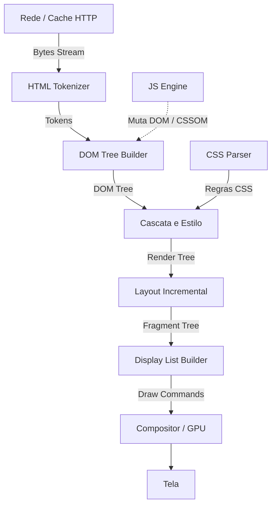
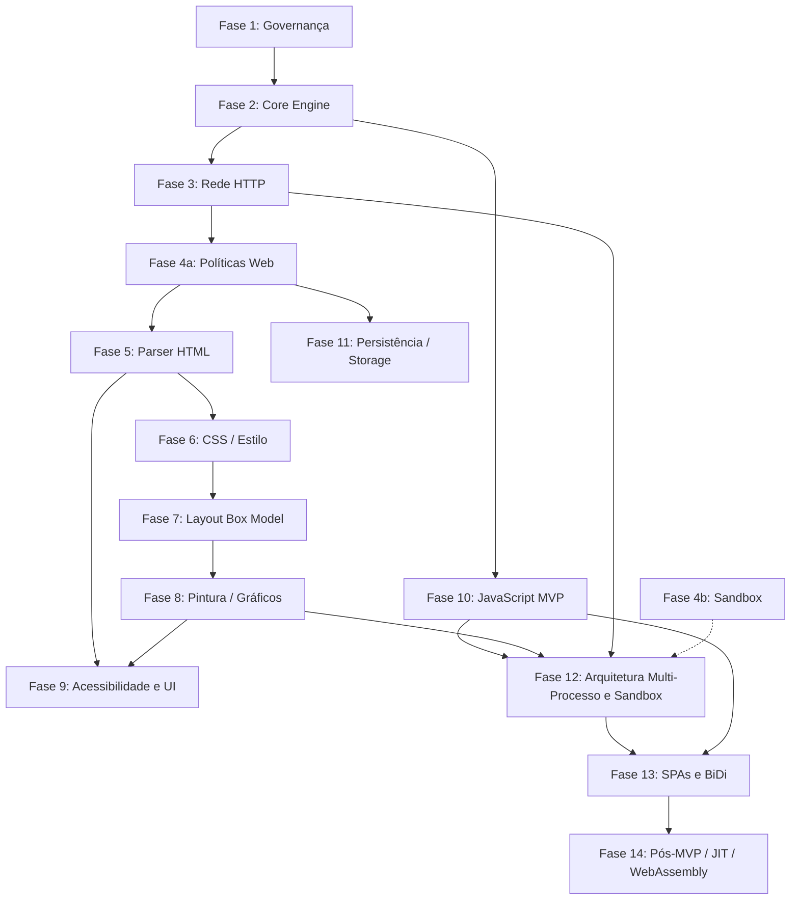

# 🗺️ PLANO MESTRE DE ENGENHARIA — ACE (Albedo Core Engine) & Albedo Browser

> **Versão:** 7.0 — *Plano Ancorado em Evidências*
> **Última atualização:** 2026-10-07
> **Auditoria de referência:** branch `feat/phase3-ace-net-http-cache`, commit `fa4a723`
> **Propósito:** Roteiro exaustivo, técnico e executável para construir um navegador web completo e competitivo, com motor próprio escrito em Rust.
> **Status:** Documento vivo. É a **fonte da verdade** do projeto. Cada mudança de estado de fase atualiza a [§3 Painel de Estado Real](#3-painel-de-estado-real) no mesmo PR.

---

## Changelog do Plano

| Versão | Data | Mudanças principais |
| --- | --- | --- |
| **7.0** | 2026-10-07 | Auditoria completa contra o repositório. Painel de estado real com evidências; status corrigidos (Fases 1, 2, 5 → 🟡; Fase 3 → 🚧). Fase 4 dividida em 4a (Políticas Web) e 4b (Sandbox de SO, acoplada à Fase 12). Trilha JS paralela desde a Fase 2. MVP sem JIT (interpretador + modo *jitless* permanente). Isolamento por site como alvo da Fase 12. Conformidade em 4 estágios (html5lib → layout/reftests → testharness.js → WebDriver BiDi). Trilhas transversais (Segurança, Conformidade, Performance, Acessibilidade, Privacidade, Web Compat, i18n, Mídia, Distribuição, Observabilidade). APIs essenciais de SPA que faltavam (Workers, History API, ResizeObserver…). Critério objetivo de fronteira, política de `unsafe`, matriz de dependências entre crates, ADRs 0012–0021. Caminhos de docs atualizados para `docs/architecture/` e `docs/scope/`. |
| 6.0 | 2026-08-16 | Paradigma Pragmático consolidado (Fundação × Alma), 14 fases, Metodologia 3D. |

---

## Como Usar Este Documento

### Hierarquia de autoridade

1. **`PLANO.md`** (este documento): visão, regras, fases, estado e prioridades.
2. **`docs/architecture/*.md`**: o aprofundamento técnico de cada subsistema ([`ace_dom.md`](./docs/architecture/ace_dom.md), [`ace_net.md`](./docs/architecture/ace_net.md), [`test_infra.md`](./docs/architecture/test_infra.md)).
3. **`docs/adr/*.md`**: decisões arquiteturais. Um ADR **aceito** pode alterar este plano, e o PR que aceita o ADR **atualiza o PLANO no mesmo commit**.
4. **`docs/scope/*.md`**: os limites do MVP ([`mvp_scope.md`](./docs/scope/mvp_scope.md), [`css_properties.md`](./docs/scope/css_properties.md), [`web_api.md`](./docs/scope/web_api.md)).

> [!IMPORTANT]
> Em caso de conflito entre documentos, **este PLANO prevalece** até que um ADR aceito o altere. Hoje `docs/scope/mvp_scope.md` contradiz o PLANO em vários pontos (ver [DV-14](#33-dívidas-verificadas)); até ser realinhado, vale o que está aqui.

### Legenda de status

| Símbolo | Significado |
| --- | --- |
| ✅ | **Concluído:** DoD da fase cumprido, evidência no repositório e gate de CI verde |
| 🚧 | **Em andamento:** trabalho ativo na branch corrente |
| 🟡 | **Parcial:** há entregas reais, mas o DoD não foi cumprido |
| ⏳ | **Planejado:** nada (ou só stub) implementado |
| ⛔ | **Bloqueado:** depende de algo não resolvido |
| 🔁 | **Pós-MVP:** fora da v1.0 por decisão explícita |

Nos checkboxes de tarefas:
- `[x]` = a entrega **existe no repositório** e há teste que a exercita (o caminho de evidência vem citado).
- `[ ]` = não existe, ou existe sem teste.

### Regra de Evidência (Regra de Ouro 5)

Nenhuma fase recebe ✅ sem as três condições:

1. **Caminho** no repositório que implementa a entrega.
2. **Teste** automatizado que exercita o comportamento exigido pelo DoD.
3. **Gate de CI verde** (`fmt`, `clippy -D warnings`, `test --workspace`, `deny`) no commit que fecha a fase.

> [!WARNING]
> Relatórios narrativos ("100% de sucesso", "0 unsafe", "aprovado") **não contam como evidência**. A auditoria v7.0 encontrou afirmações desse tipo que não se sustentavam (por exemplo, o job Miri/TSan do CI aponta para testes que não existem, e há 64 ocorrências de `unsafe` no workspace).

---

## Índice

- [1. Visão, Missão e Não-Objetivos](#1-visão-missão-e-não-objetivos)
- [2. Constituição do Projeto](#2-constituição-do-projeto)
- [3. Painel de Estado Real](#3-painel-de-estado-real)
- [4. Arquitetura](#4-arquitetura)
- [5. Metodologia 3D, Definition of Ready/Done e Phase Gates](#5-metodologia-3d-definition-of-readydone-e-phase-gates)
- [6. Fases Detalhadas](#6-fases-detalhadas)
- [7. Trilhas Transversais](#7-trilhas-transversais)
- [8. Grafo de Dependências entre Fases](#8-grafo-de-dependências-entre-fases)
- [9. Estratégia de Testes e Conformidade](#9-estratégia-de-testes-e-conformidade)
- [10. Métricas e KPIs](#10-métricas-e-kpis)
- [11. Experiência do Desenvolvedor (DX)](#11-experiência-do-desenvolvedor-dx)
- [12. Governança, ADRs e Post-Mortems](#12-governança-adrs-e-post-mortems)
- [13. Riscos Globais e Mitigações](#13-riscos-globais-e-mitigações)
- [14. Próximos Passos Imediatos](#14-próximos-passos-imediatos)
- [15. Glossário e Referências Normativas](#15-glossário-e-referências-normativas)
- [16. O Custo da Glória](#16-o-custo-da-glória)

---

## 1. Visão, Missão e Não-Objetivos

### 1.1 Visão

Um navegador web **independente**, cujo motor (o **ACE**) é escrito do zero em Rust, sem herdar Blink, WebKit, Gecko ou Servo. A meta é devolver diversidade tecnológica à web com um motor seguro por construção, paralelo por padrão e auditável de ponta a ponta.

### 1.2 Missão

Forjar a **Alma** do navegador (parsing web, DOM, cascata, layout, pintura, compositing, motor JavaScript e arquitetura multi-processo) e **orquestrar as melhores Fundações** do ecossistema Rust para o que é infraestrutura (I/O assíncrono, transporte, criptografia, Unicode, GPU, janelas).

### 1.3 Filosofia

> **A regra é simples:** se é *trabalho chato, perigoso ou já perfeitamente resolvido pela comunidade*, usamos a melhor crate. Se é *o que define um navegador* (parsing web, cascata, layout, pintura, JavaScript), **nós forjamos**.

### 1.4 Definição do MVP (v1.0)

O MVP é atingido quando o Albedo, em **Windows, Linux e macOS (desktop)**:

1. Navega via **HTTPS** (HTTP/1.1 e HTTP/2; HTTP/3 opcional) com cache, cookies e políticas de segurança.
2. Parseia e renderiza corretamente **páginas de documento reais** (Wikipedia, documentação técnica, blogs, notícias), usando o subconjunto CSS do MVP ([`css_properties.md`](./docs/scope/css_properties.md)): fluxo em bloco e inline, Flexbox, Grid básico e posicionamento.
3. Exibe texto com **shaping completo** (incluindo RTL e CJK via shaping compatível com HarfBuzz), imagens (PNG, JPEG, GIF, WebP), rolagem e formulários básicos.
4. Executa o JavaScript de páginas comuns em um **interpretador de bytecode próprio (sem JIT)**, com Promises, `async`/`await`, eventos, timers, `fetch()`, Web Workers e History API.
5. Tem abas, omnibox, histórico, voltar/avançar e DevTools mínimo.
6. Roda conteúdo web em **processos de renderer isolados** do processo do navegador.

**Fica fora do MVP (🔁):** JIT, WebAssembly, WebGL/WebGPU para conteúdo, WebRTC, DRM/EME, extensões, `<video>`/`<audio>` com codecs patenteados, impressão, mobile.

### 1.5 Não-Objetivos (permanentes)

- **Não** ser fork, wrapper ou embed de outro motor (ver [§2.3](#23-lista-negra-mata-projetos)).
- **Não** perseguir paridade de features com o Chrome no MVP: correção e segurança vêm antes de amplitude.
- **Não** compatibilidade com extensões do Chrome/Firefox no MVP.
- **Não** coletar telemetria sem consentimento explícito (*opt-in*).

### 1.6 Público-alvo inicial

Desenvolvedores, pesquisadores e entusiastas em desktop. Uso diário (*dogfooding*) pelo próprio time a partir da Fase 9.

---

## 2. Constituição do Projeto

### Regras de Ouro

**Regra 1 — O Motor é Nosso, a Fundação é Compartilhada.** Não usamos motores de navegação prontos (Blink, WebKit, Gecko, Servo) nem frameworks que ofusquem o ciclo de vida da página (CEF, webviews de sistema). Layout, parsing web, DOM, estilo, pintura e JS são **100% nossos**. Usamos ativamente crates fundacionais auditadas.

**Regra 2 — Foco na Inovação Arquitetural.** Reescrever um parser TLS ou um event loop de I/O não agrega valor, só introduz vulnerabilidades. Construir um layout massivamente paralelo, que evita repaints desnecessários, muda a performance. A engenharia se concentra no que impacta a Render Tree, o compositing e a UI.

**Regra 3 — Toda decisão arquitetural importante vira um ADR** em `docs/adr/`, usando o [template](./docs/adr/0000-template.md).

**Regra 4 — Checklist de todo código novo:**
- [ ] Usa a melhor crate disponível para trabalho "chato/inseguro" (sem reinventar a roda)?
- [ ] Tem testes (cobertura ≥ 80% na lógica de domínio)?
- [ ] Passa em `cargo clippy --workspace --all-targets --all-features -- -D warnings`?
- [ ] Está documentado com `///` (e doctests quando aplicável), citando a seção da spec que implementa?
- [ ] Todo bloco `unsafe` tem comentário `// SAFETY:` e entrada no registro de `unsafe` ([§2.4](#24-política-de-unsafe))?
- [ ] Foi revisado por pares?

**Regra 5 — Evidência antes de status.** Ver a [Regra de Evidência](#regra-de-evidência-regra-de-ouro-5).

**Regra 6 — A spec é a especificação.** Código que implementa algoritmo normativo (WHATWG, W3C, ECMA, IETF) referencia a seção correspondente no doc-comment (ex.: `/// HTML §13.2.6.4.7 "in body"`). Divergências intencionais da spec exigem ADR.

### 2.1 A Fronteira Pragmática (fonte da verdade)

| Domínio | 🧱 Fundação **em uso** (verificado nos `Cargo.toml`) | 🧱 Fundação **planejada** | 🔨 Alma (construímos do zero) |
| --- | --- | --- | --- |
| **Async & Concorrência** | `tokio`, `tokio-util`, `rayon`, `crossbeam`, `parking_lot`, `dashmap`, `futures-*` | `loom` (validação de concorrência) | Event Loop WHATWG (task sources, microtasks, rendering opportunity), agendamento, anti-starvation |
| **Rede & Transporte** | `hyper`, `hyper-util`, `hyper-rustls`, `http`, `http-body-util`, `httpdate`, `bytes`, `tower-service`, `quinn`, `h3`, `h3-quinn`, `tungstenite`, `hickory-resolver`, `url` | — | `ResourceFetcher`, cache HTTP RFC 9111 (L1/L2), scheduler RFC 9218, redirects, `data:` URIs, sniffing, particionamento |
| **Criptografia & Segurança** | `rustls` (aws-lc-rs), `webpki-roots`, `rustls-pki-types`, `sha2`, `getrandom`, `base64` | — | SOP/Origin/Site, CORS, CSP, Cookie Jar (CHIPS), HSTS, PNA, SRI, Referrer Policy, sandbox nativo |
| **Compressão** | `flate2`, `brotli`, `zstd`, `async-compression` | — | Pipeline de descompressão em streaming, Compression Dictionary Transport |
| **Encoding & Texto** | `encoding_rs`, `memchr`, `smol_str`, `ropey`, `string_cache`, `phf` | `icu4x` (UCD, bidi UAX#9, line-break UAX#14, segmentação UAX#29, `Intl`) | Algoritmo de encoding sniffing WHATWG, tokenizers |
| **Parsing Web** | — *(nenhuma)* | — *(nenhuma)* | **HTML Tokenizer + Tree Builder**, **CSS Syntax L3 + parser**, WebIDL codegen |
| **Estilos & Layout** | — *(nenhuma)* | — *(nenhuma)* | Cascata, especificidade, valores computados, Render Tree, BFC/IFC/Flex/Grid, positioning |
| **Tipografia** | — | Shaping: `harfrust` ou `rustybuzz` (ADR-0013); fontes: `skrifa`/`read-fonts` ou `ttf-parser` + `ab_glyph` (ADR-0013); `fontdb` (descoberta de fontes do sistema) | Integração do text layout, glyph atlas, font fallback, FOIT/FOUT |
| **Gráficos & Mídia** | — | `wgpu` (Vulkan/Metal/D3D12), `image`/`png`/`zune-jpeg`/`image-webp`/`gif`; AVIF/JPEG XL (pós-MVP) | Display List, Layer Tree, Compositor, efeitos, pipeline de imagens |
| **Plataforma** | — | `winit`, `raw-window-handle`, `windows-sys`/`libc` (syscalls pontuais) | PAL fino, mapeamento input → eventos DOM, IME |
| **Acessibilidade** | — | `accesskit` + adaptadores (UIA, NSAccessibility, AT-SPI) — ADR-0014 | Accessibility Tree (mapeamento DOM/ARIA → roles), cálculo de nome acessível |
| **Matemática** | `euclid` (tipos 2D/3D com unidades) — ADR-0017 | — | Box model, LayoutUnit, cores CSS Color 4 (Oklab/Oklch), decomposição de transforms |
| **Erros & Observabilidade** | `thiserror`, `anyhow` (ver ADR-0016), `tracing` | `tracing-subscriber` | `AceError`, NetLog, HAR, métricas de frame |
| **Serialização** | `serde`, `serde_json` (telemetria/HAR) | — | Protocolo IPC binário próprio (ADR-0005) |
| **Dados web** | `psl` | — | Trie compacta de PSL própria em `ace_core` (**duplicação, ver DV-09**) |
| **JavaScript** | — *(nenhuma)* | `icu4x` (só para `Intl`/ECMA-402) | **ACE JS completo**: lexer, parser, bytecode, VM, GC, RegExp, JIT (pós-MVP) |
| **Persistência** | — *(nenhuma)* | — | KV Store, cookies persistentes, histórico, bookmarks, IndexedDB |

### 2.2 Critério objetivo de fronteira

Uma crate nova **só** entra como Fundação se cumprir **todos** os critérios:

1. **Não decide semântica web observável**: não implementa parsing HTML/CSS, cascata, layout, DOM, semântica JS ou Web APIs.
2. **Resolve infraestrutura**: I/O, criptografia, compressão, dados Unicode, GPU, janela, codecs, estruturas de dados genéricas.
3. **Licença** está na allowlist do `deny.toml` (MIT, Apache-2.0, BSD-2/3, MPL-2.0, Zlib; Unicode-3.0 deve ser adicionada para `icu4x`).
4. **Saúde**: release nos últimos 12 meses, mais de um mantenedor ou mantida por uma organização, e sem advisory RustSec aberto.
5. **Não puxa crate banida**, nem transitivamente.

**Zona cinzenta → ADR obrigatório.** Exemplos:

| Crate | Situação | Decisão |
| --- | --- | --- |
| `string_cache` | Do projeto Servo, mas é *interning* genérico | Aceita **provisoriamente**; ADR-0018 deve confirmar ou trocar por interning próprio (`ace_core::intern` já existe) |
| `euclid` | Tipos geométricos genéricos | Aceita como Fundação (ADR-0017) |
| `selectors` (Servo) | Implementa matching CSS | **Proibida**: matching é Alma |
| `taffy` | Implementa Flex/Grid | **Proibida em produção**; uso como oráculo de teste só via ADR (hoje o `deny.toml` a bane até em dev-deps) |
| `tiny-skia` / `vello_cpu` | Rasterização 2D genérica | Zona cinzenta: ADR-0020 decide sobre o fallback CPU |

### 2.3 Lista Negra ("Mata-Projetos")

| Categoria | Crates banidas (alvo do `deny.toml`) |
| --- | --- |
| Motores de renderização / webviews | `servo`, `libservo`, `blitz`, `blitz-*`, `webkit2gtk`, `wry`, `tauri`, `webview2-com`, `cef`, `ultralight` |
| Motores JavaScript | `v8`, `rusty_v8`, `boa_engine`, `boa_*`, `quickjs`, `rquickjs`, `deno_core`, `mozjs`, `javascriptcore-rs` |
| Parsing/estilo/layout prontos | `html5ever`, `markup5ever`, `xml5ever`, `cssparser`, `selectors`, `stylo`, `lightningcss`, `taffy`, `yoga`, `morphorm` |

> [!NOTE]
> O `deny.toml` atual só bane `servo`, `wry`, `tauri`, `webview2-com`, `cef`, `v8`, `rusty_v8`, `boa_engine`, `quickjs`, `html5ever`, `cssparser` e `taffy`. Ampliar a lista é tarefa da Fase 1 (DV-07).
>
> Uma "allowlist" total no `cargo-deny` bloquearia dependências transitivas e é impraticável. A allowlist vale para **dependências diretas** (tabela §2.1) e será verificada por `cargo xtask deps-check`, que compara `cargo metadata` com a tabela.

### 2.4 Política de `unsafe`

Estado atual: **64 ocorrências** de `unsafe` no workspace, sem registro central (DV-12).

1. Todo bloco/fn/impl `unsafe` tem comentário `// SAFETY:` explicando a invariante.
2. Lints obrigatórios: `clippy::undocumented_unsafe_blocks`, `clippy::multiple_unsafe_ops_per_block`, `unsafe_op_in_unsafe_fn`.
3. Crates sem necessidade declaram `#![forbid(unsafe_code)]` (meta: `ace_dom`, `ace_style`, `ace_layout`, `ace_net`).
4. Registro em `docs/security/unsafe-registry.md`: arquivo, motivo, invariante, teste e cobertura Miri.
5. Todo módulo com `unsafe` tem testes executados sob **Miri** no CI; estruturas lock-free também sob **loom**.
6. O JIT (pós-MVP) é a única exceção arquitetural com `unsafe` massivo, isolado em crate próprio e com fuzzing diferencial.

---

## 3. Painel de Estado Real

Este painel reflete o estado auditado do projeto, ancorado em evidências do repositório. Nenhuma fase é marcada como ✅ sem código, teste e CI verde.

| Fase | Domínio | Status | Evidência Principal (Crate/Caminho) |
| --- | --- | --- | --- |
| 1 | Governança & Setup | 🟡 | `Cargo.toml`, CI. Faltam `LICENSE`, `SECURITY.md`, e correção do job Miri. |
| 2 | Core Engine | 🟡 | `ace_core`. `ace_ipc` é apenas stub (Falta IPC in-process real). |
| 3 | Rede HTTP | 🚧 | `ace_net`. Quase pronto, mas gate de teste falha (`tempfile` faltando). |
| 4a | Políticas Web | 🟡 | Feito no `ace_core`/`ace_net`/`ace_dom/security`. Faltam COOP/COEP. |
| 4b | Sandbox de SO | ⏳ | Acoplada à Fase 12 (depende de isolamento de processos). |
| 5 | Parser HTML | 🟡 | `ace_dom/src/html/`. Faltam testes oficiais do `html5lib`. |
| 6 | Estilo & CSS | ⏳ | `ace_dom/src/cssom` (a ser movido). `ace_style` é um stub. |
| 7 | Layout | ⏳ | `ace_layout` é um stub. |
| 8 | Pintura & Gráficos | ⏳ | `ace_gfx` não existe. |
| 9 | Acessibilidade & UI | ⏳ | `ace_ui` é um stub. |
| 10 | JavaScript (MVP) | ⏳ | `ace_js` é um stub. |
| 11 | Persistência | ⏳ | `ace_storage` não existe. |
| 12 | Integração multi-processo| ⏳ | Isolamento por site (depende das Fases 2, 4b, 10). |
| 13 | APIs de SPA & BiDi | ⏳ | Faltam Workers, History API, WebDriver BiDi. |
| 14 | WebAssembly & Fim | ⏳ | — |

### 3.1 Dívidas Conhecidas Verificadas (DVs)

Estas são as discrepâncias encontradas entre o plano antigo e o repositório, que agora estão sendo ativamente geridas:

- **DV-01 (Fase 2 inacabada):** `ace_ipc` é um stub de 1 linha. O IPC in-process exigido na Fase 2 não existe.
- **DV-02 (`ace_core` inchado):** `ace_core` contém ~25k linhas (arena, event loop, security, PSL), muito além de uma util library.
- **DV-03 (Edition 2021 vs 2024):** O projeto está no Edition 2021 (verificado nos `Cargo.toml`), pendente de ADR para 2024.
- **DV-04 (13 crates):** O projeto possui 13 crates, não 12 (`ace_data_models`, `ace_test_driver` existem).
- **DV-05 (Localização do CSSOM):** CSSOM e cascata estão hoje em `ace_dom`, contrariando o plano de ficarem em `ace_style`. A Fase 6 prevê movê-los.
- **DV-06 (Erros e Matemática):** Uso de `thiserror`/`anyhow` e `euclid` em `ace_core`, contradizendo o plano antigo de "matemática 100% nossa" e "sem thiserror". Foram aceitos como Fundação.
- **DV-07 (`deny.toml` permissivo):** A lista de crates banidas está incompleta. Crates como `taffy` estão bloqueadas, mas faltam outras da [§2.3](#23-lista-negra-mata-projetos).
- **DV-08 (CI estruturalmente quebrado):** O job Miri/TSan aponta para 5 testes inexistentes. `review.yml` foca em um monólito antigo.
- **DV-09 (Teste do workspace quebra):** `cargo test --workspace` falha por falta do pacote `tempfile` nas dev-deps de `ace_net`.
- **DV-10 (Pré-requisitos não documentados):** O build do `ace_net` exige um compilador C (para `zstd-sys`), mas não está na documentação.
- **DV-11 (WPT ausente):** `ace_test_driver` é um stub. O `html5lib-tests` exigido não possui arquivos `.dat` no repositório.
- **DV-12 (Infraestrutura de projeto ausente):** Faltam arquivos vitais: `LICENSE`, `CONTRIBUTING.md`, `SECURITY.md`, `fuzz/`, `benches/`.
- **DV-13 (Ocultamento de `unsafe`):** Há 64 ocorrências de `unsafe` no workspace, contrariando as antigas claims de "100% safe".
- **DV-14 (`mvp_scope.md` defasado):** O escopo do MVP no doc oficial está desatualizado (e.g. dizendo que não há HTTP/2, quando `ace_net` já tem H2/H3).
- **DV-15 (JIT contraditório):** O plano original colocava o JIT no MVP. A versão 7.0 consolida o JIT como **pós-MVP**.
- **DV-16 (Trilha JS incorreta):** O grafo de dependências não mostrava a independência do parse JS.
- **DV-17 (Modelo de processos defasado):** "Renderer por aba" foi substituído por "Isolamento por site" como alvo moderno.
- **DV-18 (Afirmações sem evidência):** Antigos relatórios afirmavam "100% testado", que o CI agora desmente (DV-08).

---

## 4. Arquitetura

O ACE é dividido em 13 crates. Nenhum crate depende de algo "acima" dele.

### 4.1 As 13 Crates e Responsabilidades

| Nível | Crate | Responsabilidade |
| --- | --- | --- |
| 1 | `ace_core` | Fundações comuns: arenas (EBR), concorrência, log, math (`euclid`), tipos primitivos, `AceError`. |
| 1 | `ace_data_models` | Tipos puros de dados transferíveis (IPC messages, configs). |
| 2 | `ace_net` | I/O de rede (tokio, hyper, quinn), DNS, cache RFC 9111, sockets, segurança TLS. |
| 2 | `ace_ipc` | Comunicação inter-processo e inter-thread, channel primitives. |
| 3 | `ace_js` | Interpretador JavaScript (Lexer, Parser, AST, Bytecode VM), integra com `icu4x` para `Intl`. |
| 4 | `ace_dom` | HTML Tokenizer, Tree Builder, representação DOM (Nodes), validação de segurança (CSP). |
| 5 | `ace_style` | Syntax L3 de CSS, Rule Tree, Cascata, Valores Computados (vai importar/adotar do `ace_dom`). |
| 6 | `ace_layout` | Fragment tree genérica (tipo LayoutNG), Box model, IFC/BFC, Flex, Grid. |
| 7 | `ace_gfx` | Abstração sobre `wgpu`, Display List (Vello/CPU fallback), Compositor, glyph shaping. |
| 8 | `ace_media` | Decodificação de imagem, áudio e vídeo em streaming. |
| 8 | `ace_ui` | Omni-box, abas, gestão de janelas (winit), mapeamento Acessibilidade (AccessKit). |
| 9 | `ace_test_driver` | Suítes WPT, WebDriver BiDi, mocks de testes end-to-end. |
| 10 | `albedo_browser` | Binário final. Orquestra a inicialização e aciona os processos. |

### 4.2 Matriz de Dependências Permitidas

Para evitar dependências circulares:
- `ace_dom` depende de `ace_core` e `ace_net`. Pode chamar `ace_js` (bindings).
- `ace_style` depende de `ace_dom` (para seletores).
- `ace_layout` depende de `ace_style` e `ace_dom`.
- `ace_gfx` depende de `ace_layout` e `ace_media`.
- `albedo_browser` importa todos como orquestrador.

### 4.3 Pipeline End-to-End

```mermaid
flowchart TD
    Net[Rede / Cache HTTP] -->|Bytes Stream| Tokenizer[HTML Tokenizer]
    Tokenizer -->|Tokens| TreeBuilder[DOM Tree Builder]
    TreeBuilder -->|DOM Tree| Style[Cascata e Estilo]
    
    CSS[CSS Parser] -->|Regras CSS| Style
    
    Style -->|Render Tree| Layout[Layout Incremental]
    Layout -->|Fragment Tree| Gfx[Display List Builder]
    Gfx -->|Draw Commands| Compositor[Compositor / GPU]
    Compositor --> Tela[Tela]

    JS[JS Engine] -.->|Muta DOM / CSSOM| TreeBuilder
```

### 4.4 Modelo de Threads e Processos

O Albedo é projetado para **isolamento por site** (Site Isolation).

- **Processo do Browser (Main):** Interface de usuário (winit), controle de rede (`ace_net`), acesso a disco (cache, storage).
- **Processos de Renderer (Múltiplos):** Um por *site* (eTDL+1). Roda em sandbox do SO restrito. Cada renderer possui:
  - **Main Thread:** HTML parse, JS VM (run-to-completion lock), DOM mutator, Style, Layout.
  - **Compositor Thread:** Recebe display lists, gerencia rasterização assíncrona com `wgpu`, lida com inputs de scroll (para off-main-thread-scrolling).
  - **Worker Threads:** Para Web Workers e threads do `rayon` para rasterização paralela.
- **Processo de GPU (Opcional):** Para isolamento em sistemas onde drivers gráficos são instáveis ou para IPC de comandos `wgpu`.

### 4.5 Modelo de Memória (Arena Geracional)

O DOM (grafos cíclicos) não pode usar puramente `Rc<RefCell<T>>` sem vazamentos ou perdas de performance.
- O `ace_core` provê Arenas Geracionais (baseadas em Epoch-Based Reclamation - EBR).
- Futuro (Fase 10): O GC do motor JavaScript gerenciará as referências de wrapper do DOM. Um "GC Bridge" sincronizará as liveness do DOM com o JS (ADR-0007).

---

## 5. Metodologia 3D, Definition of Ready/Done e Phase Gates

### Metodologia 3D (O Quê, Como, E Mais O Quê)
Antes de escrever código, analisamos:
1. **Funcional:** O que a feature faz, qual spec atende.
2. **Técnico:** Como implementar (arquitetura, testes, dependências).
3. **Transversal:** Segurança (Threat Model), Performance (Big-O), Acessibilidade, Privacidade.

### Definition of Ready (DoR)
Uma Fase só começa se:
- O ADR da arquitetura base foi aprovado.
- As dependências de fases anteriores (segundo o grafo) estão ✅.

### Definition of Done (DoD) Global
- Código mergeado na `main`.
- Critérios específicos da Fase atendidos.
- Testes cobrindo a feature adicionados.
- Gate de CI (compilação, formatação, lints de segurança, Miri) 100% verde.

---

## 6. Fases Detalhadas

Todas as Fases seguem o mesmo template de contrato rigoroso. As fases não são estritamente sequenciais (ver [§8 Grafo de Dependências](#8-grafo-de-dependências-entre-fases)).

### Fase 1: Governança, Setup e Infraestrutura Base
- **Objetivo:** Estabelecer fundação auditável, integração contínua rigorosa e políticas do projeto.
- **Estado:** 🟡 Parcial (CI precisa de reparos, arquivos legais ausentes).
- **Fundações:** N/A.
- **Alma:** Configurações de Lint (`deny.toml`, `clippy.toml`), CI/CD, Git Hooks.
- **Tarefas:**
  - [x] Configurar CI básico com gate de formatação, clippy, testes e `cargo-deny`.
  - [x] Implementar e documentar a política de ADR.
  - [ ] Consertar CI estruturalmente quebrado (remover testes de monólito do `review.yml`, consertar Miri).
  - [ ] Endurecer `deny.toml` com a nova lista negra estrita ([§2.3](#23-lista-negra-mata-projetos)).
  - [x] Adicionar `LICENSE` (Proprietária / Todos os Direitos Reservados).
  - [ ] Criar `CONTRIBUTING.md`, `SECURITY.md`, `CODEOWNERS`.
  - [ ] Estabelecer infraestrutura de Fuzzing (`fuzz/`) e Benchmarking (`benches/`).
- **Depende de:** —
- **Doc Vinculado:** —

### Fase 2: Core Engine & Utilitários Compartilhados
- **Objetivo:** Criar os tijolos fundamentais para o projeto todo, sem conhecer domínios de alto nível (HTML/Rede).
- **Estado:** 🟡 Parcial (IPC incompleto, escopo original extrapolado).
- **Fundações:** `thiserror`, `anyhow`, `euclid`, `crossbeam`, `rayon`.
- **Alma:** EBR Arenas, Event Loop básico genérico, tipos utilitários (Strings primitivas, Matemática estrita).
- **Tarefas:**
  - [x] Construir as estruturas de dados base (`ace_core`), incluindo arenas geracionais.
  - [x] Definir matemática e tipos geométricos integrados (`euclid` via `ace_core::math`).
  - [x] Configurar logging centralizado (`tracing`).
  - [ ] Implementar `ace_ipc` in-process real com mensagens genéricas (`Navigate`, `RenderFrame`).
- **Depende de:** Fase 1
- **Doc Vinculado:** —

### Fase 3: Rede e Transporte (HTTP/TLS/DNS)
- **Objetivo:** Estabelecer o funil seguro por onde todo byte externo entra no navegador.
- **Estado:** 🚧 Em Andamento (Falta o teste de fechamento).
- **Fundações:** `tokio`, `hyper`, `quinn`, `rustls`, `hickory-resolver`.
- **Alma:** Sockets parciais, socket racing, cache L1/L2, sniffing, pre-flight.
- **Tarefas:**
  - [x] Stack HTTP/1.1 e HTTP/2 (e HTTP/3 via `quinn`) rodando sob `tokio`.
  - [x] Cache HTTP em conformidade com a RFC 9111.
  - [x] DoH e integração com `rustls`.
  - [x] Observabilidade de rede via NetLog/HAR.
  - [ ] Consertar falha de teste atual (dependência de `tempfile`).
  - [ ] Provar o DoD com um caso end-to-end de fetch (mock) via feature flag.
- **Specs Normativas:** IETF RFC 9110/9111 (HTTP), RFC 9114 (HTTP/3).
- **Depende de:** Fase 2
- **Doc Vinculado:** [`docs/architecture/ace_net.md`](./docs/architecture/ace_net.md)

### Fase 4a: Políticas Web e Segurança em Rede
- **Objetivo:** Implementar o cinturão de segurança da Web para restringir e controlar o fluxo de dados.
- **Estado:** 🟡 Parcial (CSP e CORS avançaram, mas restam lacunas).
- **Fundações:** N/A.
- **Alma:** Origin, Site, CSP, CORS, HSTS, PNA, Cookies.
- **Tarefas:**
  - [x] Base de CORS, referrers e Same-Origin Policy.
  - [x] Parseamento e enforcement estrutural de Content Security Policy (CSP).
  - [x] Implementação de Cookies (CHIPS).
  - [ ] COOP, COEP, CORP, e Cross-Origin Isolation.
  - [ ] Permissions Policy.
- **Specs Normativas:** W3C CORS, CSP Level 3, RFC 6265bis (Cookies).
- **Depende de:** Fase 3

### Fase 5: Parser HTML e Construção do DOM
- **Objetivo:** Transformar bytes em uma árvore DOM válida, incluindo Quirks Mode.
- **Estado:** 🟡 Parcial (Tokenizer existe, faltam os testes da suite oficial).
- **Fundações:** N/A (Regra: Parse HTML é Alma pura).
- **Alma:** WHATWG Tokenizer, Tree Builder, elementos e interfaces DOM.
- **Tarefas:**
  - [x] Tokenizer HTML implementado do zero.
  - [x] Tree Builder funcional para casos felizes.
  - [ ] Integrar **html5lib-tests** (`.dat` files) no repositório local.
  - [ ] Alcançar 100% de conformidade nos testes de tokenizer.
  - [ ] Algoritmo de encoding sniffing e Quirks mode.
- **Specs Normativas:** WHATWG HTML Standard (Parsing).
- **Depende de:** Fase 2, Fase 4a
- **Doc Vinculado:** [`docs/architecture/ace_dom.md`](./docs/architecture/ace_dom.md)

### Fase 6: Estilo e CSS (Cascata, Computed Values)
- **Objetivo:** Resolver as regras CSS, cascata e aplicar valores computados à árvore DOM (Render Tree).
- **Estado:** ⏳ Planejado (`ace_style` é um stub; atual código está mal localizado em `ace_dom`).
- **Fundações:** N/A (Matching CSS é Alma).
- **Alma:** CSS Syntax Parser L3, Specificity, Cascade, Inheritance, Invalidation sets.
- **Tarefas:**
  - [ ] Migrar CSSOM e código de estilo atual de `ace_dom` para `ace_style`.
  - [ ] Implementar CSS Syntax L3.
  - [ ] Construir a Rule Tree de alta performance.
  - [ ] Cascata nível 5 (incluindo `@layer`) e nível 6 (`@scope`).
  - [ ] Cache de style sharing e invalidação incremental de regras.
- **Specs Normativas:** W3C CSS Syntax L3, CSS Cascade L5/L6.
- **Depende de:** Fase 5

### Fase 7: Layout Incremental e Box Model
- **Objetivo:** Calcular dimensões e posições (X,Y) de todos os fragmentos gerados pela Render Tree.
- **Estado:** ⏳ Planejado.
- **Fundações:** N/A (Mecanismo LayoutNG-like é Alma).
- **Alma:** BFC, IFC, Flexbox, Grid básico, Fragment Tree imutável.
- **Tarefas:**
  - [ ] Arquitetar a Fragment Tree separada da Box Tree.
  - [ ] Fluxos em bloco (BFC) e em linha (IFC).
  - [ ] Layout de tabelas básico.
  - [ ] Implementação restrita ao `css_properties.md` do MVP (Flexbox, Grid estático).
  - [ ] Testes de layout-dump sem depender de GPU/pintura.
- **Specs Normativas:** W3C CSS Box Model, Flexbox, Grid Layout.
- **Depende de:** Fase 6

### Fase 8: Pintura e Gráficos (GPU/CPU)
- **Objetivo:** Converter a Fragment Tree em listas de comandos de pintura (Display List) e rasterizá-las.
- **Estado:** ⏳ Planejado.
- **Fundações:** `wgpu`, `harfrust` ou `rustybuzz` (Tipografia, ver ADR-0013), codecs de imagem.
- **Alma:** Display List Builder, Layer Tree, Compositor, Gerenciamento de cores.
- **Tarefas:**
  - [ ] Implementar a Display List e geração de comandos gráficos.
  - [ ] Compositor off-main-thread (scroll e animações simples no compositor).
  - [ ] Integração com Text Shaping (definição ADR-0013 entre HarfRust/skrifa).
  - [ ] ADR-0020 e implementação de rasterizador CPU fallback (tiny-skia vs vello_cpu).
  - [ ] Decodificação de imagens comuns e suporte inicial a AVIF/JPEG XL via fundações.
- **Specs Normativas:** W3C Compositing and Blending Level 1.
- **Depende de:** Fase 7

### Fase 9: Acessibilidade (a11y) e UI de Navegador
- **Objetivo:** Tornar o conteúdo web legível para tecnologias assistivas (leitores de tela) e montar o shell do navegador.
- **Estado:** ⏳ Planejado.
- **Fundações:** `accesskit`, `winit`.
- **Alma:** Accessibility Tree Calculator, mapeamentos ARIA, mapeamentos de input, UI do Browser.
- **Tarefas:**
  - [ ] Construir a Accessibility Tree atualizada incrementalmente.
  - [ ] Integrar `AccessKit` (conforme ADR-0014) expondo para MSAA/UIA/NSAccessibility.
  - [ ] Shell do navegador (abas, omnibox, renderização da interface via framework ou wgpu).
  - [ ] Integração IME (Input Method Editor) baseada na plataforma local.
  - [ ] DevTools MVP (Console, Inspetor DOM básico).
- **Specs Normativas:** WAI-ARIA 1.2, HTML Accessibility API Mappings.
- **Depende de:** Fase 5, Fase 8

### Fase 10: JavaScript Engine (MVP)
- **Objetivo:** Dar vida à web com interatividade estrita (sem JIT). Executar scripts sem travar o navegador.
- **Estado:** ⏳ Planejado (Pode rodar em paralelo desde a Fase 2).
- **Fundações:** `icu4x` (para `Intl`/ECMA-402).
- **Alma:** Lexer JS, Parser AST, Bytecode Compiler, VM baseada em interpretador, GC unificado (JS ↔ DOM).
- **Tarefas:**
  - [ ] Implementar Lexer/Parser ECMAScript (estrito ao padrão atual).
  - [ ] Compilador de Bytecode e Máquina Virtual interpretada rápida (Stack ou Register VM - ADR pendente).
  - [ ] GC unificado para impedir vazamentos em ciclos JS-DOM (ADR-0007).
  - [ ] Implementar Harness do Test262.
  - [ ] WebIDL e geração automática de bindings entre JS e o código Rust (`ace_dom`).
  - [ ] Engine RegExp própria (risco isolado).
- **Nota:** O JIT é pós-MVP por decisão de segurança e escopo. O modo `jitless` será permanente.
- **Specs Normativas:** ECMA-262 (ECMAScript), WebIDL.
- **Depende de:** Fase 2

### Fase 11: Persistência de Dados e Quota
- **Objetivo:** Armazenar dados do usuário de forma durável, resiliente a crashes e particionada por site.
- **Estado:** ⏳ Planejado.
- **Fundações:** RocksDB, SQLite ou solução em puro Rust (ADR pendente).
- **Alma:** Quota Manager, IndexedDB Parser, Storage Partitioning, LocalStorage/SessionStorage.
- **Tarefas:**
  - [ ] Estabelecer banco de dados seguro à prova de crash.
  - [ ] Particionamento estrito de storage por Origin/Site (para evitar tracking transversal).
  - [ ] Gerenciador de quotas (Clear-Site-Data, Storage Standard).
  - [ ] APIs síncronas/assíncronas (LocalStorage, IndexedDB).
- **Specs Normativas:** W3C Storage, IndexedDB.
- **Depende de:** Fase 4a

### Fase 12: Arquitetura Multi-Processo Final (Site Isolation) e Sandbox
- **Objetivo:** Ligar os processos, isolar o renderer da GPU e da rede, garantir segurança via sandbox no nível do SO.
- **Estado:** ⏳ Planejado.
- **Fundações:** APIs de sistema isolado (`windows-sys`, seccomp-bpf, App Sandbox).
- **Alma:** Process orchestration, IPC out-of-process, Network Service process.
- **Tarefas:**
  - [ ] Separar de fato o Processo Principal, Renderer (por site) e GPU.
  - [ ] Fazer as chamadas de rede passarem via IPC do Renderer para o Network Service.
  - [ ] Isolamento de Site (Site Isolation) e cross-origin process swaps (ADR-0015).
  - [ ] Sandbox de Sistema Operacional acoplado a cada processo de Renderer.
- **Specs Normativas:** —
- **Depende de:** Fase 10, Fase 8, Fase 3

### Fase 13: SPAs (Single Page Applications) e Conformidade BiDi
- **Objetivo:** Suportar as APIs ricas da web moderna essenciais para SPAs funcionarem fluidamente.
- **Estado:** ⏳ Planejado.
- **Fundações:** N/A.
- **Alma:** APIs essenciais e integração de driver end-to-end.
- **Tarefas:**
  - [ ] Web Workers e MessageChannel / `structuredClone`.
  - [ ] History API (`pushState` / `popstate`) e Navigation API.
  - [ ] ResizeObserver, Fetch / Streams.
  - [ ] AbortController, URL / URLSearchParams.
  - [ ] Implementar **WebDriver BiDi** para rodar WPT de forma automatizada real.
- **Specs Normativas:** WHATWG HTML Standard (Web Workers, History).
- **Depende de:** Fase 10, Fase 12

### Fase 14: Polimento, Pós-MVP e Extras
- **Objetivo:** Entregas que estão explicitamente fora do MVP ou que dependem de licenças proprietárias.
- **Estado:** 🔁 Pós-MVP.
- **Tarefas e Alvos:**
  - [ ] **JIT de JavaScript:** Otimizações Tier 1 e Tier 2 (com W^X, proteção de CFI e fuzzing diferencial).
  - [ ] **WebAssembly:** Avaliar se entraremos com interpretador na v1 ou empurramos para v2.
  - [ ] **Canvas 2D:** Implementação sobre `ace_gfx`.
  - [ ] **Mídia Proprietária (Widevine DRM):** Depende estritamente de acordos com a Google.
  - [ ] Suporte a Extensões (WebExtensions API).
- **Depende de:** Todas as Fases do MVP concluídas.

---

## 7. Trilhas Transversais

Estas trilhas correm em paralelo às Fases. Toda feature implementada deve ser validada contra esses eixos.

| Trilha | Descrição e Ações |
| --- | --- |
| **Segurança** | Modelo de ameaças por processo. Fuzzing diferencial de parsers (HTML/CSS/JS). Isolamento estrito de memória. Política de `unsafe` auditada no CI. |
| **Conformidade** | Integração contínua rodando WPT (Web Platform Tests) e Test262. Meta é compatibilidade real, não "%" superficial. |
| **Performance** | Performance budgets para uso de memória (EBR Arenas vs JS GC), velocidade de parse e First Contentful Paint. Medição contínua via `criterion`. |
| **Acessibilidade** | Acessibilidade nativa como First-Class Citizen através do `AccessKit`. Suporte real a Screen Readers. |
| **Privacidade** | Particionamento total de network/state por Site. Telemetria e coleta de erros 100% Opt-In. Proteções nativas contra fingerprinting. |
| **Web Compat** | Intervenções site-specific. Suporte pragmático a Quirks Mode e strings de User-Agent negociadas. |
| **Mídia** | Suporte a vídeo/áudio em streaming. Cuidado rigoroso com patentes e codecs proprietários (H.264, AAC). |
| **Distribuição** | Pipeline de release, instaladores e update em background seguro com verificação de assinatura. |
| **Observabilidade** | Logging estruturado (`tracing`), netlogs e trace viewers embutidos para auxiliar reports de usuários. |

---

## 8. Grafo de Dependências entre Fases

Esta é a ordem de ataque correta. Notem a trilha JS paralela iniciada logo após a Fase 2.

```mermaid
graph TD
    F1[Fase 1: Governança] --> F2[Fase 2: Core Engine]
    
    %% Trilha JS Independente
    F2 --> F10[Fase 10: JavaScript MVP]
    
    %% Trilha Web Principal
    F2 --> F3[Fase 3: Rede HTTP]
    F3 --> F4a[Fase 4a: Políticas Web]
    F4a --> F5[Fase 5: Parser HTML]
    
    F5 --> F6[Fase 6: CSS / Estilo]
    F6 --> F7[Fase 7: Layout Box Model]
    F7 --> F8[Fase 8: Pintura / Gráficos]
    
    F5 --> F9[Fase 9: Acessibilidade e UI]
    F8 --> F9
    
    F4a --> F11[Fase 11: Persistência / Storage]
    
    %% Convergência
    F10 --> F12[Fase 12: Arquitetura Multi-Processo e Sandbox]
    F8 --> F12
    F3 --> F12
    F4b[Fase 4b: Sandbox] -.-> F12
    
    F12 --> F13[Fase 13: SPAs e BiDi]
    F10 --> F13
    
    F13 --> F14[Fase 14: Pós-MVP / JIT / WebAssembly]
```

---

## 9. Estratégia de Testes e Conformidade

A meta é rodar as suítes oficiais (Web Platform Tests e Test262). A implementação acontece em estágios baseados no que o motor suporta.

| Estágio | Suíte Alvo | Requisitos do Motor | Quando Ocorre |
| --- | --- | --- | --- |
| **Estágio A** | `html5lib-tests` e `css-syntax` | Apenas Parsers (Sem renderização). Testes rodam com asserções estáticas em árvores de AST/Tokens. | Fase 5 e 6 |
| **Estágio B** | *Layout-dump* e Reftests (sem JS) | Motor produzindo coordenadas (Layout) e bitmaps estáticos (Gfx) a partir de HTML local, sem intervenção de scripts. | Fase 7 e 8 |
| **Estágio C** | `testharness.js` local | `ace_js` e bindings atrelados ao DOM, permitindo a execução de asserções em JS direto na engine. | Fase 10 |
| **Estágio D** | `wptrunner` via WebDriver BiDi | Integração total end-to-end com WebSockets / controle real da página. | Fase 13 |

---

## 10. Métricas e KPIs

Nenhum progresso é assumido sem mensuração técnica.

- **KPI 1: Conformidade WPT Absoluta** (Quantidade de sub-testes passados, não apenas %).
- **KPI 2: FCP (First Contentful Paint)**. Meta: Renderizar a Wikipedia offline em menos tempo que o Chrome/Firefox.
- **KPI 3: Memória**. Meta: O motor rodando `about:blank` e a tela inicial sem vazar memória e usando <50MB base.
- **KPI 4: Velocidade de Parse HTML**. Meta: MB/s processados pelo tokenizer.
- **KPI 5: Crashes e Panics**. Meta: Zero unwinding não controlado nos `Renderers`. Todo panic deve gerar uma tela de "Aw Snap!" limpa.

---

## 11. Experiência do Desenvolvedor (DX)

### Pré-requisitos Reais
- Ferramentas Rust padrão: `cargo`, `rustc` 1.80+ (Edition 2021).
- **Compilador C/C++:** Necessário para crates que envolvem FFI (como `zstd-sys` do `ace_net`). No Windows: Visual Studio Build Tools ou MSYS2/MinGW (gcc). No Linux: `build-essential`. No macOS: Xcode Command Line Tools.
- Gerenciador de tarefas: `cargo xtask` (a ser configurado).

### Comandos-Chave
- Validar tudo: `cargo test --workspace && cargo clippy --workspace --all-targets -- -D warnings && cargo fmt --all -- --check`
- Auditar segurança: `cargo deny check`
- Executar componente local de debug: `RUST_LOG=trace cargo run -p albedo_browser`

---

## 12. Governança, ADRs e Post-Mortems

Decisões de design são permanentes até que outro ADR o revogue.

### ADRs Fundamentais (Já em Vigor ou Planejados)
- **ADR-0001:** Migração para Edition 2024 (Pendente).
- **ADR-0005:** Protocolo binário de IPC próprio (Aprovado).
- **ADR-0007:** GC unificado JS ↔ DOM para evitar leaks cíclicos (Aprovado conceitualmente).
- **ADR-0012:** Migração de CSSOM para `ace_style` na Fase 6.
- **ADR-0013:** Pilha de Fontes e Shaping (HarfRust vs skrifa vs Fontdb).
- **ADR-0014:** Adoção de AccessKit como abstração de A11y.
- **ADR-0015:** Adoção estrita do isolamento de processos por site (Site Isolation).
- **ADR-0016:** Uso de `thiserror` (bibliotecas) e `anyhow` (binários).
- **ADR-0017:** Adoção da `euclid` como biblioteca padrão de matemática 2D.
- **ADR-0018:** Allowlist estrita de dependências no `deny.toml`.
- **ADR-0019:** Interpretador vs JIT no MVP.
- **ADR-0020:** GPU vs Fallback de CPU via `vello_cpu` ou `tiny-skia`.
- **ADR-0021:** Regra de Evidência para Atualizações de Status (Reforçada neste PLANO).

---

## 13. Riscos Globais e Mitigações

1. **Bus Factor & Tamanho do Time:** A equipe inicial é minúscula para o tamanho do desafio. *Mitigação: Automação absurda, modularidade, e pragmatismo (Fundações fortes).*
2. **Afirmações sem Evidência:** Agentes ou humanos marcando Fases concluídas ilusoriamente. *Mitigação: Regra de Evidência e CI irredutível.*
3. **Escopo Creeping (Inflação de Escopo):** Adição de features não essenciais da spec HTML5 no meio do projeto. *Mitigação: `mvp_scope.md` é o corte fixo. A Fase 3 já fugiu do escopo original.*
4. **Supply Chain Attacks:** Confiança cega em dezenas de crates do `crates.io`. *Mitigação: `cargo-deny`, `cargo-audit`, e uso de dependabot com auditoria manual.*
5. **Dívida de C/C++:** A dependência contínua de FFI para certas tarefas que não existem em Rust puro. *Mitigação: Isolar todos os wrappers FFI, exigir `unsafe` rigorosamente auditado, e eventualmente migrar para alternativas nativas quando surgirem (ex: `rustls` substituindo OpenSSL).*

---

## 14. Próximos Passos Imediatos

Dado o Painel de Estado Real (Fases 1, 2, 4a, 5 parcialmente concluídas e Fase 3 quase fechada), a ordem de execução recomendada para as próximas semanas é:

1. **Fechamento Definitivo da Fase 3:** Consertar o dev-dependency do `tempfile`, arrumar os 2 warnings do `stress_memory_test.rs`, integrar requisição simulada, passar `cargo test --workspace` e unificar branch para verde (✅).
2. **Resgate da Fase 1 (Governança):** Criar `LICENSE`, limpar o `review.yml` antigo, arrumar a target de testes no job Miri/TSan no `ci.yml`, adicionar um script básico `cargo xtask` (se necessário), e criar allowlist rígida no `deny.toml`.
3. **Resgate da Fase 2 (IPC Real):** Implementar o esqueleto do `ace_ipc` para que não seja mais "apenas 1 linha", incluindo os channels inter-processos com tipos mockados.
4. **Fechamento da Fase 5 (HTML Tests):** Baixar localmente os `*.dat` do WPT html5lib e plugar no test_driver do `ace_dom/src/html/`. Validar as estatísticas reais.

---

## 15. Glossário e Referências Normativas

- **Fundações:** Crates de infraestrutura provadas, criadas pela comunidade (ex: `tokio`, `rustls`).
- **Alma:** O domínio restrito do navegador web (Parsing web, Layout, JS, UI, DOM). Este código deve ser escrito do zero pelo projeto.
- **EBR:** Epoch-Based Reclamation. Estratégia Lock-free e Wait-free para liberação de memória em concorrência, usada no núcleo do `ace_core`.
- **WPT:** Web Platform Tests. O consórcio oficial do W3C para validar browsers.
- **IPC:** Inter-Process Communication. Fundamental no Site Isolation.

**Referências:**
- [WHATWG HTML Standard](https://html.spec.whatwg.org/)
- [W3C CSS Core Standards](https://www.w3.org/Style/CSS/current-work)
- [ECMA-262 (JS)](https://tc39.es/ecma262/)

---

## 16. O Custo da Glória

Escrever um motor web em Rust não é um projeto de fim de semana. É o Everest do desenvolvimento de software.

**Milhões de linhas de especificações.**
**Casos extremos infindáveis.**
**Performances exigidas no nível do micro-segundo.**

Nós não seremos paralisados pelo medo. Em vez disso, escalaremos a montanha metodicamente: crate por crate, módulo por módulo, fase a fase. Nossa fundação é matemática e segura por tipos. O Albedo Browser não nasce para concorrer com o Chrome no Dia 1. Nasce para provar que a Web pode ter de volta uma alma independente.