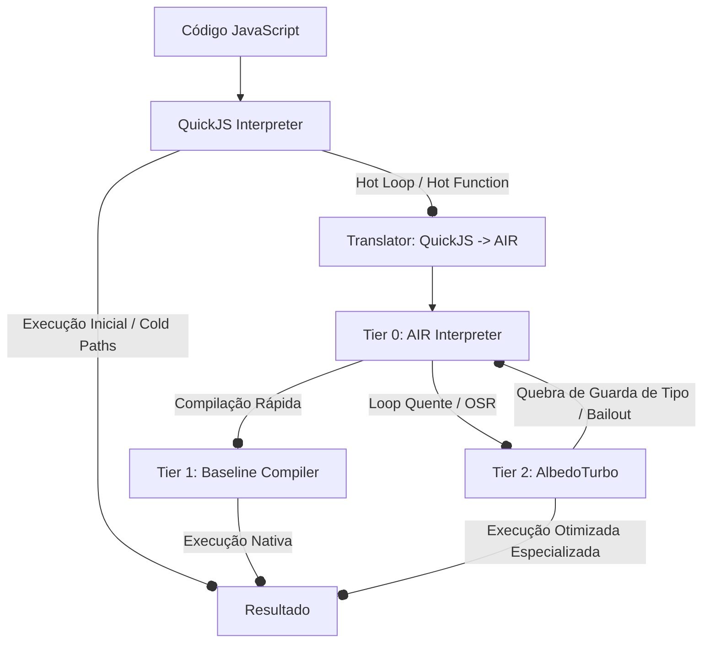

# 📁 albedo-jit

`albedo-jit` é o motor compilador JIT (Just-In-Time) de JavaScript nativo do **Albedo Browser**. Construído em Rust puro e utilizando o **Cranelift** como backend de geração de código nativo, ele atua de forma híbrida com o interpretador do QuickJS, identificando caminhos de código frequentemente executados (*hot paths*) e compilando-os para código de máquina nativo de alta performance (x86-64 / ARM64).

---

## 🎯 Objetivo & Função

Na arquitetura do Albedo Browser, o `albedo-jit` tem a função de acelerar drasticamente a execução de scripts e operações intensivas de computação em JavaScript. Ele substitui a interpretação lenta baseada em pilha por uma execução nativa baseada em registradores especializados, aplicando otimizações avançadas de compiladores como especialização de tipo dinâmica, análise de escape de objetos e otimizações de loops.

### Arquitetura de Execução Híbrida (Tiers de Compilação)

O ciclo de execução de código JavaScript no Albedo Browser funciona através de três estágios principais (Tiers):

1. **Tier 0 — AIR Interpreter (`AirInterpreter`)**
   - **Função**: Interpretador baseado em registradores que executa o Albedo Intermediate Representation (AIR).
   - **Uso**: Execução imediata (*cold startup*), ponto de destino imediato de deotimizações (*bailouts*) e gerenciamento de transição de loops quentes (*OSR*).

2. **Tier 1 — Baseline JIT Compiler (`BaselineCompiler`)**
   - **Função**: Traduz o AIR diretamente para código de máquina nativo utilizando o Cranelift, priorizando velocidade de compilação.
   - **Uso**: Gera código genérico sem otimizações avançadas, onde operações complexas ou dinâmicas são convertidas em chamadas rápidas para auxiliares nativos da C-ABI (*runtime helpers*).

3. **Tier 2 — Optimizing JIT Compiler - AlbedoTurbo (`Tier2Compiler`)**
   - **Função**: Compilador otimizador avançado que aplica especializações baseadas no histórico de tipos coletados dinamicamente.
   - **Uso**: Compila funções altamente executadas substituindo chamadas dinâmicas genéricas por operações nativas otimizadas de CPU (ex.: `iadd`/`fadd` diretos) sob a premissa de tipos estáveis, aplicando análise de escape de objetos e remoção de alocações.

---

## 🏗️ Conceitos Centrais do JIT

### 1. Representação SSA-like (Albedo Intermediate Representation - AIR)
O Albedo IR (AIR) é um bytecode registrador de baixo nível estruturado em blocos básicos.
* Cada instrução opera diretamente sobre registradores virtuais (`AirReg`), semelhante ao formato SSA (Static Single Assignment).
* Cada bloco básico possui controle de fluxo explícito finalizado com um terminador obrigatório (`AirTerminator::Jump`, `AirTerminator::JumpIf`, `AirTerminator::Return`).

### 2. Deotimização (Bailout)
Se as suposições otimistas de tipos do **Tier 2 (AlbedoTurbo)** falharem em tempo de execução (por exemplo, um operador `+` que recebia apenas inteiros de repente recebe uma `string`), o código de máquina nativo realiza um **bailout**:
1. Invoca-se o helper runtime `js_deopt_bailout`.
2. O estado atual da CPU e a pilha de registradores virtuais (*spill area*) são lidos a partir de um ponteiro de salvamento (`spill_ptr`).
3. O frame do interpretador é reconstruído em memória.
4. A execução é transferida de volta para o **Tier 0 (AIR Interpreter)** exatamente no índice da instrução correspondente, garantindo a corretude semântica do JavaScript.

### 3. Análise de Escape (Escape Analysis)
Uma análise estática de fluxo de dados *field-sensitive* classifica a alocação de objetos em três estados:
* **Escaping**: O objeto é retornado pela função ou passado como argumento para funções desconhecidas, sendo obrigatoriamente alocado no Heap do motor.
* **StackOnly**: O objeto não escapa do escopo da função corrente, mas possui acessos dinâmicos. Ele é alocado localmente na pilha nativa de execução da CPU usando o `StackAllocator`.
* **ScalarReplaceable**: O objeto tem propriedades fixas e estáticas acessadas localmente. O compilador realiza **SROA** (*Scalar Replacement of Aggregates*), explodindo o objeto e promovendo cada um de seus campos a registradores virtuais independentes (`AirReg`). Isso elimina completamente o overhead de alocação de memória e acessos a ponteiros.

### 4. On-Stack Replacement (OSR)
O `OsrManager` monitora execuções repetitivas de loops no interpretador. Ao atingir um limite (*threshold*), o gerenciador OSR compila a cabeceira do loop (*loop header*) e seus blocos internos diretamente para código JIT otimizado de Tier 2, substituindo a pilha do interpretador pela pilha nativa no exato meio da execução do loop quente.

---

## 📄 Arquivos e Suas Funções

Abaixo está o mapeamento detalhado da estrutura interna de código do diretório `albedo-jit/src`:

| Diretório / Arquivo | Função principal |
| :--- | :--- |
| [`lib.rs`](file:///c:/Users/24802449/Documents/Github/Albedo-Browser/albedo-jit/src/lib.rs) | Entry point principal do crate; expõe as principais APIs do motor JIT. |
| [`contracts.rs`](file:///c:/Users/24802449/Documents/Github/Albedo-Browser/albedo-jit/src/contracts.rs) | Contratos internos e asserções estruturais usadas para garantir integridade. |
| [`parking_lot.rs`](file:///c:/Users/24802449/Documents/Github/Albedo-Browser/albedo-jit/src/parking_lot.rs) | Wrappers seguros de concorrência (`RwLock`) para gerenciamento de estados globais. |
| [`jit_equivalence_tests.rs`](file:///c:/Users/24802449/Documents/Github/Albedo-Browser/albedo-jit/src/jit_equivalence_tests.rs) | Suite de testes de equivalência semântica de ponta a ponta comparando QuickJS, AIR e JIT. |
| **`bytecode/`** | **Módulo de Definição e Construção do Albedo IR** |
| 📄 [`bytecode/mod.rs`](file:///c:/Users/24802449/Documents/Github/Albedo-Browser/albedo-jit/src/bytecode/mod.rs) | Declaração do módulo de bytecode intermediário e testes unitários estruturais. |
| 📄 [`bytecode/builder.rs`](file:///c:/Users/24802449/Documents/Github/Albedo-Browser/albedo-jit/src/bytecode/builder.rs) | API de construção fluente (Builder Pattern) para geração programática de AIR. |
| 📄 [`bytecode/opcodes.rs`](file:///c:/Users/24802449/Documents/Github/Albedo-Browser/albedo-jit/src/bytecode/opcodes.rs) | Definição da lista de opcodes do AIR, operandos de registradores e terminadores. |
| **`compiler/`** | **Módulo de Compilação e Otimizações de Fluxo** |
| 📄 [`compiler.rs`](file:///c:/Users/24802449/Documents/Github/Albedo-Browser/albedo-jit/src/compiler.rs) | Indexador dos submódulos de compilação. |
| 📄 [`compiler/air_interpreter.rs`](file:///c:/Users/24802449/Documents/Github/Albedo-Browser/albedo-jit/src/compiler/air_interpreter.rs) | Motor interpretador da representação AIR (Tier 0). Contém o OSR loop manager. |
| 📄 [`compiler/baseline_compiler.rs`](file:///c:/Users/24802449/Documents/Github/Albedo-Browser/albedo-jit/src/compiler/baseline_compiler.rs) | Implementação do Tier 1 JIT usando Cranelift para rápida codegen nativa. |
| 📄 [`compiler/tier2_compiler.rs`](file:///c:/Users/24802449/Documents/Github/Albedo-Browser/albedo-jit/src/compiler/tier2_compiler.rs) | O compilador otimizador AlbedoTurbo (Tier 2) com especialização de tipos. |
| 📄 [`compiler/deopt.rs`](file:///c:/Users/24802449/Documents/Github/Albedo-Browser/albedo-jit/src/compiler/deopt.rs) | Registro de pontos de bailout e rotina de deotimização (de Tier 2 para Tier 0). |
| 📄 [`compiler/escape_analysis.rs`](file:///c:/Users/24802449/Documents/Github/Albedo-Browser/albedo-jit/src/compiler/escape_analysis.rs) | Análise estática de escape de alocações (Heap vs Stack vs Scalars). |
| 📄 [`compiler/scalar_replacement.rs`](file:///c:/Users/24802449/Documents/Github/Albedo-Browser/albedo-jit/src/compiler/scalar_replacement.rs) | Transformação SROA para objetos e arrays não-escapantes. |
| 📄 [`compiler/stack_allocator.rs`](file:///c:/Users/24802449/Documents/Github/Albedo-Browser/albedo-jit/src/compiler/stack_allocator.rs) | Planejador de alocação de variáveis complexas na pilha nativa da CPU. |
| 📄 [`compiler/loop_opts.rs`](file:///c:/Users/24802449/Documents/Github/Albedo-Browser/albedo-jit/src/compiler/loop_opts.rs) | Validador e otimizador de loops no grafo de fluxo de controle (CFG). |
| 📄 [`compiler/code_cache.rs`](file:///c:/Users/24802449/Documents/Github/Albedo-Browser/albedo-jit/src/compiler/code_cache.rs) | Cache estruturado de código compilado de máquina nativa associado a metadados. |
| **`decoder/`** | **Módulo de Tradução QuickJS ➔ Albedo IR** |
| 📄 [`decoder/mod.rs`](file:///c:/Users/24802449/Documents/Github/Albedo-Browser/albedo-jit/src/decoder/mod.rs) | Declaração do módulo decodificador e testes integrados de tradução. |
| 📄 [`decoder/qjs_opcodes.rs`](file:///c:/Users/24802449/Documents/Github/Albedo-Browser/albedo-jit/src/decoder/qjs_opcodes.rs) | Representação e parsing estrutural do bytecode baseado em pilha do QuickJS. |
| 📄 [`decoder/source_map.rs`](file:///c:/Users/24802449/Documents/Github/Albedo-Browser/albedo-jit/src/decoder/source_map.rs) | Mapeamento bi-direcional de offsets entre instruções QuickJS e registradores AIR. |
| 📄 [`decoder/translator.rs`](file:///c:/Users/24802449/Documents/Github/Albedo-Browser/albedo-jit/src/decoder/translator.rs) | Algoritmo que traduz a semântica de pilhas (Push/Pop) em fluxos de registradores AIR. |
| **`engine/`** | **Orquestração e Orçamento do Engine JIT** |
| 📄 [`engine.rs`](file:///c:/Users/24802449/Documents/Github/Albedo-Browser/albedo-jit/src/engine.rs) | Indexador de submódulos do motor JIT. |
| 📄 [`engine/jit_engine.rs`](file:///c:/Users/24802449/Documents/Github/Albedo-Browser/albedo-jit/src/engine/jit_engine.rs) | Orquestrador principal do ciclo de compilação, linking e ponteiros JIT nativos. |
| 📄 [`engine/jit_bridge.rs`](file:///c:/Users/24802449/Documents/Github/Albedo-Browser/albedo-jit/src/engine/jit_bridge.rs) | Ponte de integração entre o interpretador QuickJS nativo e o motor JIT. |
| 📄 [`engine/profiler.rs`](file:///c:/Users/24802449/Documents/Github/Albedo-Browser/albedo-jit/src/engine/profiler.rs) | Profiler dinâmico que detecta *hot paths* com base em contadores de execução. |
| **`infra/`** | **Alocação de Memória Física e Proteções Virtuais** |
| 📄 [`infra.rs`](file:///c:/Users/24802449/Documents/Github/Albedo-Browser/albedo-jit/src/infra.rs) | Indexador dos submódulos de infraestrutura e alocação. |
| 📄 [`infra/executable_memory.rs`](file:///c:/Users/24802449/Documents/Github/Albedo-Browser/albedo-jit/src/infra/executable_memory.rs) | Alocador de baixo nível de páginas executáveis com suporte nativo a proteções W^X. |
| **`runtime/`** | **Modelo de Objetos, NaN-Boxing e Chamadas Dinâmicas** |
| 📄 [`runtime.rs`](file:///c:/Users/24802449/Documents/Github/Albedo-Browser/albedo-jit/src/runtime.rs) | Indexador do submódulo runtime do JIT. |
| 📄 [`runtime/js_value.rs`](file:///c:/Users/24802449/Documents/Github/Albedo-Browser/albedo-jit/src/runtime/js_value.rs) | Representação de 64 bits de tipos dinâmicos (NaN-Boxing) e macros auxiliares. |
| 📄 [`runtime/object_model.rs`](file:///c:/Users/24802449/Documents/Github/Albedo-Browser/albedo-jit/src/runtime/object_model.rs) | Definição de layouts de objetos em memória nativa (Shapes, offsets, metadados). |
| 📄 [`runtime/runtime_helpers.rs`](file:///c:/Users/24802449/Documents/Github/Albedo-Browser/albedo-jit/src/runtime/runtime_helpers.rs) | Helpers de apoio em C-ABI exportados e vinculados nas chamadas JIT. |
| 📄 [`runtime/type_feedback.rs`](file:///c:/Users/24802449/Documents/Github/Albedo-Browser/albedo-jit/src/runtime/type_feedback.rs) | Tabelas de monitoramento de Inline Cache (IC) e histórico de tipos. |
| 📄 [`runtime/fast_builtins.rs`](file:///c:/Users/24802449/Documents/Github/Albedo-Browser/albedo-jit/src/runtime/fast_builtins.rs) | Funções matemáticas e utilitárias de execução rápida e direta nativas. |
| 📄 [`runtime/builtins.rs`](file:///c:/Users/24802449/Documents/Github/Albedo-Browser/albedo-jit/src/runtime/builtins.rs) | Registro e identificadores de funções internas JavaScript suportadas. |
| 📄 [`runtime/random.rs`](file:///c:/Users/24802449/Documents/Github/Albedo-Browser/albedo-jit/src/runtime/random.rs) | Helpers e utilitários para geração de números aleatórios velozes. |

---

## 🛠️ O que DEVE e NÃO DEVE estar aqui (Regras de Design)

> [!IMPORTANT]
> Manter o desacoplamento de camadas é vital para a portabilidade e segurança da arquitetura JIT.

### O que DEVE estar aqui
* **Pipelines e Motores de Compilação JIT**: Códigos de baseline (Tier 1), otimizadores (Tier 2/AlbedoTurbo) e o interpretador auxiliar de IR (Tier 0).
* **Análise estática e otimizações de fluxos de dados**: Análise de escape, substituição escalar de agregados (SROA), alocação na pilha nativa e otimização de laços.
* **Componentes de mapeamento e representação de tipos do JS**: Representações NaN-boxed (`JsValue`), layouts e metadados de objetos na memória JIT (`Shapes`) e monitoramento de tipos dinâmicos (Inline Caches).
* **Alocação física de memória executável**: Gerenciadores de páginas do SO (`VirtualAlloc`/`mmap`) garantindo transições seguras de W^X.

### O que NÃO DEVE estar aqui
* **Código de renderização visual ou árvore de layout (DOM/CSS)**: Nenhuma dependência com bibliotecas de interface visual, HTML parser ou WebGL deve vazar para este módulo.
* **Parser textual direto de JavaScript**: O `albedo-jit` traduz diretamente o bytecode binário gerado previamente pelo interpretador/parser do QuickJS. A análise léxica e sintática de texto não pertence a este crate.
* **Gerenciadores de rede ou E/S assíncrona de alto nível**: Manipulação de sockets, requisições HTTP ou timers de eventos pertencem ao runtime principal do browser, não às camadas básicas do compilador de máquina.

---

## 🔒 Restrições do Compilador JIT

> [!WARNING]
> Compiladores JIT são vetores críticos de vulnerabilidades de segurança e exaustão de recursos. Por isso, as seguintes restrições de design devem ser estritamente seguidas:

* **Segurança W^X (Write XOR Execute)**
  Páginas de memória física que guardam os códigos nativos do JIT nunca devem ser graváveis e executáveis de forma simultânea. O `CodeRegion` deve iniciar em estado `ProtectionState::ReadWrite` (gravação dos opcodes) e transitar para `ProtectionState::ReadExecute` antes de ser exposto à CPU para execução.
* **Orçamento Máximo de Memória (Memory Budget)**
  Para mitigar riscos de *JIT-spraying* e vazamentos de memória, o alocador nativo impõe um budget máximo configurável (padrão 64MB) através do `CodePool`. Tentativas de alocação que ultrapassarem esse limite resultarão em falha imediata, forçando a execução a permanecer em modo interpretado convencional.
* **Garantias de Guarda de Tipo**
  O código especializado gerado pelo AlbedoTurbo (Tier 2) assume um comportamento de tipagem rígida. Sempre que uma guarda de tipo falhar, a deotimização imediata via `js_deopt_bailout` deve ser engatilhada, impedindo qualquer chance de acesso ilegal a ponteiros e corrupção de memória.
* **Estrutura de Grafos de Loops Estrita**
  Qualquer alteração ou otimização do CFG no módulo `compiler/loop_opts.rs` deve passar obrigatoriamente pelo validador `validate_air_cfg` antes de iniciar a geração final em Cranelift, prevenindo loops órfãos ou saltos para blocos inválidos na CPU.
