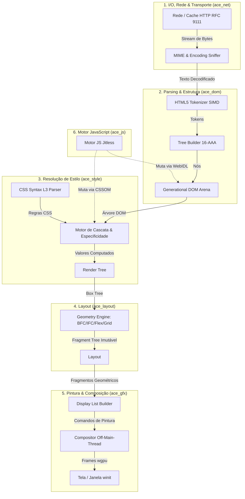

# 🏛️ Central de Arquitetura — Albedo Core Engine (ACE)

> **Diretório:** `docs/architecture/`  
> **Status:** Ativo & Vigente  
> **Propósito:** Centralizar as especificações técnicas aprofundadas (*Engineering Master Plans*) de cada subsistema do motor ACE.

---

## 🧭 Pipeline Geral do Motor (End-to-End)

O fluxo de processamento de uma página web no Albedo segue um pipeline unidirecional estritamente desacoplado, projetado para execução massivamente paralela e assíncrona:

---

## 📚 Especificações Técnicas dos Subsistemas

| Subsistema | Documento de Arquitetura | Fase no PLANO | Responsabilidade Principal |
| :--- | :--- | :---: | :--- |
| **`ace_core`** | [**`ace_core.md`**](./ace_core.md) | Fase 2 | Arenas geracionais com EBR, `Option<NodeId>` em 8B, `TripleBuffer` lock-free, matemática `euclid`, cores CSS Color 4 e Event Loop WHATWG. |
| **`ace_net`** | [**`ace_net.md`**](./ace_net.md) | Fase 3 | `ResourceFetcher`, Cache RFC 9111 L1/L2 com WAL, DoH Happy Eyeballs v2, Early Hints 103, Cookies CHIPS e conector HTTP/3 (QUIC). |
| **`ace_dom`** | [**`ace_dom.md`**](./ace_dom.md) | Fase 5 | Tokenizer HTML5 SIMD, Tree Builder com 16-AAA, seletores CSS4 com Ancestor Bloom Filter de 64 buckets, DSD, MutationObserver e Sanitizer API. |
| **Infra de Testes** | [**`test_infra.md`**](./test_infra.md) | Transversal | Arquitetura 4-Tier para baixo nível e estratégia em 4 estágios para o consórcio Web Platform Tests (WPT). |

---

## ⚖️ Convenções Inegociáveis de Arquitetura

1. **Paradigma Pragmático (Regra 1):** O motor web é 100% nosso (*Alma*), enquanto a infraestrutura reutiliza crates maduras e auditadas do ecossistema Rust (*Fundações*). É terminantemente proibido incorporar motores pré-fabricados (Blink, Gecko, Servo, V8, etc.).
2. **Matriz Hierárquica de Dependências:** Nenhum crate pode depender de uma camada superior no pipeline. `ace_core` não conhece HTML; `ace_dom` não conhece janelas do SO; `ace_layout` recebe apenas nós computados.
3. **Isolamento de Memória & Concorrência:** Estruturas compartilhadas entre threads de renderização e composição utilizam primitivas atômicas lock-free (`TripleBuffer`), impedindo travamentos de interface (*jank*).

