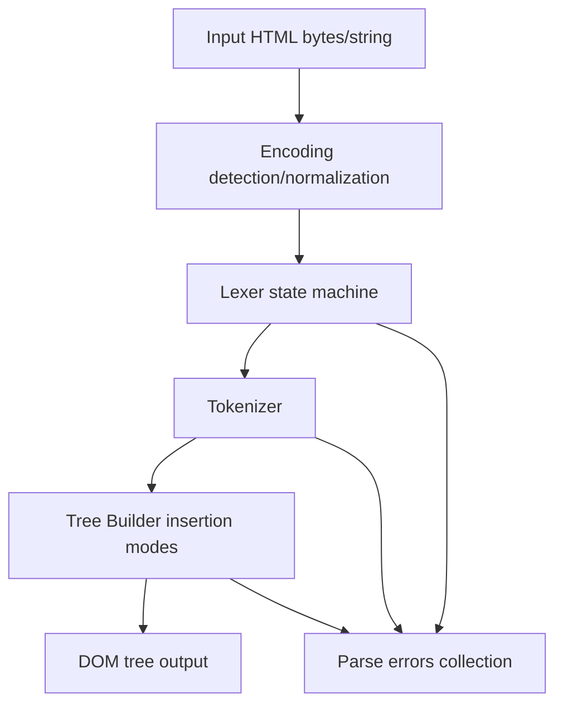
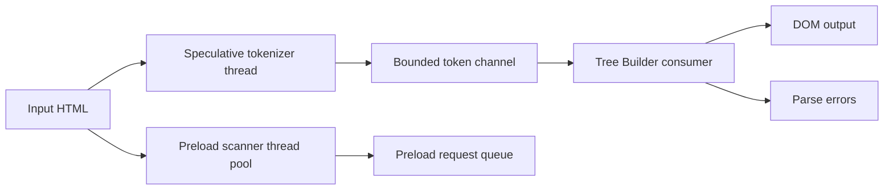
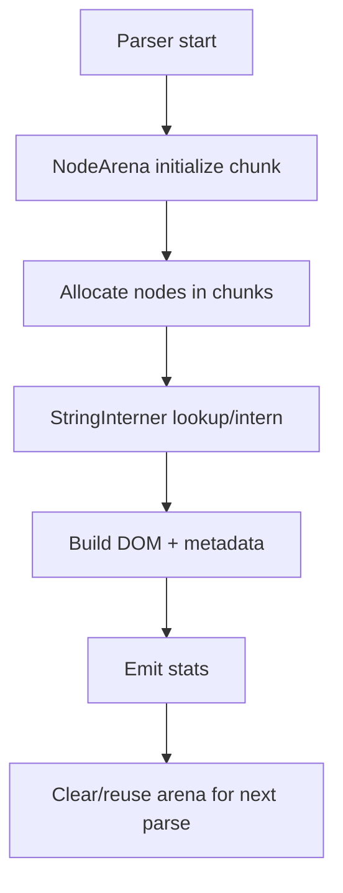
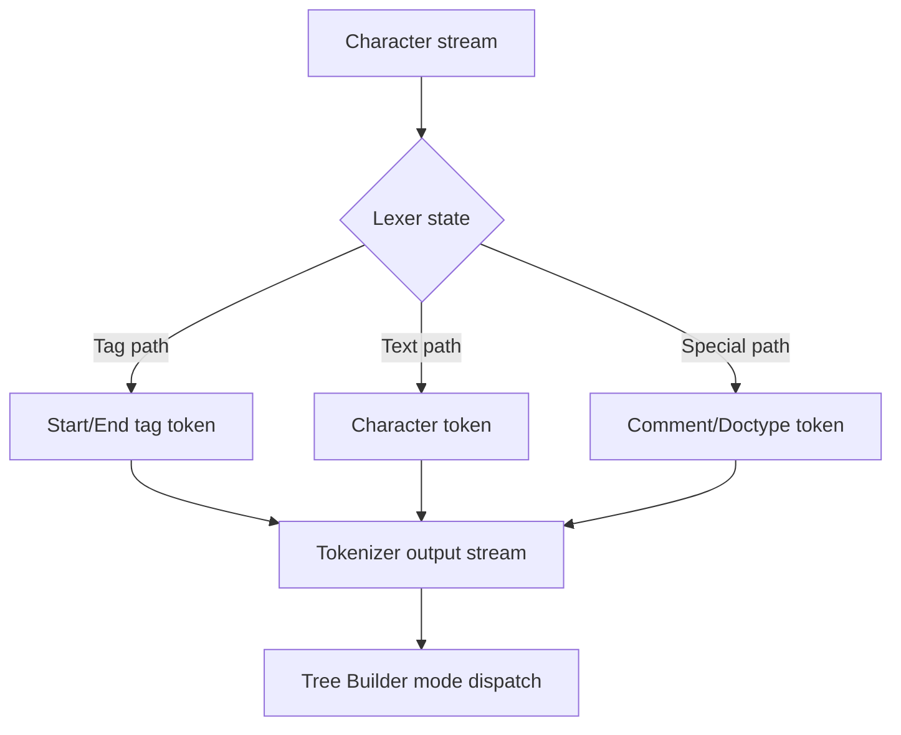
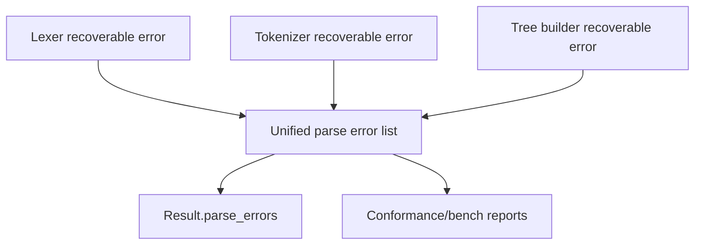

# ACE HTML Parser - Data Flow Diagrams

This document formalizes the data flow for ACE-HTML parsing paths, memory behavior, token movement, and error propagation.

## 1. Single-Threaded Parsing Flow

## 2. Multi-Threaded Speculative Flow

## 3. Memory Allocation and Reuse Flow

## 4. Token Flow Patterns

## 5. Error Propagation Paths

## Notes

- Errors are collected and reported without aborting parsing, following WHATWG recovery behavior.
- In speculative mode, bounded channels enforce backpressure and avoid unbounded memory growth.
- Arena/interner stats are consumed by integrated reports and validation tooling.

